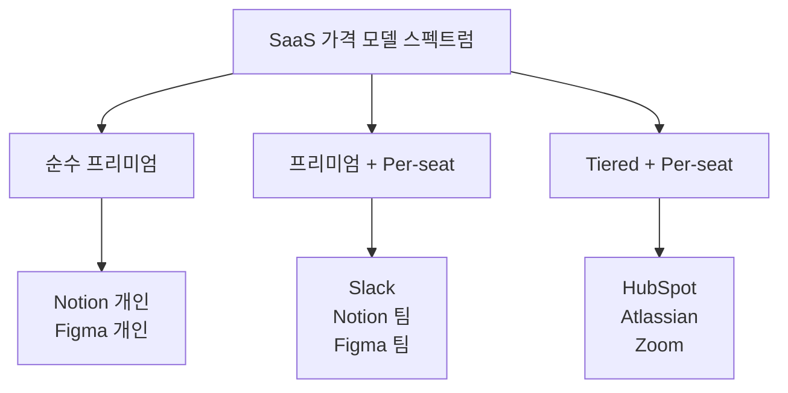

# SaaS 비즈니스 모델 - 대표 제품 비교 개요

> 주요 SaaS 제품을 비즈니스 모델 관점에서 비교하고, 각 제품이 어떤 전략으로 성장했는지 분석한다.

[< SaaS 비즈니스 모델 개요로 돌아가기](../index.md)

---

## 주요 SaaS 제품 비교표

| 제품 | 가격 모델 | GTM 전략 | 핵심 지표 (추정) | 타겟 시장 | 차별화 |
|------|-----------|----------|-------------------|-----------|--------|
| [Notion](notion.md) | 프리미엄 + Per-seat | PLG + CLG | ARR $1B+, NRR ~120% | 개인~엔터프라이즈 | 올인원 워크스페이스, 템플릿 생태계 |
| [Figma](figma.md) | 프리미엄 + Per-editor | PLG | ARR $600M+, NRR ~150% | 디자이너·개발자·PM | 브라우저 기반 멀티플레이어, 디자인 시스템 |
| [Slack](slack.md) | 프리미엄 + Per-seat | PLG → SLG | ARR $1.5B+ (Salesforce 내), NRR ~120% | 팀 커뮤니케이션 | 바이럴 성장, 플랫폼·앱 생태계 |
| Zoom | 프리미엄 + Per-host | PLG | ARR $4.5B+, NRR ~110% | 화상회의·협업 | 압도적 사용 편의성, 네트워크 효과 |
| HubSpot | 프리미엄 + Tiered | PLG + SLG | ARR $2.6B+, NRR ~110% | SMB~Mid-market CRM | 올인원 CRM, 인바운드 마케팅 교육 |
| Atlassian | Per-seat + Tiered | PLG (No Sales) | ARR $4B+, NRR ~120% | 개발팀·IT팀 | 영업팀 없는 PLG, Jira+Confluence 번들 |

---

## 가격 모델 비교

| 가격 요소 | Notion | Figma | Slack | Zoom | HubSpot | Atlassian |
|-----------|--------|-------|-------|------|---------|-----------|
| 무료 플랜 | 개인 무제한 | 3 프로젝트 | 90일 메시지 | 40분 제한 | CRM 무료 | 10명 무료 |
| 시작 가격 (월) | $10/seat | $15/editor | $8.75/user | $13.33/host | $20/seat | $7.75/user |
| 엔터프라이즈 | 커스텀 | 커스텀 | 커스텀 | 커스텀 | 커스텀 | 커스텀 |
| 연간 할인 | ~20% | ~20% | ~15% | ~30% | ~20% | ~35% |

---

## GTM 전략 비교

| 전략 | PLG 순도 | 대표 기업 | 특징 |
|------|----------|-----------|------|
| **Pure PLG** | 100% | Atlassian | 영업팀 제로, 셀프서브만으로 $4B ARR |
| **PLG + Community** | 90% | Notion, Figma | 커뮤니티·템플릿이 바이럴 엔진 |
| **PLG → SLG** | 60~70% | Slack, Zoom | 바텀업 도입 후 엔터프라이즈 영업팀 확장 |
| **PLG + SLG** | 50% | HubSpot | 무료 CRM + 인바운드 리드 + 영업팀 |

!!! tip "PLG의 핵심 지표: Time-to-Value"
    PLG에서 가장 중요한 것은 **Time-to-Value(가치 체험까지의 시간)** 다. Figma는 URL 하나로 디자인 협업이 가능하고, Notion은 템플릿으로 즉시 워크스페이스를 구축할 수 있다. 가입부터 "아하 모먼트"까지의 시간이 짧을수록 전환율이 높다.

---

## 시나리오별 참고 제품

### 프리미엄 모델 설계 시

!!! note "참고: Notion, Figma"
    무료 플랜의 범위를 어디까지 설정할지가 핵심이다. [Notion](notion.md)은 개인 사용을 무제한 무료로, 팀 기능에서 과금한다. [Figma](figma.md)는 프로젝트 수 제한으로 유료 유도한다. 두 경우 모두 무료 사용자가 팀 내 바이럴의 핵심 동력이다.

### 바이럴 성장 설계 시

!!! note "참고: Slack, Figma"
    [Slack](slack.md)은 팀 단위 초대로 조직 내 확산, [Figma](figma.md)는 디자인 링크 공유로 조직 외부까지 확산한다. 협업 제품에서 바이럴 루프 설계가 곧 GTM 전략이다.

### 엔터프라이즈 확장 시

!!! note "참고: Slack, HubSpot"
    바텀업으로 도입된 후 엔터프라이즈 세일즈로 확장하는 패턴이 가장 효율적이다. [Slack](slack.md)은 부서 단위 무료 사용 → IT 부서 통합 구매 → 전사 계약 경로를 밟았다.

---

## 제품 상세 문서

| 제품 | 상세 문서 |
|------|-----------|
| Notion | [Notion 상세](notion.md) |
| Figma | [Figma 상세](figma.md) |
| Slack | [Slack 상세](slack.md) |

---

## 다음 단계

- 각 제품의 상세 문서에서 비즈니스 모델, 성장 전략, 지표를 깊이 분석
- [핵심 개념](../concepts.md)에서 비교에 사용된 지표와 모델의 정의 확인
- [트렌드](../trends.md)에서 이 제품들이 향후 어떤 방향으로 진화할지 확인
