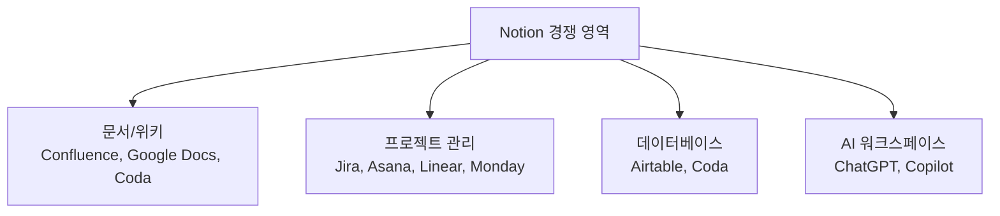

---
tags:
  - 비즈니스모델
  - SaaS
---
# Notion

> 올인원 워크스페이스로 문서·위키·프로젝트 관리·데이터베이스를 하나로 통합한 SaaS. 프리미엄 + PLG + 커뮤니티의 교과서적 성장 사례다.

[< 제품 비교 개요로 돌아가기](index.md)

---

## 기본 정보

| 항목 | 내용 |
|------|------|
| **회사명** | Notion Labs, Inc. |
| **설립** | 2013년 (Ivan Zhao, Simon Last) |
| **본사** | 미국 샌프란시스코 |
| **기업가치** | 약 $10B (2024년 기준) |
| **ARR** | $1B+ (추정, 2025년 기준) |
| **사용자** | 100M+ 가입자, 유료 팀 수백만 |
| **웹사이트** | [notion.so](https://notion.so) |

---

## 비즈니스 모델

### 가격 구조

| 플랜 | 가격 (월, 연간 결제 기준) | 핵심 기능 |
|------|---------------------------|-----------|
| **Free** | $0 | 개인 사용 무제한, 10명 게스트 |
| **Plus** | $10/seat | 무제한 블록, 30일 히스토리, 파일 업로드 무제한 |
| **Business** | $18/seat | SAML SSO, 고급 권한, 250일 히스토리 |
| **Enterprise** | 커스텀 | 감사 로그, 고급 보안, 전담 매니저 |

### 프리미엄 전략 분석

Notion의 프리미엄 설계는 **개인에게 관대하고, 팀에서 과금**하는 구조다.

!!! tip "프리미엄 핵심 설계"
    개인 사용자는 페이지·블록 제한 없이 무료로 사용할 수 있다. 이 사용자가 팀에 Notion을 소개하는 순간 유료 전환이 시작된다. 팀 워크스페이스에서 협업하려면 Plus 이상 구독이 필요하다. 이것이 Notion PLG의 핵심 엔진이다.

---

## 성장 전략

### PLG (Product-Led Growth)

- **셀프서브 온보딩**: 가입 후 즉시 템플릿으로 워크스페이스 구축 가능
- **낮은 Time-to-Value**: 첫 방문에서 가치를 체험하는 데 5분 이내
- **인제품 바이럴**: 페이지 공유, 게스트 초대, 공개 페이지가 자연스러운 바이럴 루프

### CLG (Community-Led Growth)

- **템플릿 갤러리**: 수만 개의 커뮤니티 제작 템플릿이 SEO + 바이럴 엔진
- **Notion Ambassador**: 공식 커뮤니티 리더 프로그램
- **크리에이터 이코노미**: Notion 템플릿 판매가 하나의 수익 모델로 정착 (Gumroad, 자체 마켓플레이스)
- **교육 콘텐츠**: YouTube, 블로그에서 Notion 사용법 콘텐츠가 지속적으로 생산

### 엔터프라이즈 확장

- **바텀업 도입**: 개인/팀 사용 → 부서 확산 → IT 주도 전사 계약
- **Notion AI**: AI 기능이 엔터프라이즈 부가 매출(+$10/seat)과 차별화 요소
- **API + 인테그레이션**: Slack, Jira, GitHub 등과 연동하여 기업 워크플로우에 통합

---

## 핵심 지표 (추정)

| 지표 | 수치 (추정) | 비고 |
|------|-------------|------|
| ARR | $1B+ | 2024년 기준 |
| 가입자 수 | 100M+ | 무료 포함 |
| 유료 전환율 | ~4% | B2C SaaS 평균 수준 |
| NRR | ~120% | 팀 → 부서 → 전사 확장 |
| Gross Margin | ~80% | SaaS 평균 상회 |

---

## 장단점

| 장점 | 단점 |
|------|------|
| 올인원(문서+위키+DB+프로젝트)으로 도구 통합 | 대규모 DB 시 성능 저하 이슈 |
| 강력한 프리미엄 + PLG 성장 엔진 | 오프라인 지원 미흡 |
| 템플릿 생태계가 자체적 바이럴 엔진 | 전문 도구(Jira, Confluence) 대비 깊이 부족 |
| Notion AI가 신규 매출원 + 차별화 | 엔터프라이즈 보안·컴플라이언스 후발 |
| 높은 커스터마이징 자유도 | 학습 곡선이 있음 (빈 캔버스 부담) |

---

## 경쟁 구도

Notion의 강점이자 위험은 **올인원** 전략이다. 개별 영역에서 전문 도구보다 깊이가 부족하지만, "하나의 도구로 충분한" 고객층에서 압도적 선택을 받는다.

---

## 다음 단계

- [Figma](figma.md)와 비교하여 PLG 전략의 차이점 확인
- [Slack](slack.md)과 비교하여 팀 도구의 바이럴 메커니즘 비교
- [핵심 개념](../concepts.md)에서 프리미엄, PLG, NRR 등 지표 정의 확인
- [트렌드](../trends.md)에서 AI SaaS와 컴파운드 스타트업 방향 확인
