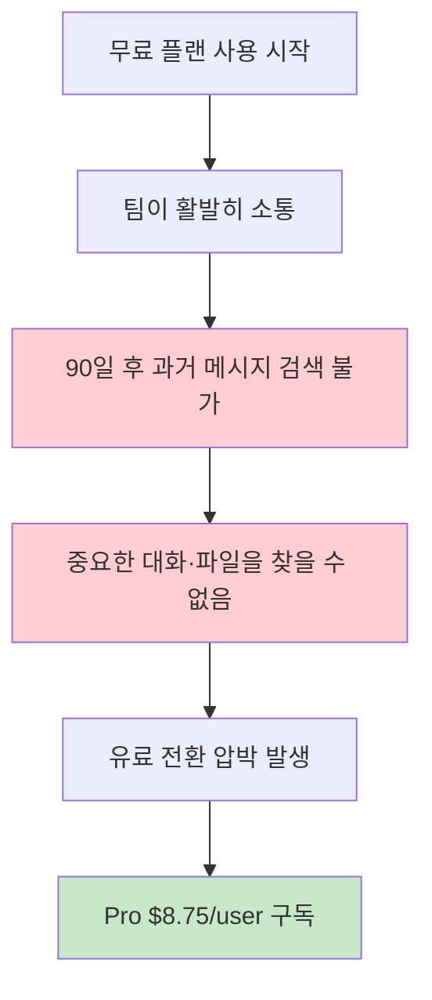
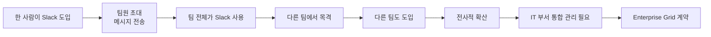
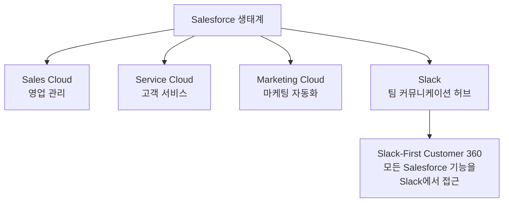

# Slack

> 팀 커뮤니케이션의 대명사. 바이럴 성장으로 프리미엄에서 엔터프라이즈까지 확장한 뒤, Salesforce에 인수되어 CRM 생태계의 핵심 허브로 자리잡았다.

[< 제품 비교 개요로 돌아가기](index.md)

---

## 기본 정보

| 항목 | 내용 |
|------|------|
| **회사명** | Slack Technologies (Salesforce 자회사) |
| **설립** | 2013년 (Stewart Butterfield) |
| **본사** | 미국 샌프란시스코 |
| **인수** | 2021년 Salesforce가 $27.7B에 인수 |
| **ARR** | $1.5B+ (추정, Salesforce 내 2025년 기준) |
| **사용자** | DAU 30M+, 유료 팀 수십만 |
| **웹사이트** | [slack.com](https://slack.com) |

---

## 비즈니스 모델

### 가격 구조

| 플랜 | 가격 (월, 연간 결제 기준) | 핵심 기능 |
|------|---------------------------|-----------|
| **Free** | $0 | 90일 메시지 히스토리, 10개 앱 연동 |
| **Pro** | $8.75/user | 무제한 히스토리, 무제한 앱, 그룹 통화 |
| **Business+** | $12.50/user | SAML SSO, 데이터 내보내기, 24/7 지원 |
| **Enterprise Grid** | 커스텀 | 다중 워크스페이스, DLP, eDiscovery |

### 프리미엄 전략: 제한의 기술

Slack의 프리미엄 설계는 **"맛보기 후 불편함 유발"** 전략이다.

!!! warning "메시지 히스토리 제한의 전략적 의미"
    Slack은 2022년에 무료 플랜을 "최근 10,000건 메시지"에서 "90일 히스토리"로 변경했다. 이는 소규모 팀에는 더 관대하지만, 성장하는 팀에는 유료 전환 동기를 강화한 전략적 변경이다. 팀이 커질수록 90일 제한이 빠르게 불편해진다.

---

## 성장 전략

### 1단계: 바이럴 성장 (PLG)

Slack의 초기 성장은 **바텀업 바이럴**의 교과서다.

**바이럴 핵심 메커니즘**:

- **초대 기반**: Slack은 혼자 쓸 수 없다. 가입 = 팀원 초대 = 바이럴
- **채널 중심**: 채널에 외부 인원을 초대하면서 조직 경계를 넘어 확산
- **Slack Connect**: 외부 조직과 채널을 공유하여 B2B 바이럴 발생

### 2단계: 프리미엄 → 엔터프라이즈

| 단계 | 주체 | 행동 | Slack 대응 |
|------|------|------|------------|
| 발견 | 개인 | 무료로 팀에 도입 | PLG, 셀프서브 |
| 확산 | 팀 | 부서 전체가 사용 | 바이럴 루프 |
| 전환 | 팀 리더 | 유료 구독 결정 | Pro/Business+ |
| 통합 | IT 부서 | 전사 보안·관리 필요 | Enterprise Grid |
| 확장 | CSM | 부가 기능·Salesforce 연동 | Upsell + Cross-sell |

### 3단계: 플랫폼 전략

Slack은 단순 메신저를 넘어 **업무 자동화 플랫폼**으로 진화하고 있다.

- **Slack App Directory**: 2,600+ 앱 연동 (Jira, GitHub, Google Drive, Salesforce 등)
- **Workflow Builder**: 코드 없이 업무 자동화 워크플로우 구축
- **Slack API + Bot**: 커스텀 봇·인테그레이션 개발
- **Slack AI**: 채널 요약, 검색 강화, 스레드 요약 등 AI 기능 추가 ($10/user 추가)

---

## Salesforce 인수

**사건**: 2021년 7월 Salesforce가 $27.7B에 인수 완료. Salesforce 역사상 최대 규모 인수.

**전략적 의미**:

**인수 후 변화**:

| 항목 | 인수 전 | 인수 후 |
|------|---------|---------|
| 포지셔닝 | 팀 메신저 | Salesforce의 "디지털 HQ" |
| GTM | PLG 중심 | PLG + Salesforce 영업력 |
| 수익화 | 독립 구독 | Salesforce 번들 + 독립 구독 |
| AI | 기본 검색 | Slack AI (Einstein AI 연계) |
| 경쟁 | Microsoft Teams | Teams + Copilot과 본격 경쟁 |

!!! note "인수의 교훈"
    Slack은 PLG로 $1B+ ARR에 도달했지만, Microsoft Teams의 번들 전략(Office 365 포함)에 시장 점유율을 빼앗기고 있었다. Salesforce 인수로 CRM 생태계의 허브라는 새로운 포지셔닝을 확보했다. PLG만으로는 번들 전략에 취약할 수 있다는 사례다.

---

## 핵심 지표 (추정)

| 지표 | 수치 (추정) | 비고 |
|------|-------------|------|
| ARR | $1.5B+ | Salesforce 내 Slack 매출 |
| DAU | 30M+ | 2024년 기준 |
| 유료 전환율 | ~30% | 팀 단위 기준, 업계 최고 수준 |
| NRR | ~120% | Per-seat 확장 + 플랜 업그레이드 |
| ARPU | ~$12/user/월 | 플랜 믹스 기준 |

---

## 장단점

| 장점 | 단점 |
|------|------|
| 팀 커뮤니케이션의 사실상 표준 | Microsoft Teams의 번들 공세 |
| 초대 기반 바이럴이 강력한 PLG 엔진 | Per-seat 모델은 AI 시대에 한계 |
| 2,600+ 앱 생태계로 업무 허브화 | 정보 과부하(채널 난립) 문제 |
| Slack Connect로 B2B 네트워크 효과 | Salesforce 종속 리스크 |
| Salesforce CRM 연계 시너지 | 독립 브랜드 정체성 약화 우려 |

---

## 다음 단계

- [Notion](notion.md)과 비교하여 문서 협업 vs 커뮤니케이션 협업의 PLG 차이 확인
- [Figma](figma.md)와 비교하여 바이럴 루프 메커니즘의 차이 분석
- [핵심 개념](../concepts.md)에서 프리미엄, 바이럴 루프, NRR 정의 확인
- [트렌드](../trends.md)에서 AI가 팀 커뮤니케이션 SaaS에 미치는 영향 확인
