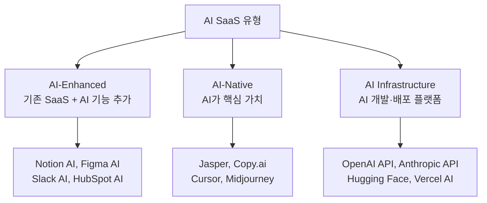
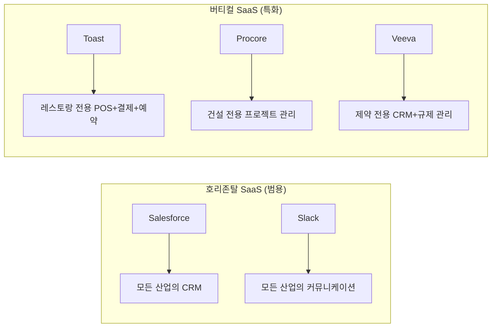
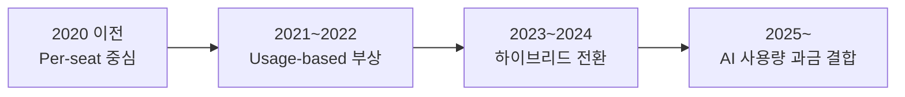
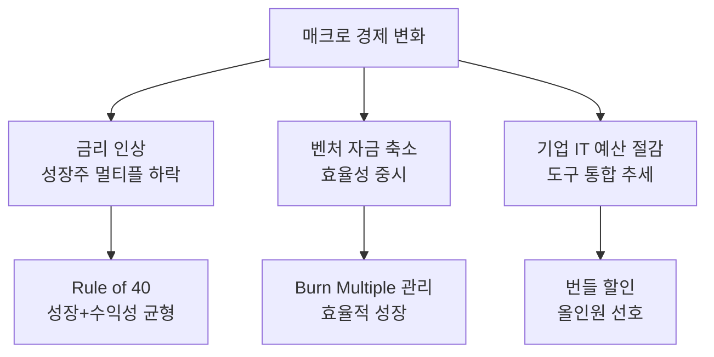
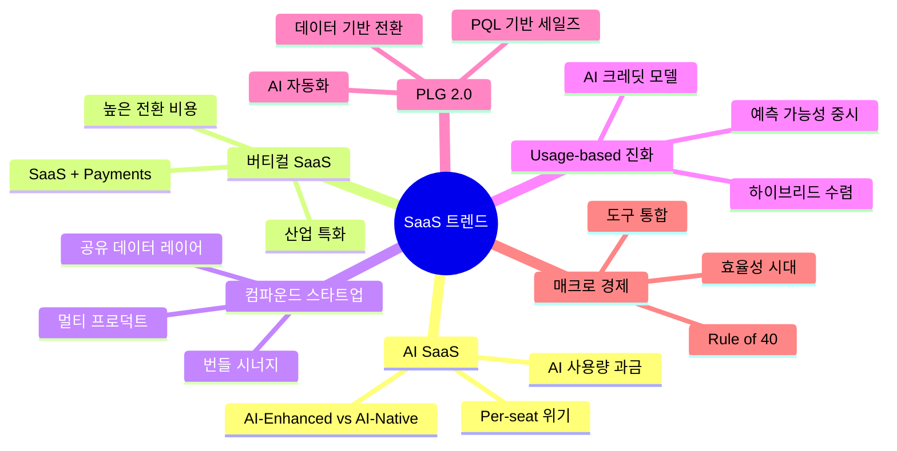

# SaaS 비즈니스 모델 - 트렌드 및 전망

> SaaS 산업의 최신 트렌드와 비즈니스 모델의 미래 방향을 다룬다. 2025~2026년 기준 주요 변화와 전망을 정리한다.

[< SaaS 비즈니스 모델 개요로 돌아가기](index.md)

---

## 1. AI SaaS (AI-Native SaaS)

### 정의

AI를 핵심 기능으로 내장하거나, AI 자체를 서비스로 제공하는 SaaS다. 기존 SaaS에 AI를 추가하는 "AI-Enhanced"와 처음부터 AI로 설계된 "AI-Native"를 구분한다.

### 현황과 영향

**비즈니스 모델 변화**:

| 기존 SaaS | AI SaaS |
|-----------|---------|
| Per-seat 과금 | Per-seat + AI 사용량 과금 |
| 고정 기능 세트 | AI가 기능을 동적 생성 |
| 사용자가 직접 작업 | AI가 작업, 사용자가 검토 |
| 더 많은 사용자 = 더 많은 매출 | AI가 사용자를 대체할 가능성 |

!!! warning "Per-seat 모델의 위기"
    AI가 1명의 생산성을 10배로 높이면, 기업은 10명 대신 1명만 고용한다. Per-seat 모델의 SaaS는 "좌석 수 감소 = 매출 감소" 리스크에 직면한다. 이에 [Notion](products/notion.md)과 [Figma](products/figma.md)는 AI를 별도 추가 과금($10/seat)으로 설정하여 ARPU를 높이는 전략을 취하고 있다.

---

## 2. 버티컬 SaaS (Vertical SaaS)

### 정의

특정 산업(의료, 건설, 부동산, 레스토랑 등)에 특화된 SaaS다. 호리존탈(범용) SaaS와 대비된다.

### 왜 주목하는가

**버티컬 SaaS의 장점**:

- **높은 전환 비용**: 산업 특화 워크플로우가 깊이 통합되어 대체가 어렵다
- **낮은 Churn**: 월 0.5% 미만의 Churn Rate 달성 가능
- **Payments 결합**: Toast, Mindbody처럼 SaaS + 결제 수수료로 이중 수익 모델
- **규제 대응**: 산업별 규제(HIPAA, SOX 등)를 기본 내장하여 호리존탈 대비 우위

---

## 3. 컴파운드 스타트업 (Compound Startup)

### 정의

하나의 제품이 아닌 **여러 제품을 동시에 개발·출시**하여 통합 플랫폼을 구축하는 전략이다. Rippling의 Parker Conrad가 명명했다.

### 전략 비교

| 접근 | 전통적 SaaS | 컴파운드 스타트업 |
|------|-------------|-------------------|
| 제품 수 | 1개에 집중 | 여러 개 동시 개발 |
| 성장 방식 | 단일 제품 확장 → 인접 제품 추가 | Day 1부터 멀티 프로덕트 |
| 데이터 | 제품별 사일로 | 통합 데이터 레이어 |
| 경쟁 | 개별 제품끼리 경쟁 | 번들로 경쟁 (1+1 > 2) |

**대표 기업**:

- **Rippling**: HR + IT + Finance 통합. 직원 데이터를 중심으로 급여, 복리후생, 기기 관리, 비용 관리를 하나로
- **[HubSpot](products/index.md)**: CRM + 마케팅 + 세일즈 + CS + CMS를 하나의 플랫폼으로
- **[Notion](products/notion.md)**: 문서 + 위키 + DB + 프로젝트 관리를 올인원으로

!!! tip "컴파운드 전략의 핵심"
    컴파운드 전략이 작동하려면 **공유 데이터 레이어**가 필수다. Rippling의 "직원 그래프", HubSpot의 "CRM 데이터"처럼 모든 제품이 하나의 데이터를 공유해야 번들의 시너지가 발생한다.

---

## 4. Usage-based 가격 모델의 진화

### 현황

2021~2022년 Usage-based 가격이 크게 주목받았으나, 2023~2024년 매크로 경제 악화로 매출 예측 어려움이 부각되면서 **하이브리드 모델**이 대세로 자리잡았다.

### 가격 모델 트렌드

**하이브리드 모델 예시**:

| 기업 | 구조 |
|------|------|
| Slack | Per-seat 기본 + Slack AI $10/user 추가 |
| HubSpot | 플랜 기본료 + 마케팅 연락처 수 과금 |
| Notion | Per-seat 기본 + Notion AI $10/seat 추가 |
| Vercel | 무료 티어 + 빌드 시간·대역폭 과금 |

!!! note "AI 시대의 가격 모델 딜레마"
    AI 기능은 호출당 비용(LLM API 비용)이 발생하므로 Usage-based가 자연스럽다. 그러나 고객은 예측 가능한 비용을 원한다. 현재 대부분의 SaaS가 "기본료 + AI 사용량 크레딧" 하이브리드로 수렴하고 있다.

---

## 5. PLG 2.0

### 정의

기존 PLG(셀프서브 가입 → 제품 체험 → 유료 전환)에 **데이터 기반 세일즈**와 **AI 자동화**를 결합한 진화된 GTM 전략이다.

### PLG 1.0 vs PLG 2.0

| 항목 | PLG 1.0 | PLG 2.0 |
|------|---------|---------|
| 전환 | 자연스러운 업그레이드 대기 | PQL(Product Qualified Lead) 기반 능동적 세일즈 |
| 데이터 활용 | 가입·결제 데이터 | 제품 사용 행동 데이터 분석 |
| 세일즈 역할 | 최소 또는 없음 | 제품 사용 시그널 기반 적시 개입 |
| AI | 없음 | AI가 전환 시점·대상 예측 |
| 확장 | 자연 확산 의존 | 확장 시그널 감지 → 세일즈 트리거 |

**PLG 2.0의 핵심**: 무료 사용자가 "유료 전환 준비가 된 시점"을 **제품 사용 데이터**로 감지하여, 세일즈가 정확한 타이밍에 개입한다. [Figma](products/figma.md)와 [Slack](products/slack.md)이 이 전략을 적극 활용하고 있다.

---

## 6. 매크로 경제 영향

### 2023~2025년 SaaS 환경 변화

**핵심 변화**:

| 2021년 (호황기) | 2024~2025년 (효율성 시대) |
|-----------------|--------------------------|
| "Growth at all costs" | "Efficient growth" |
| ARR 성장률이 최우선 | Rule of 40 (성장+수익) |
| 높은 Burn Multiple 용인 | Burn Multiple < 2x 요구 |
| 다수 SaaS 도구 도입 | 도구 통합·비용 절감 |
| 높은 멀티플 (30~50x ARR) | 멀티플 정상화 (10~20x ARR) |

!!! tip "PM 관점의 시사점"
    SaaS PM은 이제 "기능 추가"보다 "기존 기능의 가치 극대화", "유료 전환율 개선", "NRR 향상"에 집중해야 한다. 신규 고객 획득보다 기존 고객 확장이 더 효율적인 성장 동력이 되는 시대다.

---

## 트렌드 요약

---

## 다음 단계

- [핵심 개념](concepts.md)에서 이 트렌드에 사용된 지표와 모델의 정의 확인
- [제품 비교](products/index.md)에서 각 제품이 이 트렌드에 어떻게 대응하는지 비교
- [플랫폼 이코노미 트렌드](../platform-economy/trends.md)와 비교하여 SaaS와 플랫폼의 교차점 확인
- [MOR (Merchant of Record)](../mor-service/index.md)에서 SaaS 글로벌 판매의 결제·세금 트렌드 확인
