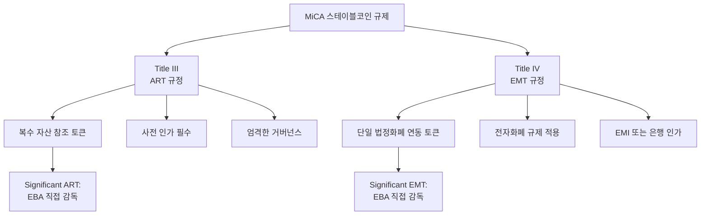
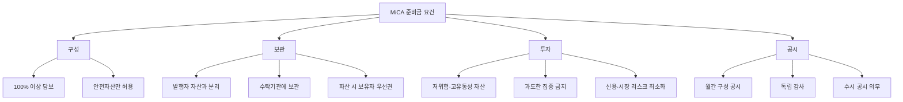
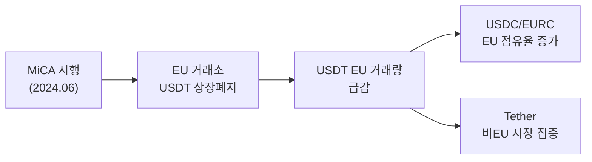

---
tags:
  - 디지털자산
  - 규제
  - 스테이블코인
---
# EU 스테이블코인 규제 (MiCA)

> 마지막 검토: 2025년 5월

## 개요

EU의 MiCA(Markets in Crypto-Assets Regulation)는 세계 최초로 스테이블코인에 대한 포괄적 규제를 시행한 법적 프레임워크다. 스테이블코인 관련 조항(Title III: ART, Title IV: EMT)은 2024년 6월 30일부터 적용되었으며, EU 전역에서 통일된 기준으로 운영된다.

---

## EMT 발행 요건 상세

### EMT (E-Money Token) 정의

MiCA 제48조에 따르면, EMT는 "단일 공식 화폐(official currency)를 참조하여 안정적 가치를 유지하는 것을 목적으로 하는 가상자산"이다. 본질적으로 전자화폐의 블록체인 버전으로 볼 수 있다.

### 발행자 자격

| 요건 | 상세 |
|------|------|
| **법적 형태** | EU 회원국 내 설립된 법인 |
| **인가** | 전자화폐지침(EMD2) 하 **전자화폐기관(EMI)** 인가, 또는 **신용기관(은행)** 인가 |
| **패스포팅** | 1개 회원국 인가로 EU 전역 발행·유통 가능 |
| **백서** | 표준화된 가상자산 백서 작성·공시 의무 (NCA 통보) |
| **자기자본** | EMD2 기준에 따른 최소 자기자본 유지 |

### EMT 준비금 요건

| 항목 | 요건 |
|------|------|
| **담보 비율** | 발행량의 100% 이상 |
| **허용 자산** | 현금(은행 예금), 중앙은행 예치금, 단기 국채, 역환매조건부채권 |
| **분리 보관** | 발행자 자산과 법적·물리적으로 분리 (신탁, 별도 계좌) |
| **투자 제한** | 준비금은 안전하고 유동성 높은 자산에만 투자 가능 |
| **현금 비율** | 준비금의 최소 30%를 신용기관 예금으로 보유 (5개 이상 기관에 분산) |
| **감사** | 독립적 감사법인에 의한 정기 감사 |
| **공시** | 준비금 구성 수시 공시, 최소 월간 업데이트 |

### EMT 상환권

MiCA는 EMT 보유자에게 강력한 상환권을 부여한다:

- **무조건적 상환**: 보유자는 언제든 발행자에게 참조 화폐의 액면가로 상환 요청 가능
- **수수료**: 상환 수수료는 제한적으로만 허용 (비례적이어야 함)
- **최소 금액 제한 불가**: 최소 상환 금액을 설정할 수 없음
- **처리 기한**: 합리적 기간 내 처리 (당일~익영업일)

!!! note "이자 지급 금지"
    MiCA 제50조는 EMT 발행자가 토큰 보유 기간에 비례한 이자나 기타 이익을 제공하는 것을 명시적으로 금지한다. 이는 EMT가 예금 상품으로 변질되는 것을 방지하기 위함이다.

---

## ART 발행 요건 상세

### ART (Asset-Referenced Token) 정의

MiCA 제16조에 따르면, ART는 "하나 이상의 공식 화폐를 포함한 복수의 자산, 또는 단일 공식 화폐가 아닌 자산을 참조하여 안정적 가치를 유지하는 것을 목적으로 하는 가상자산"이다.

### 발행자 자격 및 인가 절차

| 요건 | 상세 |
|------|------|
| **법적 형태** | EU 회원국 내 설립된 법인 |
| **사전 인가** | 회원국 NCA(National Competent Authority)에 인가 신청 |
| **심사 기간** | 신청 접수 후 3개월 이내 결정 |
| **백서** | NCA 승인을 받은 가상자산 백서 공시 |
| **사업계획서** | 상세 사업계획, 거버넌스 구조, 리스크 관리 정책 제출 |
| **면제** | 12개월 미발행량 평균 500만 유로 미만 또는 적격투자자 대상만인 경우 간소화 절차 |

### ART 자기자본 및 거버넌스

| 항목 | 요건 |
|------|------|
| **최소 자기자본** | 35만 유로, 또는 준비금의 2%, 또는 고정비의 25% 중 가장 큰 금액 |
| **거버넌스** | 이해충돌 방지 정책, 사업 연속성 계획, 내부 통제 체계 |
| **아웃소싱** | 핵심 기능의 외부 위탁 시 NCA 사전 통보 |
| **주주 적격성** | 적격 주주(significant shareholders) 심사 |

---

## 준비금 요건 공통 사항

### 준비금 관리 원칙

### 준비금 투자 제한 상세

MiCA는 준비금의 투자 가능 자산을 엄격히 제한한다:

| 자산 유형 | EMT 준비금 | ART 준비금 |
|-----------|-----------|-----------|
| 중앙은행 예치금 | O | O |
| 고신용등급 국채 | O (단기) | O (단기) |
| 역환매조건부채권 | O | O |
| 은행 예금 | O (30% 이상 분산) | O (분산 의무) |
| 커버드본드 | 제한적 | 제한적 |
| 기업어음 (CP) | X | 제한적 |
| 주식, 가상자산 | X | X |

!!! warning "준비금에 대한 재투자 수익"
    MiCA는 준비금 운용에서 발생하는 수익(이자 등)을 보유자에게 분배하는 것을 금지한다. 이 수익은 발행자의 영업 수익이 되지만, 보유자에게 이자 형태로 돌려줄 수는 없다.

---

## Significant 스테이블코인 추가 요건

### Significant 지정 기준

EMT 또는 ART가 다음 기준 중 하나 이상을 충족하면 "Significant(시스템적으로 중요한)" 스테이블코인으로 지정된다:

| 기준 | 임계값 |
|------|--------|
| 보유자 수 | 1,000만 명 이상 |
| 시가총액 | 50억 유로 이상 |
| 일일 거래 건수 | 250만 건 이상 |
| 일일 거래 금액 | 5억 유로 이상 |
| 국제 활동 범위 | EU 회원국 7개 이상 + 제3국 다수 |
| 금융 시스템 연계성 | 금융 기관·인프라와의 상호연결 정도 |

### 추가 적용 요건

| 요건 | 일반 EMT/ART | Significant EMT/ART |
|------|-------------|---------------------|
| 감독 기관 | 회원국 NCA | **EBA(유럽은행감독청)** 직접 감독 |
| 자기자본 | 기본 요건 | 인상된 자기자본 (준비금의 3%) |
| 유동성 | 기본 준비금 요건 | **유동성 스트레스 테스트** 의무 |
| 회복·정리 계획 | 선택적 | **의무** |
| 상호운용성 | 권장 | 의무적 상호운용성 확보 |
| 준비금 분산 | 기본 분산 | 강화된 분산 요건 |

---

## 거래량 상한

### 비유로 통화 연동 EMT/ART

MiCA는 **유로 이외의 화폐에 연동된 EMT/ART**가 EU 내에서 결제 수단으로 과도하게 사용되는 것을 제한한다. 이는 유로의 화폐주권을 보호하기 위한 조항이다.

| 제한 항목 | 기준 |
|-----------|------|
| 일일 거래 건수 | **100만 건** 초과 시 |
| 일일 거래 금액 | **2억 유로** 초과 시 |
| 조치 | 발행 중단 또는 거래량 억제 조치 이행 의무 |

!!! warning "달러 스테이블코인에 대한 영향"
    이 거래량 제한은 USDT, USDC 같은 달러 연동 스테이블코인에 직접적 영향을 미친다. EU 내에서 달러 스테이블코인이 유로를 대체하는 결제 수단이 되는 것을 방지하려는 취지이며, 이 조항이 실무에서 어떻게 적용될지가 핵심 쟁점이다.

---

## Tether/USDT의 MiCA 대응 현황

### 현황 (2025년 기준)

Tether는 MiCA 시행에 대해 소극적으로 대응하고 있으며, 2025년 현재 EU 내에서 EMT 라이선스를 취득하지 않았다.

**주요 경과**:

| 시점 | 내용 |
|------|------|
| 2024.06 | MiCA 스테이블코인 규정 시행 시작 |
| 2024.12 | 주요 EU 거래소(Coinbase EU, Bitstamp 등)에서 USDT 상장 폐지 또는 거래 제한 |
| 2025.01 | Tether, EU 시장 대응 전략 미발표. MiCA 준수 의사 불분명 |
| 2025.Q1 | USDT, EU 역내 거래량 감소. USDC/EURC 등 MiCA 준수 코인으로 대체 진행 |

**Tether의 입장**:

- MiCA의 일부 요건(특히 준비금 30% 은행 예금 의무)이 역설적으로 시스템 리스크를 높인다고 주장
- EU 시장보다 글로벌 시장(아시아, 중동, 남미)에 집중하는 전략으로 선회
- EU 전용 유로 스테이블코인(EURT) 발행을 검토했으나, 규모의 경제 부족으로 보류

### 시장 영향

---

## Circle/USDC의 MiCA 승인 사례

### MiCA 최초의 주요 스테이블코인 승인

Circle은 MiCA 하에서 EMT 라이선스를 취득한 최초의 글로벌 주요 스테이블코인 발행사이다.

**주요 경과**:

| 시점 | 내용 |
|------|------|
| 2024.07 | Circle, 프랑스 ACPR(금융건전성감독청)로부터 EMI 인가 취득 |
| 2024.07 | USDC, MiCA 준수 EMT로서 EU 전역 합법적 유통 시작 |
| 2024.07 | EURC(유로 연동 스테이블코인)도 동시에 EMT 인가 |
| 2024.H2 | EU 내 USDC 거래량 증가, 주요 거래소에서 USDT 대체 |
| 2025.Q1 | Circle, EU 내 시장점유율 확대 (EU 스테이블코인 시장 1위) |

**Circle의 MiCA 준수 전략**:

| 요건 | Circle의 대응 |
|------|---------------|
| 발행자 인가 | 프랑스 ACPR EMI 인가 |
| 준비금 100% | 현금 + 단기 미국 국채 100% 담보 유지 |
| 분리 보관 | 별도 신탁 계좌에 준비금 보관 |
| 감사 | 월간 Deloitte 준비금 증명 보고서 공시 |
| 상환권 | 무조건 1:1 상환 보장 |
| EU 법인 | Circle Europe (프랑스 파리 소재) |

!!! note "MiCA의 경쟁 촉진 효과"
    MiCA는 규제 준수 스테이블코인에 "합법성의 프리미엄"을 부여함으로써, Circle/USDC가 EU 시장에서 Tether/USDT를 추월하는 계기가 되었다. 이는 규제가 시장 구도를 직접 재편하는 사례로 주목받고 있다.

---

## 참고 자료

- EU: [Regulation (EU) 2023/1114 (MiCA)](https://eur-lex.europa.eu/eli/reg/2023/1114/oj) - Title III (ART: Art.16-47), Title IV (EMT: Art.48-58)
- EBA: [MiCA Technical Standards](https://www.eba.europa.eu/activities/single-rulebook/regulatory-activities/markets-crypto-assets-mica)
- ESMA: [MiCA Guidelines](https://www.esma.europa.eu/esmas-activities/digital-finance-and-innovation/markets-crypto-assets-regulation-mica)
- Circle: [MiCA Compliance Announcement](https://www.circle.com/en/pressroom)

---

> [국가별 비교로 돌아가기](index.md) | [한국](korea.md) | [미국](usa.md) | [개요](../index.md)
