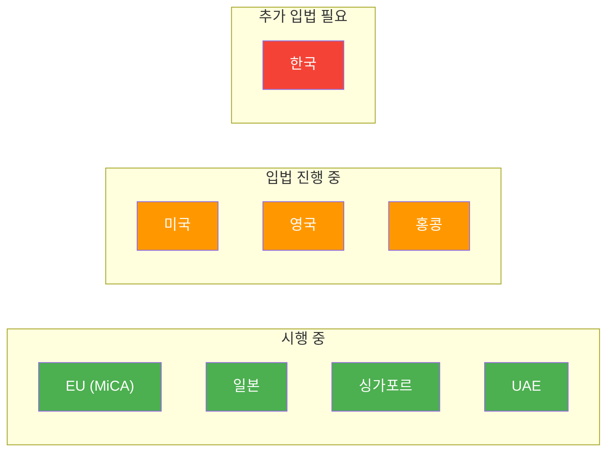

---
tags:
  - 디지털자산
  - 규제
  - 스테이블코인
---
# 국가별 스테이블코인 규제 비교

> 마지막 검토: 2025년 5월

주요 국가 및 지역의 스테이블코인 규제 현황을 비교 분석한다. 각국의 접근 방식은 상이하지만, 준비금 요건, 발행자 인가, 상환권 보장이라는 공통 요소가 수렴하는 추세다.

## 규제 비교표

| 국가/지역 | 규제 법률 | 발행 요건 | 준비금 요건 | 상환권 보장 | 시행 상태 |
|-----------|-----------|-----------|-------------|-------------|-----------|
| **한국** | 특금법 + 가상자산이용자보호법 | VASP 신고 (스테이블코인 별도 규제 미비) | 명시적 규정 없음 | 미규정 | 추가 입법 논의 중 |
| **미국** | GENIUS Act / STABLE Act (심의 중) | 연방/주 인가 이원 구조 (안) | 100% 고품질 유동자산 (안) | 1:1 보장 (안) | 2025년 입법 추진 중 |
| **EU** | MiCA (2023/1114) | EMI/은행(EMT) 또는 별도 인가(ART) | 100% 안전자산, 분리 보관 | EMT: 무조건, ART: 조건부 | **시행 중** (2024.06~) |
| **일본** | 자금결제법 개정 (2023) | 은행 또는 자금이전업자만 발행 가능 | 100% 동등 자산, 신탁 보관 | 보장 | **시행 중** (2023.06~) |
| **싱가포르** | MAS 스테이블코인 프레임워크 (2023) | MAS 인가 (단일 화폐 연동만 대상) | 100% 저위험 자산, 분리 보관 | 5영업일 이내 보장 | **시행 중** (2023.08~) |
| **영국** | Financial Services and Markets Act 2023 | FCA 인가 예정 | 100% 고품질 자산 (예정) | 보장 (예정) | 하위 법규 제정 중 |
| **홍콩** | 스테이블코인 법안 (2024 공개) | HKMA 인가 | 100% 준비금, 분리 보관 | 보장 | 2025년 시행 목표 |
| **UAE** | CBUAE 규정 (2024) | CBUAE 인가, 디르함 연동만 허용 | 100% 준비금 | 보장 | 시행 중 |

## 규제 성숙도 비교

## 주요 쟁점별 비교

### 발행자 자격

| 국가/지역 | 은행 허용 | 비은행 허용 | 비은행 요건 |
|-----------|-----------|-------------|-------------|
| EU (MiCA) | O | O (EMI 인가) | 전자화폐기관 인가 |
| 미국 (안) | O | O (주 인가) | 주 머니트랜스미터 또는 별도 인가 |
| 일본 | O | O (자금이전업자) | 등록 + 자본 요건 |
| 싱가포르 | O | O (MAS 인가) | 별도 라이선스 |
| 한국 | 미정 | 미정 | 별도 법률 미비 |

### 알고리즘형 스테이블코인에 대한 입장

| 국가/지역 | 입장 |
|-----------|------|
| EU (MiCA) | EMT/ART 정의에 부합하지 않으면 별도 분류. 순수 알고리즘형은 사실상 발행 곤란 |
| 미국 (GENIUS Act) | 명시적 금지 |
| 미국 (STABLE Act) | 2년 모라토리엄 |
| 일본 | 자금결제법상 발행 불가 (담보 요건 미충족) |
| 한국 | 별도 규정 없음 |

### 해외 발행 스테이블코인 취급

| 국가/지역 | 역내 유통 허용 여부 | 조건 |
|-----------|-------------------|------|
| EU (MiCA) | 조건부 허용 | 역내 법인 설립 또는 제3국 동등성 평가 필요 |
| 미국 (안) | 조건부 허용 | 재무부의 승인 또는 동등 규제 인정 |
| 일본 | 제한적 | 국내 등록 사업자를 통해서만 유통 가능 |
| 싱가포르 | 규제 대상 외 | MAS 프레임워크는 싱가포르 내 발행에만 적용 |

## 상세 문서

| 국가/지역 | 문서 |
|-----------|------|
| 한국 | [한국 스테이블코인 규제](korea.md) |
| 미국 | [미국 스테이블코인 규제](usa.md) |
| EU | [EU 스테이블코인 규제](eu.md) |

→ 관련: [가상자산 규제 - 국가별 현황](../../crypto-regulation/by-country/index.md)

---

> [개요로 돌아가기](../index.md) | [규제 프레임워크](../frameworks.md) | [주요 스테이블코인](../products/index.md)
