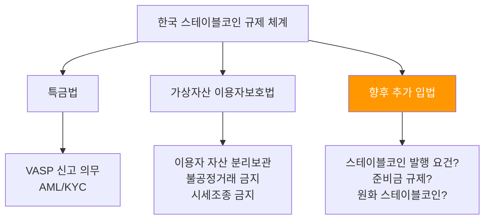
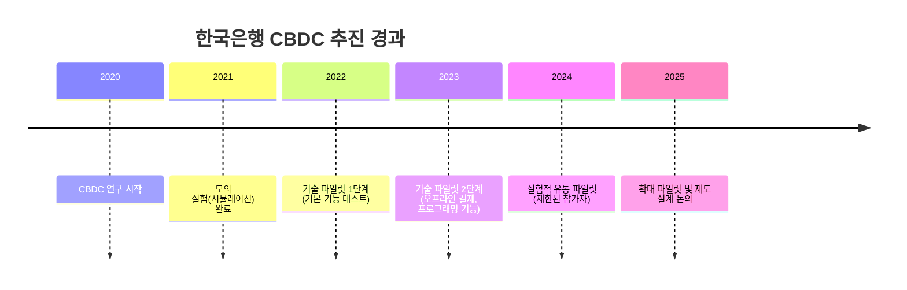

# 한국 스테이블코인 규제

> 마지막 검토: 2025년 5월

## 개요

한국은 2025년 현재 스테이블코인에 대한 별도의 규제 법률이 존재하지 않는다. 스테이블코인은 **특정금융거래정보법(특금법)** 상 가상자산의 한 유형으로 취급되며, **가상자산 이용자보호법(2024년 7월 시행)**의 적용을 받는다. 그러나 스테이블코인의 발행, 준비금, 상환 등 고유 쟁점에 대한 규제는 공백 상태이며, 추가 입법 논의가 진행 중이다.

---

## 현행 규제 현황

### 특금법 내 스테이블코인의 위치

특금법은 가상자산을 "경제적 가치를 지닌 것으로서 전자적으로 거래 또는 이전될 수 있는 전자적 증표"로 정의한다. 스테이블코인은 이 정의에 포함되며, 스테이블코인을 취급하는 사업자는 VASP 신고 의무가 있다.

| 항목 | 현행 규제 |
|------|-----------|
| 스테이블코인 정의 | 별도 정의 없음 (가상자산으로 포괄) |
| 발행 규제 | 없음 (국내 발행 스테이블코인 사실상 부재) |
| 유통 규제 | VASP를 통한 거래 시 특금법 적용 |
| 준비금 요건 | 없음 |
| 상환권 | 미규정 |
| AML/KYC | 특금법에 따라 VASP에 적용 |

### 가상자산 이용자보호법과 스테이블코인

2024년 7월 시행된 가상자산 이용자보호법은 거래소 중심의 투자자 보호를 목적으로 하며, 스테이블코인을 직접 규율하지는 않지만 간접적으로 영향을 미친다.

**관련 조항**:

- **이용자 예치금 분리보관**: 거래소가 보관하는 스테이블코인(USDT, USDC 등)에도 분리보관 의무 적용
- **불공정거래 금지**: 스테이블코인의 시세조종, 미공개정보 이용 등 금지
- **이상거래 감시**: 스테이블코인 관련 이상거래에 대해서도 감시 의무
- **손해배상**: 가상자산사업자의 귀책사유로 인한 이용자 손해 배상 책임

!!! note "규제 공백"
    현행법은 스테이블코인의 "거래" 측면만 규율할 뿐, "발행"과 "준비금 관리"에 대해서는 아무런 규제가 없다. 이는 국내에서 스테이블코인이 발행되지 않는 주요 원인이기도 하다.

→ 관련: [가상자산 규제 - 한국](../../crypto-regulation/by-country/korea.md)

---

## 금융당국의 입장

### 금융위원회

금융위원회는 스테이블코인 규제의 필요성을 인식하고 있으나, 2025년 현재 구체적 입법안을 발표하지 않았다.

**주요 발언 및 방향**:

- 2024년: "스테이블코인은 가상자산 생태계의 핵심 인프라이며, 별도 규제가 필요하다"
- 2025년: 가상자산 기본법(2단계 입법) 내 스테이블코인 규제 포함 가능성 시사
- EU MiCA, 일본 자금결제법, 싱가포르 MAS 프레임워크를 벤치마킹 대상으로 언급

### 한국은행

한국은행은 스테이블코인의 통화정책 및 금융안정에 대한 영향을 연구하고 있다.

**주요 입장**:

- 스테이블코인이 결제 수단으로 대규모 채택될 경우 통화정책 전달 경로에 영향 가능
- 원화 스테이블코인 발행 시 은행 예금 유출(bank disintermediation) 리스크
- CBDC(디지털 원화)와 민간 스테이블코인의 역할 분담 필요
- 대규모 외화 스테이블코인(USDT, USDC) 유통이 외환시장에 미치는 영향 주시

### 금융감독원

금융감독원은 가상자산사업자에 대한 검사·감독 과정에서 스테이블코인 관련 리스크를 모니터링하고 있다.

---

## 원화 스테이블코인 이슈

### 현황

2025년 현재 원화(KRW)에 연동된 스테이블코인은 공식적으로 존재하지 않는다. 이는 다음과 같은 규제적·구조적 요인에 기인한다.

**원화 스테이블코인 부재 원인**:

| 요인 | 설명 |
|------|------|
| 법적 근거 부재 | 스테이블코인 발행에 대한 법률이 없어 법적 불확실성 |
| 전자금융업 충돌 | 원화 스테이블코인이 전자화폐 또는 선불전자지급수단에 해당할 가능성 |
| 외환규제 | 원화의 자유로운 토큰화는 외국환거래법과의 충돌 소지 |
| 한국은행 우려 | 통화주권 및 통화정책 영향에 대한 중앙은행의 신중한 입장 |
| 시장 수요 불확실 | 국내 거래소가 원화 직접 거래를 지원하여 원화 스테이블코인 수요가 상대적으로 낮음 |

### 논의 동향

- 일부 블록체인 프로젝트가 원화 스테이블코인 발행을 검토했으나, 규제 불확실성으로 보류
- 금융당국은 원화 스테이블코인이 전자금융거래법, 외국환거래법과의 관계에서 어떻게 분류될지 검토 중
- 원화 스테이블코인 허용 시 EU의 EMT 모델(전자화폐기관 인가)을 참고할 가능성

!!! warning "외환규제 리스크"
    원화 스테이블코인이 국경 간 자유롭게 이전될 경우, 외국환거래법상 자본거래 규제를 우회할 수 있다는 우려가 있다. 이 문제의 해결 없이 원화 스테이블코인이 허용되기 어렵다.

---

## CBDC(디지털 원화)와의 관계

### 한국은행 CBDC 추진 현황

한국은행은 2020년부터 CBDC 연구를 본격화했으며, 2025년 현재 파일럿 프로그램을 진행 중이다.

**주요 경과**:

### CBDC vs 민간 스테이블코인 역할 분담

| 구분 | CBDC (디지털 원화) | 민간 스테이블코인 |
|------|-------------------|------------------|
| 발행 주체 | 한국은행 | 민간 기업 |
| 법적 지위 | 법정통화 | 가상자산 (또는 전자화폐) |
| 용도 (예상) | 소액 결제, 정부 보조금 지급 | 가상자산 거래, DeFi, 국제 송금 |
| 프라이버시 | 제한적 익명성 (규제 요건) | 블록체인 투명성 |
| 프로그래밍 | 제한적 (정책 목적) | 스마트 컨트랙트 완전 지원 |

**핵심 쟁점**: 한국은행은 CBDC와 민간 스테이블코인이 보완적 역할을 수행할 수 있다는 입장이나, 민간 스테이블코인이 CBDC의 역할을 대체하는 것은 경계하고 있다. 향후 스테이블코인 규제는 CBDC 정책과 연계하여 설계될 가능성이 높다.

---

## 향후 전망

### 예상 규제 방향

1. **가상자산 기본법 2단계**: 스테이블코인 발행 요건, 준비금 규제를 포함한 포괄적 입법 예상
2. **발행자 인가제**: EU MiCA의 EMT 모델 벤치마킹, 전자화폐기관 또는 별도 인가 체계
3. **준비금 규제**: 100% 담보, 분리 보관, 정기 감사 의무화
4. **원화 스테이블코인**: CBDC 정책과 연계하여 단계적 허용 가능성
5. **해외 스테이블코인**: USDT, USDC 등 해외 발행 스테이블코인의 국내 유통 요건 마련

!!! note "입법 일정 불확실"
    스테이블코인 별도 규제의 구체적 입법 일정은 확정되지 않았다. 미국의 연방 입법 진행 상황과 국제적 규제 수렴 동향이 한국의 입법 속도에 영향을 미칠 것으로 전망된다.

---

> [국가별 비교로 돌아가기](index.md) | [미국](usa.md) | [EU](eu.md) | [개요](../index.md)
