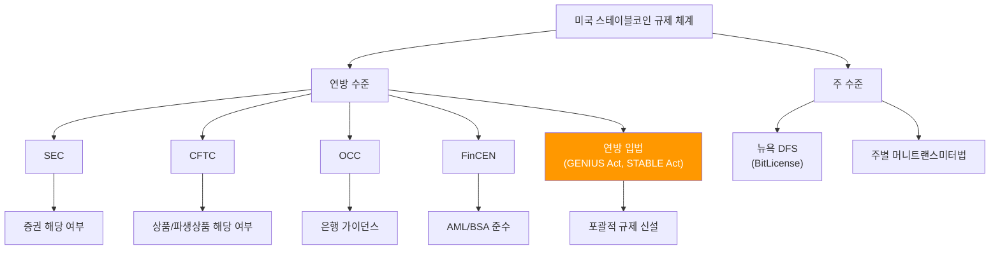
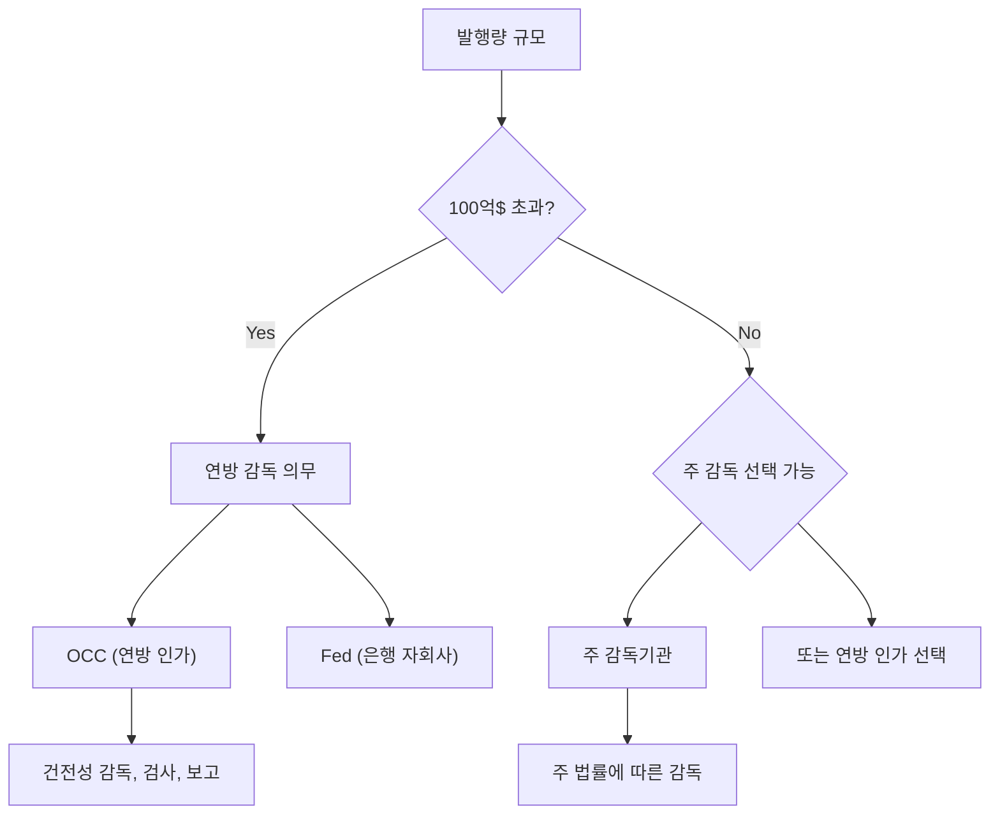
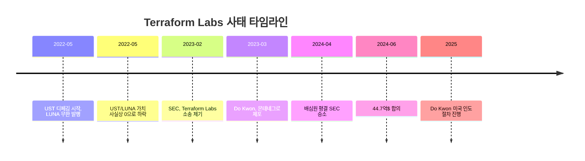

---
tags:
  - 디지털자산
  - 규제
  - 스테이블코인
---
# 미국 스테이블코인 규제

> 마지막 검토: 2025년 5월

## 개요

미국은 세계 최대 스테이블코인 시장이지만, 2025년 현재 포괄적인 연방 수준 스테이블코인 법률이 아직 제정되지 않았다. 기존 금융 규제 체계(증권법, 은행법, 주 머니트랜스미터법 등)가 패치워크 형태로 적용되고 있으며, 2025년 초당적 입법 작업이 본격화되었다.

---

## GENIUS Act 상세

### 법안 개요

**GENIUS Act(Guiding and Establishing National Innovation for U.S. Stablecoins Act)**는 2025년 2월 상원에서 발의된 초당적 법안이다. 미국에서 결제용 스테이블코인에 대한 최초의 포괄적 연방 규제 프레임워크를 수립하려는 시도로, 2025년 3월 상원 은행위원회를 통과했다.

### 주요 조항

| 조항 | 내용 |
|------|------|
| **결제용 스테이블코인 정의** | 법정화폐에 고정된 가치를 유지하고, 보유자에게 상환권을 부여하며, 결제 또는 결제 수단으로 사용되는 디지털 자산 |
| **발행자 분류** | (1) 연방 인가 비은행 발행자 (OCC 인가), (2) 주 인가 발행자, (3) 은행/신탁회사 자회사 |
| **준비금 요건** | 발행량의 100%를 고품질 유동 자산으로 보유 |
| **허용 준비 자산** | 현금, 93일 이내 만기 미국 국채, 연방준비은행 준비금, 적격 역환매조건부채권 |
| **상환권** | 모든 보유자에게 액면가 1:1 상환 보장 |
| **감사** | 독립적 공인회계사에 의한 월간 준비금 증명(attestation) 공시 |
| **규모 기준** | 발행량 100억$ 이하: 주 감독기관이 1차 감독, 100억$ 초과: 연방 감독 의무 |
| **알고리즘형 금지** | 담보 없이 알고리즘만으로 가치를 유지하는 스테이블코인 발행 금지 |
| **증권 면제** | 결제용 스테이블코인은 증권, 상품, 투자계약이 아님을 명시 |
| **해외 발행** | 재무부 인정 하에 동등한 규제를 받는 해외 발행 스테이블코인의 미국 내 유통 허용 |

### 감독 구조

---

## STABLE Act 상세

### 법안 개요

**STABLE Act(Stablecoin Transparency and Accountability for a Better Ledger Economy Act)**는 2025년 3월 하원에서 발의된 법안으로, GENIUS Act와 유사한 목표를 가지지만 일부 접근 방식이 다르다.

### GENIUS Act와의 주요 차이점

| 항목 | GENIUS Act (상원) | STABLE Act (하원) |
|------|-------------------|-------------------|
| **감독 구조** | 연방/주 이원 구조, 규모 기준 100억$ | 연방 중심, Fed와 OCC가 주요 감독 |
| **알고리즘형** | 명시적 금지 | 2년 모라토리엄(유예) + 연구 |
| **DeFi 스테이블코인** | 명시적 언급 적음 | 탈중앙화 발행에 대한 별도 조항 |
| **이자 지급** | 허용 여부 불명확 | 제한적 허용 논의 |
| **해외 발행** | 재무부 인정 체계 | 상호 인정 프레임워크 |
| **진행 상황** | 상원 위원회 통과 | 하원 위원회 심의 중 |

!!! note "최종 법률 전망"
    두 법안이 모두 소속 원(院)을 통과하면 양원 협의회를 거쳐 단일 법안으로 조율된다. 2025년 내 어떤 형태로든 연방 스테이블코인 법이 제정될 가능성이 높으며, 최종안은 두 법안의 절충점이 될 것으로 예상된다.

---

## SEC vs CFTC 관할

### 스테이블코인은 증권인가, 상품인가?

미국 규제 체계에서 가장 오래된 쟁점 중 하나는 가상자산의 관할 귀속 문제다. 스테이블코인의 경우, GENIUS Act/STABLE Act 모두 결제용 스테이블코인을 증권에서 제외하려 하지만, 현행법 하에서는 여전히 불확실성이 존재한다.

| 기관 | 입장 | 논거 |
|------|------|------|
| **SEC** | 일부 스테이블코인은 증권에 해당할 수 있음 | Howey Test 적용, 이자 지급형 스테이블코인은 투자계약 |
| **CFTC** | 스테이블코인은 상품(commodity) 또는 결제수단 | 가상자산 = 상품이라는 기존 입장 |
| **OCC** | 은행의 스테이블코인 활동 허용 | 은행업무의 현대적 확장 |
| **Fed** | 규제 프레임워크 필요, 직접 발행은 의회 승인 필요 | 금융안정 관점 |

### SEC의 주요 입장

- Gensler 전 SEC 의장 시기(~2025.01): 스테이블코인도 증권법 적용 가능 입장
- 2025년 새 SEC 지도부: 결제용 스테이블코인에 대한 규제 완화 시그널
- **"수익 제공 스테이블코인"**: 스테이킹, 이자 지급 기능이 결합된 경우 증권 해당 가능성 여전히 존재

---

## OCC의 스테이블코인 가이던스

### 주요 가이던스

OCC(Office of the Comptroller of the Currency)는 국법은행의 스테이블코인 관련 활동에 대한 가이던스를 발표해왔다.

| 가이던스 | 시기 | 내용 |
|----------|------|------|
| **Interpretive Letter 1174** | 2021.01 | 국법은행이 스테이블코인 결제 네트워크 노드로 참여 가능 |
| **Interpretive Letter 1179** | 2021.11 | 스테이블코인 준비금 보관(custody) 허용 |
| **2025년 업데이트** | 2025.03 | 은행의 가상자산 활동에 대한 사전 승인 요건 완화 |

### 영향

OCC의 가이던스는 은행이 스테이블코인 생태계에 참여하는 법적 근거를 제공한다. 특히 준비금 수탁, 결제 네트워크 참여, 향후 자체 스테이블코인 발행까지 그 범위가 확대되고 있다.

---

## 주별 규제

### 뉴욕 DFS (Department of Financial Services)

뉴욕주는 미국에서 가장 엄격한 스테이블코인 규제를 운영하며, 사실상 연방 규제의 벤치마크 역할을 한다.

**뉴욕 스테이블코인 가이던스 (2022년 6월)**:

| 요건 | 내용 |
|------|------|
| **발행자 인가** | BitLicense 또는 뉴욕 신탁회사 면허 보유 |
| **준비금** | 100% 이상 담보, 허용 자산: 미국 국채, 역RP, 은행 예금, MMF |
| **분리 보관** | 발행자 자산과 완전 분리 |
| **상환** | 적시에 액면가 상환 보장 |
| **감사** | 독립적 월간 증명, 연간 감사 |
| **공시** | 준비금 구성 월간 공시 |

**뉴욕 DFS 인가를 받은 스테이블코인**:

- USDC (Circle - 뉴욕 신탁회사)
- PYUSD (Paxos Trust Company)
- GUSD (Gemini Dollar - 뉴욕 신탁회사)
- ~~BUSD~~ (Paxos - 2023년 발행 중단)

### 기타 주

| 주 | 접근 방식 |
|----|-----------|
| 와이오밍 | DAO LLC 인정, SPDI(Special Purpose Depository Institution) 면허로 스테이블코인 발행 허용 |
| 텍사스 | 머니트랜스미터법 적용, 비교적 유연한 해석 |
| 캘리포니아 | 디지털금융자산법(DFAL, 2025 시행), 스테이블코인 포함 규제 |

---

## 주요 집행 사례

### Paxos / BUSD 사태 (2023)

**배경**: Paxos가 Binance 브랜드로 발행하던 BUSD(Binance USD)에 대해 규제 당국이 제동을 건 사례.

| 항목 | 내용 |
|------|------|
| **시기** | 2023년 2월 |
| **조치 기관** | 뉴욕 DFS, SEC |
| **DFS 조치** | BUSD 신규 발행 중단 명령 (기존 상환은 허용) |
| **SEC** | BUSD가 미등록 증권에 해당한다는 Wells Notice 발송 |
| **사유** | Binance와의 관계에서 준비금 관리 우려, 소비자 보호 이슈 |
| **결과** | BUSD 시가총액 230억$ → 사실상 0으로 감소 (상환 완료) |
| **교훈** | 스테이블코인 발행 시 브랜드 파트너십의 리스크, 규제 기관의 단호한 대응 |

### Terraform Labs / UST 사태 (2022~2024)

**배경**: 알고리즘 스테이블코인 UST 붕괴와 그 법적 후속 조치.

| 항목 | 내용 |
|------|------|
| **붕괴 시기** | 2022년 5월 |
| **피해 규모** | 약 400억$ 증발 |
| **SEC 소송** | Do Kwon 및 Terraform Labs 상대 사기·미등록증권 혐의 소송 |
| **판결** | 2024년 4월 배심원 평결: SEC 승소 (UST, LUNA 등이 증권에 해당) |
| **합의금** | Terraform Labs 44.7억$ 합의 (2024년 6월) |
| **형사** | Do Kwon, 몬테네그로에서 체포 후 미국 인도 절차 |
| **교훈** | 알고리즘 스테이블코인의 구조적 위험, 사후적 규제의 한계 |

### Tether 관련 규제 이력

| 시기 | 기관 | 내용 |
|------|------|------|
| 2019~2021 | 뉴욕 NYAG | Tether/Bitfinex 조사 - 준비금 부실 혐의 |
| 2021.02 | 뉴욕 NYAG | 1,850만$ 합의. 분기별 준비금 보고 의무 부과 |
| 2021.10 | CFTC | 4,100만$ 과징금. 준비금 관련 허위 진술 |
| 2025 | - | USDT, EU MiCA 미준수로 유럽 주요 거래소 상장 폐지 |

!!! warning "집행 강화 추세"
    미국 규제 당국은 스테이블코인에 대한 집행 조치를 강화하는 추세다. 특히 준비금 투명성, 증권법 준수, 소비자 보호 측면에서 사후적 규제가 활발히 이루어지고 있으며, 연방 입법이 완료되면 사전적 규제로 전환될 전망이다.

---

> [국가별 비교로 돌아가기](index.md) | [한국](korea.md) | [EU](eu.md) | [개요](../index.md)
