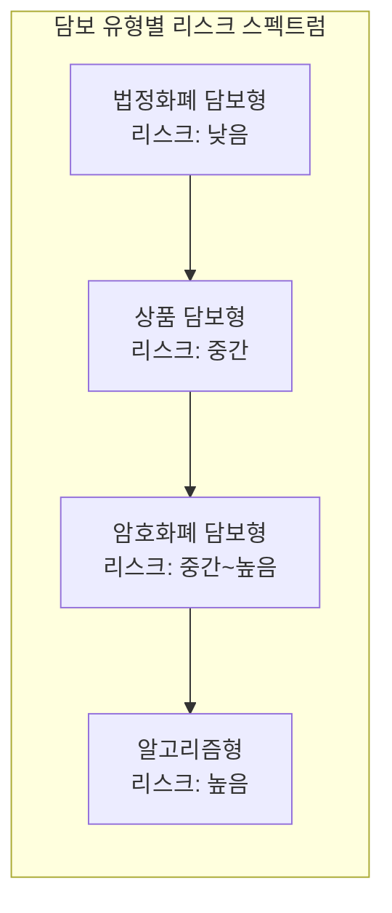
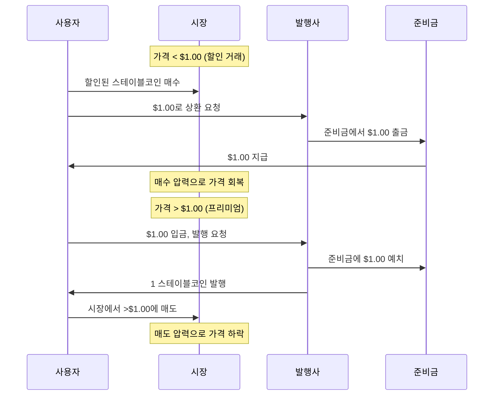
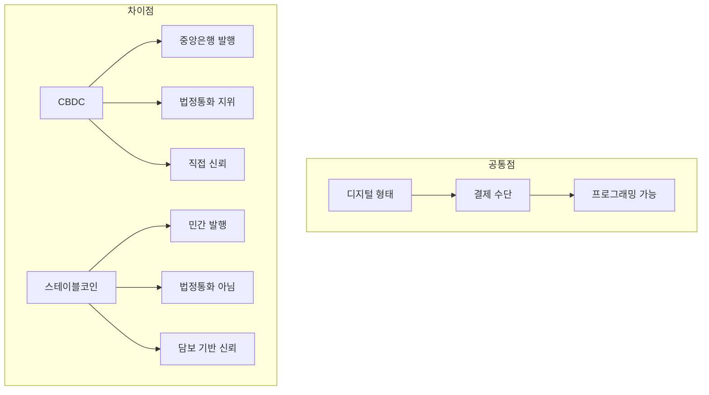

# 핵심 개념

> 마지막 검토: 2025년 5월

스테이블코인 규제를 이해하기 위한 핵심 개념을 정리한다. 각 개념은 규제 프레임워크와 실제 상품 분석의 기초가 된다.

## 용어 정리표

| 용어 | 영문 | 정의 | 관련 섹션 |
|------|------|------|-----------|
| 법정화폐 담보형 | Fiat-Collateralized | 법정화폐를 1:1로 보유하여 가치 유지 | [유형](#1-스테이블코인-유형) |
| 암호화폐 담보형 | Crypto-Collateralized | 가상자산을 과잉 담보로 가치 유지 | [유형](#1-스테이블코인-유형) |
| 알고리즘형 | Algorithmic | 알고리즘으로 공급량을 조절하여 가치 유지 | [유형](#1-스테이블코인-유형) |
| 준비금 | Reserve | 발행된 스테이블코인의 가치를 뒷받침하는 자산 | [준비금](#2-준비금과-준비금-증명) |
| 페깅 | Pegging | 기준 자산에 가격을 고정하는 메커니즘 | [페깅](#3-페깅과-디페깅) |
| EMT | E-Money Token | MiCA 정의 단일 법정화폐 연동 토큰 | [EMT](#4-emt-e-money-token) |
| ART | Asset-Referenced Token | MiCA 정의 복수 자산 참조 토큰 | [ART](#5-art-asset-referenced-token) |
| 상환권 | Redemption Right | 액면가 상환 청구 권리 | [상환권](#6-상환권) |
| CBDC | Central Bank Digital Currency | 중앙은행 발행 디지털 화폐 | [CBDC](#8-cbdc와-스테이블코인) |

---

## 1. 스테이블코인 유형

### 법정화폐 담보형 (Fiat-Collateralized)

**정의**: 발행된 토큰과 동일한 가치의 법정화폐(또는 현금성 자산)를 은행 계좌나 수탁기관에 보유하는 방식.

**왜 중요한가**: 전체 스테이블코인 시가총액의 90% 이상을 차지하며, 규제 당국이 가장 먼저 제도권에 편입하려는 유형이다. 준비금의 구성과 투명성이 핵심 규제 쟁점이다.

**실제 예시**:

- **USDT**: Tether Limited 발행. 미국 국채 중심의 준비금 보유 (시가총액 약 1,400억$)
- **USDC**: Circle 발행. 현금 + 단기 미국 국채 100% 담보 (시가총액 약 600억$)
- **PYUSD**: PayPal 발행. 미국 달러 예금 + 국채 담보

### 암호화폐 담보형 (Crypto-Collateralized)

**정의**: 다른 가상자산(ETH, BTC 등)을 스마트 컨트랙트에 과잉 담보(150~200%)로 예치하여 스테이블코인을 발행하는 방식.

**왜 중요한가**: 탈중앙화를 유지하면서 가격 안정을 추구한다는 점에서 DeFi의 핵심 인프라이다. 그러나 담보 가치 하락 시 연쇄 청산 리스크가 존재하며, 규제 관점에서 발행 주체와 책임 소재가 불명확하다.

**실제 예시**:

- **DAI**: MakerDAO(현 Sky Protocol)의 과잉 담보 스테이블코인. ETH, USDC 등 다양한 담보 수용
- **LUSD**: Liquity Protocol 발행. ETH만을 담보로 사용하며 최소 110% 담보율 유지

### 알고리즘형 (Algorithmic)

**정의**: 실물 담보 없이 알고리즘(민트/번 메커니즘, 차익거래 인센티브 등)으로 공급량을 조절하여 가격을 유지하는 방식.

**왜 중요한가**: Terra/Luna 붕괴(2022년 5월)로 인해 알고리즘형 스테이블코인의 구조적 취약성이 입증되었다. 대부분의 규제 프레임워크가 알고리즘형에 대해 가장 엄격한 기준을 적용하거나, 발행 자체를 금지하는 방향으로 진행 중이다.

**실제 예시**:

- **UST (붕괴)**: Terra 블록체인의 알고리즘 스테이블코인. LUNA 토큰과의 민트/번 메커니즘 실패로 400억$ 증발
- **FRAX**: 부분 담보 + 부분 알고리즘 하이브리드 모델. 이후 완전 담보 모델로 전환

### 상품 담보형 (Commodity-Backed)

**정의**: 금, 은, 원유 등 실물 상품을 담보로 하여 토큰 가치를 유지하는 방식.

**왜 중요한가**: 전통 상품 투자의 접근성을 높이지만, 상품 규제와 가상자산 규제가 중첩 적용되는 복잡한 규제 영역이다.

**실제 예시**:

- **PAXG**: Paxos 발행, 런던 금고에 보관된 실물 금 1온스에 연동
- **XAUT**: Tether Gold. 스위스 금고의 실물 금 담보

---

## 2. 준비금과 준비금 증명

### 준비금 (Reserve)

**정의**: 발행된 스테이블코인의 가치를 뒷받침하기 위해 발행사가 보유하는 자산 포트폴리오. 법정화폐 담보형의 경우 현금, 은행 예금, 국채, 기업어음(CP), MMF 등으로 구성된다.

**왜 중요한가**: 준비금의 양과 질이 스테이블코인의 안정성을 직접 결정한다. 규제의 핵심은 준비금 구성 기준, 분리 보관 의무, 정기 감사 요건이다.

**규제별 준비금 요건 비교**:

| 요건 | MiCA (EU) | GENIUS Act (미국) | 싱가포르 MAS |
|------|-----------|-------------------|-------------|
| 담보 비율 | 100% 이상 | 100% 이상 | 100% 이상 |
| 허용 자산 | 현금, 단기 국채, 역RP | 현금, 국채(93일 이내), 역RP | 현금, 국채, MAS 인정 자산 |
| 분리 보관 | 의무 | 의무 | 의무 |
| 감사 주기 | 월간 이상 | 월간 | 월간 |
| 공시 | 수시 + 정기 | 월간 | 월간 |

### 준비금 증명 (Proof of Reserves)

**정의**: 스테이블코인 발행사가 보유한 준비금이 실제로 발행량을 뒷받침하는지 독립적 제3자(회계법인 등)가 검증하고 그 결과를 공개하는 절차.

**왜 중요한가**: 준비금 부실은 스테이블코인 신뢰의 근간을 흔든다. Tether의 준비금 투명성 논란이 대표적 사례이며, 체인링크(Chainlink) 등은 온체인 Proof of Reserves 오라클 서비스를 제공하여 실시간 검증을 시도한다.

**실제 예시**:

- **USDC**: 매월 Deloitte가 준비금 증명 보고서 발행
- **USDT**: 분기별 BDO Italia가 증명 보고서 발행 (과거 투명성 논란 존재)

!!! note "증명(Attestation) vs 감사(Audit)"
    현재 대부분의 스테이블코인 발행사가 공개하는 것은 특정 시점의 **증명(attestation)**이며, 전체 기간의 재무 상태를 검토하는 정식 **감사(audit)**와는 다르다. 규제 당국은 점차 정식 감사를 요구하는 방향으로 움직이고 있다.

---

## 3. 페깅과 디페깅

### 페깅 (Pegging)

**정의**: 스테이블코인의 가격을 기준 자산(일반적으로 USD 1.00)에 고정하는 메커니즘. 발행·상환, 차익거래, 알고리즘 조절 등 다양한 방식이 사용된다.

**왜 중요한가**: 페깅 메커니즘의 견고성이 스테이블코인의 존재 이유 자체를 결정한다. 규제는 이 메커니즘이 스트레스 상황에서도 작동하도록 준비금 요건, 상환 절차, 유동성 버퍼 등을 요구한다.

### 페깅 유지 메커니즘

### 디페깅 (Depegging)

**정의**: 스테이블코인이 기준 가격에서 유의미하게 이탈하는 현상. 일시적(수시간~수일) 또는 영구적(UST 붕괴)일 수 있다.

**왜 중요한가**: 디페깅은 보유자의 자산 손실로 직결되며, 시스템적 중요 스테이블코인의 디페깅은 금융 안정을 위협할 수 있다.

**주요 디페깅 사례**:

| 시점 | 스테이블코인 | 최저가 | 원인 | 회복 여부 |
|------|-------------|--------|------|-----------|
| 2022-05 | UST | $0.00 | 알고리즘 실패, LUNA 무한 발행 | 미회복 (영구 붕괴) |
| 2023-03 | USDC | $0.87 | SVB 파산 (준비금 33억$ 예치) | 회복 (3일 소요) |
| 2023-03 | DAI | $0.89 | USDC 디페깅 전이 (DAI 담보의 일부가 USDC) | 회복 |
| 2022-05 | USDT | $0.95 | Terra/Luna 패닉 전이 | 회복 (수일 소요) |

---

## 4. EMT (E-Money Token)

**정의**: MiCA(Markets in Crypto-Assets Regulation)에서 정의하는 전자화폐 토큰. **단일 법정화폐**의 가치를 참조하여 안정적 가치를 유지하는 것을 목적으로 하는 가상자산이다.

**왜 중요한가**: USDC, USDT 같은 달러 연동 스테이블코인이 EMT로 분류된다. EMT 발행자는 기존 전자화폐 지침(EMD2)에 따라 **전자화폐기관(EMI)** 또는 **신용기관(은행)** 인가를 받아야 한다.

**핵심 요건**:

- 보유자에게 언제든 액면가 상환권 보장
- 발행량의 100% 이상을 안전자산으로 보유
- 준비금은 신탁 또는 별도 계좌에 분리 보관
- 준비금에 이자를 지급하거나 토큰 보유자에게 수익을 제공할 수 없음

**실제 예시**: Circle의 USDC는 2024년 프랑스 ACPR(금융건전성감독청)로부터 EMI 인가를 받아 EU 내에서 합법적 EMT로 발행 가능해졌다.

→ 상세: [EU 규제 현황](by-country/eu.md)

---

## 5. ART (Asset-Referenced Token)

**정의**: MiCA에서 정의하는 자산참조토큰. **복수의 법정화폐, 상품, 가상자산, 또는 이들의 조합**을 참조하여 안정적 가치를 유지하는 것을 목적으로 하는 가상자산이다.

**왜 중요한가**: Facebook(현 Meta)의 Libra/Diem 프로젝트가 복수 화폐 바스켓 연동을 계획했던 것이 ART 규정 탄생의 배경이다. EMT보다 더 엄격한 규제가 적용되며, 발행 전 관할 감독기관의 사전 승인이 필요하다.

**핵심 요건**:

- 감독기관의 사전 인가 필수 (EMT보다 엄격)
- 최소 자기자본 요건 (35만 유로 또는 준비자산의 2% 중 큰 금액)
- 준비금 구성, 투자, 관리에 대한 상세 정책 수립 의무
- 거버넌스, 이해충돌 관리, 사업 연속성 계획 요구

**EMT vs ART 비교**:

| 구분 | EMT | ART |
|------|-----|-----|
| 참조 자산 | 단일 법정화폐 | 복수 자산 조합 |
| 발행자 자격 | 전자화폐기관 또는 은행 | MiCA 별도 인가 필요 |
| 상환권 | 무조건 액면가 상환 | 상환 조건 백서에 명시 |
| 감독 기관 | 회원국 NCA | NCA + EBA(significant인 경우) |
| 대표 사례 | USDC, EURC | (현재 활발한 사례 적음) |

---

## 6. 상환권 (Redemption Right)

**정의**: 스테이블코인 보유자가 발행사에 대해 토큰의 액면가에 해당하는 법정화폐 또는 기준 자산으로의 교환을 요구할 수 있는 법적 권리.

**왜 중요한가**: 상환권은 스테이블코인의 가격 안정 메커니즘의 핵심이며, 보유자 보호의 최후 수단이다. 상환권이 없으면 스테이블코인은 유통 시장의 수급에만 의존하게 되어 페깅 유지가 불안정해진다.

**규제 프레임워크별 상환권 비교**:

| 항목 | MiCA (EMT) | MiCA (ART) | GENIUS Act (미국) |
|------|-----------|-----------|-------------------|
| 상환 보장 | 무조건 보장 | 조건부 (백서 명시) | 무조건 보장 |
| 수수료 | 제한적 허용 | 합리적 범위 | 발행사 정책 |
| 처리 기한 | 당일~익영업일 | 백서에 명시 | 합리적 기한 |
| 최소 금액 | 제한 불가 | 설정 가능 | 발행사 정책 |

!!! warning "실질적 상환 가능성"
    법적 상환권이 존재하더라도 대규모 뱅크런 시 실제 상환이 원활히 이루어지는지는 별개의 문제다. 준비금의 유동성(즉시 현금화 가능 여부)과 상환 절차의 효율성이 핵심이다.

---

## 7. 시스템적 중요 스테이블코인 (Significant Stablecoin)

**정의**: 발행 규모, 거래량, 사용자 수 등이 일정 기준을 초과하여 금융 안정에 영향을 미칠 수 있다고 판단되는 스테이블코인. MiCA에서는 Significant EMT/ART로 지정되며, 추가 규제가 적용된다.

**왜 중요한가**: 시스템적으로 중요한 스테이블코인의 실패는 전체 금융 시스템에 파급될 수 있으므로, 일반 스테이블코인보다 더 높은 수준의 건전성 규제가 적용된다.

**MiCA의 Significant 지정 기준** (하나 이상 충족 시):

- 보유자 수 1,000만 명 이상
- 시가총액 50억 유로 이상
- 일일 거래 건수 250만 건 이상 또는 거래 금액 5억 유로 이상
- 국제 활동 범위 (15개국 이상)
- 금융 시스템 연계성

**추가 요건**: 더 높은 자기자본 요건, 유동성 스트레스 테스트, 회복·정리 계획(Recovery & Resolution Plan), EBA 직접 감독.

---

## 8. CBDC와 스테이블코인

**정의**: CBDC(Central Bank Digital Currency)는 중앙은행이 직접 발행하는 디지털 화폐다. 스테이블코인은 민간 발행 토큰인 반면, CBDC는 법정통화의 디지털 형태이다.

**왜 중요한가**: CBDC와 스테이블코인은 경쟁이자 보완 관계에 있다. 많은 국가가 CBDC 개발을 추진하면서 스테이블코인 규제 방향에도 영향을 미치고 있다.

| 비교 항목 | CBDC | 스테이블코인 |
|-----------|------|-------------|
| 발행 주체 | 중앙은행 | 민간 기업/프로토콜 |
| 법적 지위 | 법정통화 | 가상자산/전자화폐 |
| 신뢰 기반 | 국가 신용 | 준비금/담보 |
| 프라이버시 | 정책에 따라 상이 | 블록체인 투명성 |
| 프로그래밍 | 제한적 | 스마트 컨트랙트 활용 |
| 현재 상태 | 대부분 파일럿/연구 단계 | 실제 대규모 운용 중 |

**실제 예시**:

- **디지털 유로**: ECB가 2025년 준비 단계 진행 중. MiCA 스테이블코인 규제와 병행
- **디지털 원화**: 한국은행 CBDC 파일럿 프로그램 진행
- **디지털 위안(e-CNY)**: 중국, 가장 진전된 CBDC. 스테이블코인은 사실상 금지

→ 상세: [트렌드 및 전망](trends.md) | [가상자산 규제 - 트렌드](../crypto-regulation/trends.md)

---

> [개요로 돌아가기](index.md) | [규제 프레임워크](frameworks.md) | [국가별 현황](by-country/index.md)
