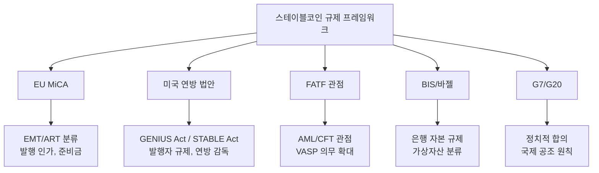
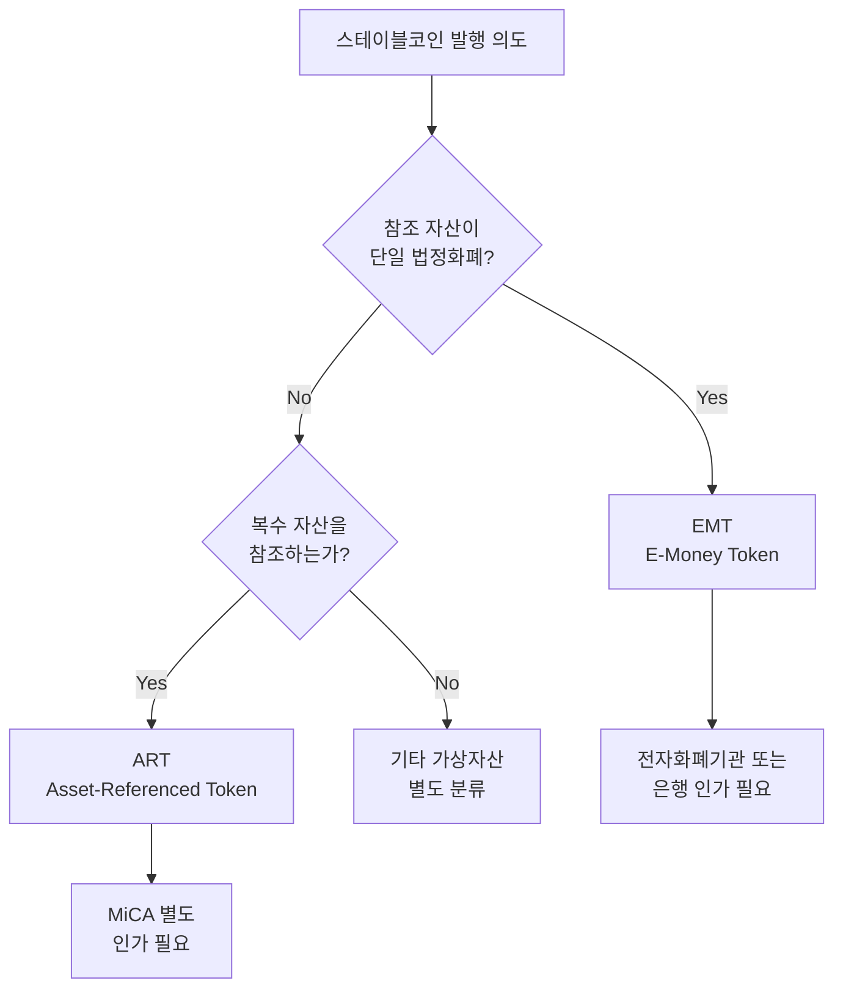
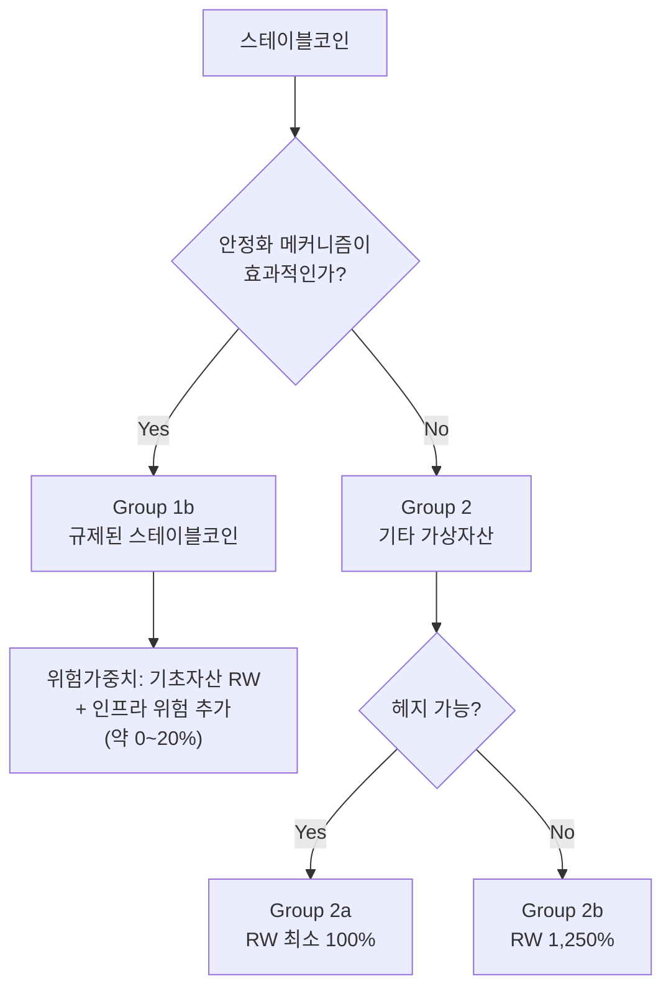
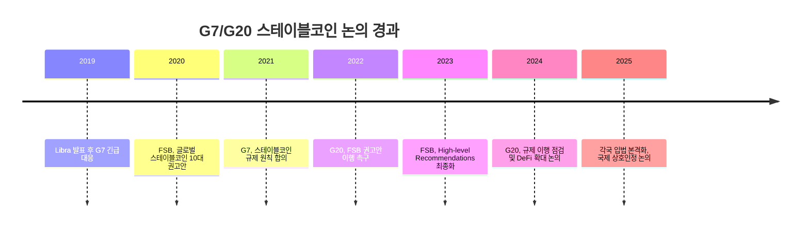
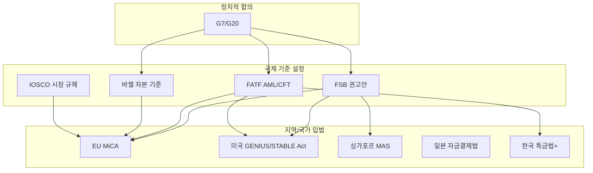

# 규제 프레임워크

> 마지막 검토: 2025년 5월

스테이블코인에 적용되는 주요 글로벌 규제 프레임워크를 정리한다. 각 프레임워크는 서로 다른 기관과 관점에서 스테이블코인을 규율하며, 점차 수렴하는 추세를 보이고 있다.

---

## 1. MiCA의 스테이블코인 규제

### 개요

MiCA(Markets in Crypto-Assets Regulation, EU 2023/1114)는 세계 최초의 포괄적 가상자산 규제 법안으로, 스테이블코인을 **EMT(E-Money Token)**와 **ART(Asset-Referenced Token)**로 분류하여 규제한다. 스테이블코인 관련 조항은 2024년 6월부터 시행되었다.

### EMT/ART 분류 체계

### EMT 발행 요건

| 요건 | 내용 |
|------|------|
| **발행자 자격** | EU 내 인가된 전자화폐기관(EMI) 또는 신용기관(은행) |
| **백서** | 표준화된 가상자산 백서 발행·공시 의무 |
| **준비금** | 발행량 100% 이상을 안전자산(현금, 단기 국채)으로 보유 |
| **분리 보관** | 준비금은 발행자 자산과 분리하여 신탁/별도 계좌에 보관 |
| **상환권** | 보유자에게 무조건 액면가 상환권 보장 |
| **이자 금지** | 토큰 보유에 대한 이자/수익 제공 불가 |
| **감독** | 회원국 감독기관(NCA)의 감독. Significant인 경우 EBA 직접 감독 |

### ART 발행 요건

| 요건 | 내용 |
|------|------|
| **사전 인가** | 회원국 NCA에 사전 인가 신청. 평가 기간 3개월 |
| **자기자본** | 최소 35만 유로 또는 준비금의 2% 중 큰 금액 |
| **준비금 정책** | 준비금 구성, 배분, 리스크 관리 정책 수립·공시 |
| **거버넌스** | 이해충돌 방지, 사업 연속성 계획, 내부 통제 체계 |
| **회복·정리 계획** | Significant인 경우 회복 및 정리 계획 수립 의무 |
| **거래량 제한** | Significant ART: 일일 100만 건 또는 2억 유로 초과 시 추가 조치 |

### 준비금 투자 제한

MiCA는 준비금의 안전성을 위해 투자 가능 자산을 엄격히 제한한다:

- 고신용등급 국채 (만기 제한)
- 중앙은행 예치금
- 역환매조건부채권(역RP)
- 고신용등급 커버드본드 (제한적)

!!! warning "이자 지급 금지"
    MiCA는 EMT/ART 보유자에게 이자를 지급하는 것을 명시적으로 금지한다. 이는 스테이블코인이 예금 상품으로 변질되는 것을 방지하기 위함이며, DeFi에서의 수익 창출(lending, staking)과의 경계가 주요 쟁점이다.

→ 상세: [EU 규제 현황](by-country/eu.md)

---

## 2. 미국 스테이블코인 법안

### 개요

미국은 2025년 현재 스테이블코인에 대한 포괄적 연방 법률이 아직 제정되지 않았다. 그러나 2025년 상반기를 기점으로 초당적 입법 작업이 활발히 진행 중이며, GENIUS Act와 STABLE Act가 대표적 법안이다.

### GENIUS Act (Guiding and Establishing National Innovation for U.S. Stablecoins)

2025년 상원에서 발의된 초당적 법안으로, 스테이블코인 발행에 대한 연방 수준의 규제 프레임워크를 최초로 수립하려는 시도이다.

**주요 내용**:

| 조항 | 내용 |
|------|------|
| **정의** | 결제용 스테이블코인(Payment Stablecoin)을 법정화폐에 고정되고 상환 가능한 디지털 자산으로 정의 |
| **발행자 분류** | 연방 인가(OCC) 또는 주(state) 인가 이원 구조 |
| **준비금 요건** | 100% 고품질 유동 자산(현금, 93일 이내 국채, 중앙은행 준비금, 역RP) |
| **상환권** | 보유자에게 1:1 액면가 상환권 보장 |
| **감사** | 독립적 월간 준비금 증명(attestation) 의무 |
| **규모 기준선** | 발행량 100억$ 초과 시 연방 감독 의무 적용 |
| **알고리즘 금지** | 순수 알고리즘형 스테이블코인 발행 금지 |
| **SEC 명확화** | 결제용 스테이블코인은 증권이 아님을 명시 |

### STABLE Act (Stablecoin Transparency and Accountability for a Better Ledger Economy)

2025년 하원에서 발의된 법안으로, GENIUS Act와 유사한 방향이나 일부 차이가 존재한다.

**GENIUS Act vs STABLE Act 비교**:

| 항목 | GENIUS Act (상원) | STABLE Act (하원) |
|------|-------------------|-------------------|
| 발의 시기 | 2025년 2월 | 2025년 3월 |
| 감독 구조 | 연방/주 이원 구조 | 연방 중심 (Fed, OCC) |
| 규모 기준 | 100억$ 초과 시 연방 감독 | 발행사 규모별 차등 |
| 알고리즘형 | 발행 금지 | 2년 모라토리엄 |
| SEC 면제 | 명시적 비증권 선언 | 유사하나 표현 상이 |
| 진행 상황 | 상원 위원회 통과 (2025.03) | 하원 위원회 심의 중 |

!!! note "입법 전망 (2025년 기준)"
    양당 모두 스테이블코인 규제 필요성에 공감하고 있어, 2025년 내 어떤 형태로든 연방 스테이블코인 법이 제정될 가능성이 높다. 최종 법률은 두 법안의 절충안이 될 것으로 전망된다.

→ 상세: [미국 규제 현황](by-country/usa.md)

---

## 3. FATF 관점의 스테이블코인

### 개요

FATF(Financial Action Task Force)는 스테이블코인을 가상자산(Virtual Asset)의 하위 유형으로 분류하며, AML/CFT(자금세탁방지/테러자금조달방지) 관점에서 규제한다.

### 핵심 입장

- **가상자산 정의에 포함**: 스테이블코인은 FATF 정의상 가상자산이며, 발행·유통·교환에 관여하는 사업자는 VASP로서 FATF 권고안 준수 의무
- **Travel Rule 적용**: 스테이블코인 전송에도 Travel Rule(권고안 제16조) 적용
- **리스크 기반 접근**: 스테이블코인의 대규모 채택 시 자금세탁 리스크가 증가하므로 강화된 모니터링 필요

### 글로벌 스테이블코인(GSC)에 대한 특별 관심

FATF는 2020년 보고서에서 **글로벌 스테이블코인(Global Stablecoin, GSC)** 개념을 도입했다. GSC는 대규모 사용자 기반을 가진 스테이블코인(당시 Facebook/Libra 프로젝트를 염두)으로, 일반 스테이블코인보다 높은 수준의 AML/CFT 통제가 필요하다고 권고했다.

**GSC의 추가 리스크**:

- 다수 관할권에 걸친 운영으로 규제 차익(regulatory arbitrage) 가능
- 대규모 사용자 기반으로 자금세탁 경로가 될 위험
- 중앙 거버넌스 부재 시 의무 이행 주체 불분명

### FATF의 스테이블코인 관련 주요 문서

| 문서 | 시기 | 핵심 내용 |
|------|------|-----------|
| FATF Report on So-Called Stablecoins | 2020.06 | GSC 개념 도입, 리스크 분석 |
| Updated Guidance for VA and VASPs | 2021.10 | 스테이블코인 포함 VASP 의무 구체화 |
| Targeted Update on Implementation | 2024.07 | 각국 이행 현황 점검, 미이행국 경고 |

→ 관련: [가상자산 규제 - 프레임워크](../crypto-regulation/frameworks.md)

---

## 4. BIS/바젤의 스테이블코인 분류

### 개요

바젤은행감독위원회(BCBS)는 은행이 보유하는 가상자산에 대한 자본 요건을 2022년 12월 확정했다. 스테이블코인은 그 안정화 메커니즘의 효과성에 따라 다른 그룹으로 분류되며, 자본 요건이 크게 달라진다.

### 스테이블코인의 바젤 분류

**Group 1b 분류 요건** (효과적 안정화 메커니즘):

- 준비자산이 기초 자산에 충분히 일치
- 상환 메커니즘이 스트레스 상황에서도 작동
- 규제·감독 체계가 존재
- 발행자가 적절한 거버넌스와 리스크 관리 체계 보유

### 영향

| 분류 | 스테이블코인 예시 | 자본 부담 | 은행 보유 인센티브 |
|------|------------------|-----------|-------------------|
| Group 1b | 규제된 USDC, PYUSD | 낮음 (기초자산 수준) | 높음 |
| Group 2a | 규제 미비 스테이블코인 | 중간 (100%+) | 중간 |
| Group 2b | 알고리즘형, 비투명 | 매우 높음 (1,250%) | 사실상 보유 억제 |

!!! note "은행의 스테이블코인 전략"
    바젤 분류에 따라 은행은 Group 1b에 해당하는 규제된 스테이블코인(USDC, PYUSD 등)을 선호하게 되며, 이는 규제 준수 스테이블코인의 시장 점유율 확대를 촉진한다.

→ 관련: [가상자산 규제 - 바젤 프레임워크](../crypto-regulation/frameworks.md#3-바젤-프레임워크-은행의-가상자산-익스포저)

---

## 5. G7/G20 논의

### 개요

G7과 G20은 스테이블코인(특히 글로벌 스테이블코인)에 대한 정치적 합의와 국제 공조 원칙을 제시하는 역할을 한다. 실질적인 규제 기준은 FATF, BCBS, IOSCO 등 기술 기구가 수립하지만, G7/G20의 정치적 합의가 이를 뒷받침한다.

### 주요 논의 경과

### FSB(금융안정위원회) 글로벌 스테이블코인 권고안

G20의 위임을 받은 FSB가 2023년 최종 확정한 **High-level Recommendations for the Regulation, Supervision and Oversight of Global Stablecoin Arrangements**의 10대 원칙:

| 번호 | 원칙 | 내용 |
|------|------|------|
| 1 | 포괄적 규제 | GSC는 포괄적이고 비례적인 규제·감독 대상 |
| 2 | 비례성 | 리스크에 비례한 규제 적용 |
| 3 | 관할 간 협력 | 국제적 정보 공유 및 공조 |
| 4 | 거버넌스 | 효과적 거버넌스 체계 요구 |
| 5 | 리스크 관리 | 포괄적 리스크 관리 프레임워크 |
| 6 | 데이터 관리 | 안전한 데이터 수집·저장·보호 |
| 7 | 회복·정리 계획 | 위기 시 대응 계획 수립 |
| 8 | 준비금 관리 | 안정적이고 투명한 준비금 관리 |
| 9 | 상환권 | 명확한 상환 권리 및 절차 |
| 10 | 금융안정 대응 | 금융 안정을 저해하기 전 적절한 조치 |

### 핵심 원칙: "Same Activity, Same Risk, Same Regulation"

G7/G20의 일관된 메시지는 **"동일 활동, 동일 리스크, 동일 규제"** 원칙이다. 스테이블코인이 결제·저축·투자 기능을 수행한다면, 전통 금융과 동일 수준의 규제를 적용해야 한다는 것이다.

---

## 프레임워크 간 관계

---

## 참고 자료

- EU: [Regulation (EU) 2023/1114 (MiCA)](https://eur-lex.europa.eu/eli/reg/2023/1114/oj) - Title III (ART), Title IV (EMT)
- US Senate: [GENIUS Act (S.394)](https://www.congress.gov/bill/119th-congress/senate-bill/394)
- FATF: [Report on So-Called Stablecoins (2020)](https://www.fatf-gafi.org/en/publications/Virtualassets/Report-so-called-stablecoins.html)
- BIS/BCBS: [Prudential treatment of cryptoasset exposures (2022)](https://www.bis.org/bcbs/publ/d545.htm)
- FSB: [High-level Recommendations for GSC Arrangements (2023)](https://www.fsb.org/2023/07/high-level-recommendations-for-the-regulation-supervision-and-oversight-of-global-stablecoin-arrangements-final-report/)

---

> [개요로 돌아가기](index.md) | [국가별 현황](by-country/index.md) | [주요 스테이블코인](products/index.md)
