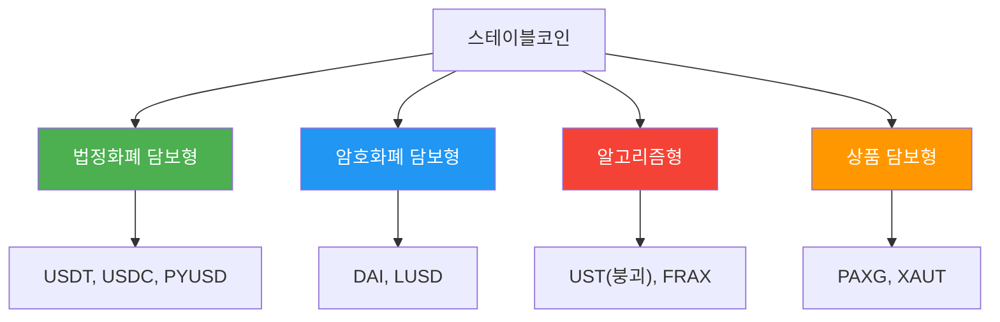
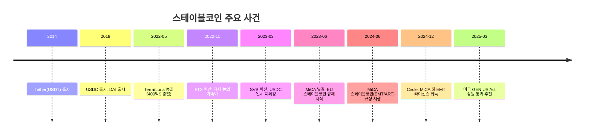

---
tags:
  - 디지털자산
  - 규제
  - 스테이블코인
---
# 스테이블코인 규제 개요

> 마지막 검토: 2025년 5월

## 스테이블코인이란 무엇인가

스테이블코인(Stablecoin)은 가격 변동성을 최소화하기 위해 특정 자산(법정화폐, 상품, 가상자산 등)에 가치를 연동(peg)한 가상자산이다. 2025년 기준 전체 시가총액은 약 2,300억 달러를 넘어섰으며, 가상자산 거래의 결제 매개, 국제 송금, DeFi 유동성 공급 등 광범위한 용도로 활용되고 있다.

### 스테이블코인 유형

| 유형 | 담보 방식 | 대표 사례 | 리스크 수준 |
|------|-----------|-----------|-------------|
| **법정화폐 담보형** | 법정화폐(USD 등) 1:1 보유 | USDT, USDC | 낮음 (담보 투명성에 따라 상이) |
| **암호화폐 담보형** | 가상자산 과잉 담보(150%+) | DAI, LUSD | 중간 (담보 가치 변동) |
| **알고리즘형** | 알고리즘으로 공급 조절 | UST(붕괴) | 높음 (디페깅 위험) |
| **상품 담보형** | 금, 원유 등 실물 자산 | PAXG, XAUT | 중간 (상품 가격 변동) |

## 왜 규제가 중요한가

### 시스템 리스크

스테이블코인은 전통 금융 시스템과 가상자산 시장의 접점에 위치한다. 대규모 스테이블코인의 붕괴나 뱅크런은 금융 시스템 전체에 파급될 수 있다.

### 투자자 보호

스테이블코인 보유자는 사실상 발행사에 대한 채권을 보유하는 것과 유사하다. 준비금의 적정성과 상환 가능성이 보장되지 않으면 보유자가 손실을 입을 수 있다.

### Terra/Luna 사태의 교훈

2022년 5월, 알고리즘 스테이블코인 UST의 디페깅과 연쇄 붕괴로 약 400억 달러가 증발했다. 이 사건은 스테이블코인 규제 논의를 전 세계적으로 가속화한 결정적 계기가 되었다.

## 핵심 키워드

| 키워드 | 설명 |
|--------|------|
| **스테이블코인** | 특정 자산에 가치를 연동한 가상자산. 가격 안정성이 핵심 특성 |
| **EMT** | E-Money Token. MiCA에서 정의하는 단일 법정화폐 연동 토큰 |
| **ART** | Asset-Referenced Token. MiCA에서 정의하는 복수 자산 참조 토큰 |
| **준비금(Reserve)** | 스테이블코인 가치를 뒷받침하는 담보 자산 |
| **상환권(Redemption Right)** | 보유자가 액면가로 법정화폐 교환을 요구할 수 있는 권리 |
| **디페깅(Depegging)** | 스테이블코인이 기준 가격에서 이탈하는 현상 |
| **Proof of Reserves** | 준비금 보유를 제3자가 검증하는 절차 |
| **Significant Stablecoin** | MiCA 기준 시스템적으로 중요한 스테이블코인 (추가 규제 적용) |
| **CBDC** | Central Bank Digital Currency. 중앙은행 디지털 화폐 |
| **뱅크런(Bank Run)** | 대규모 동시 상환 요청으로 인한 유동성 위기 |

## 하위 문서

| 문서 | 내용 |
|------|------|
| [핵심 개념](concepts.md) | 스테이블코인 유형, 준비금, 페깅 메커니즘, EMT/ART, CBDC |
| [규제 프레임워크](frameworks.md) | MiCA, 미국 법안, FATF, BIS/바젤, G7/G20 논의 |
| [국가별 현황](by-country/index.md) | 주요국 규제 비교표 및 상세 분석 |
| [한국](by-country/korea.md) | 특금법, 이용자보호법, 원화 스테이블코인, CBDC |
| [미국](by-country/usa.md) | GENIUS Act, STABLE Act, SEC/CFTC, OCC |
| [EU](by-country/eu.md) | MiCA EMT/ART 상세, 준비금 요건, 거래량 상한 |
| [주요 스테이블코인](products/index.md) | USDT, USDC, DAI 등 비교 분석 |
| [USDT](products/usdt.md) | Tether 발행, 담보 구성, 규제 이슈 |
| [USDC](products/usdc.md) | Circle 발행, MiCA 승인, SVB 디페깅 |
| [DAI](products/dai.md) | MakerDAO, 과잉 담보, 탈중앙화 쟁점 |
| [트렌드 및 전망](trends.md) | CBDC 경쟁, 결제 인프라, RWA 토큰화 |

## 관련 도메인

- **[가상자산 규제](../crypto-regulation/index.md)**: 스테이블코인은 가상자산 규제의 핵심 하위 영역. VASP 규제, AML/KYC 의무가 스테이블코인 발행·유통에도 적용
- **[PG (Payment Gateway)](../pg-service/index.md)**: 스테이블코인을 결제 수단으로 활용하는 경우 PG 연동 및 전자금융업 규제와 교차
- **[MOR (Merchant of Record)](../mor-service/index.md)**: 가상자산 결제를 수용하는 MOR 모델에서 스테이블코인의 법적 지위가 중요

!!! warning "규제 변동 주의"
    스테이블코인 규제는 전 세계적으로 빠르게 변화하고 있다. 본 문서는 학습 참고용이며, 실제 사업 의사결정 시에는 반드시 최신 법령과 전문 법률 자문을 확인해야 한다.
