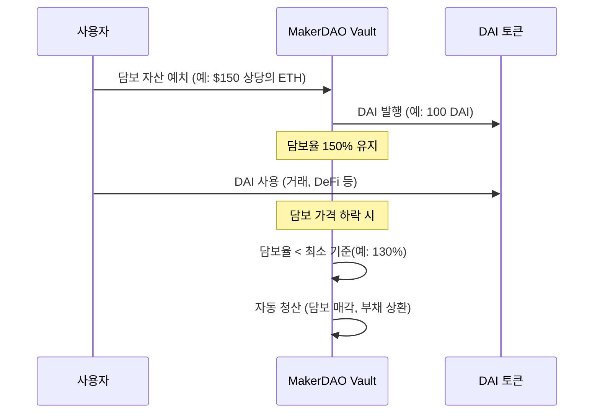
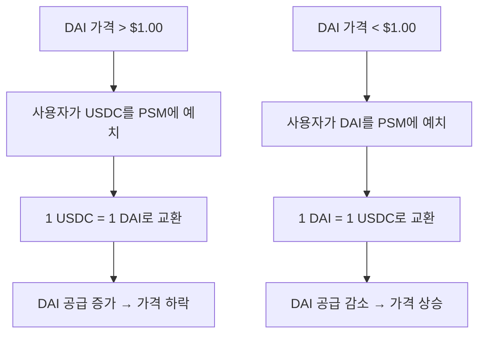
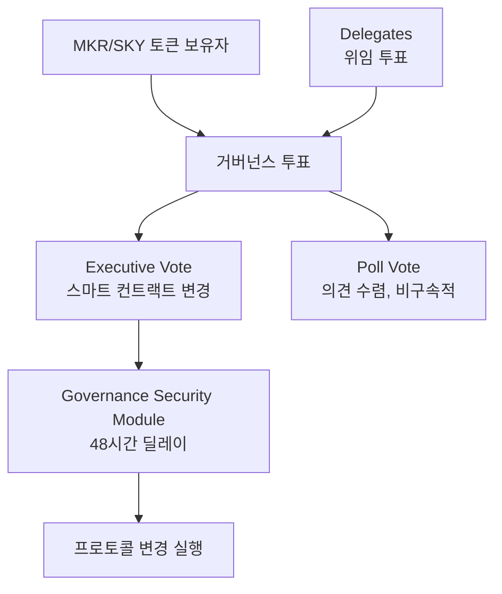

---
tags:
  - 디지털자산
  - 규제
  - 스테이블코인
---
# DAI (MakerDAO / Sky Protocol)

> 마지막 검토: 2025년 5월

## 기본 정보

| 항목 | 내용 |
|------|------|
| **정식 명칭** | DAI Stablecoin |
| **발행 프로토콜** | MakerDAO (2024년 Sky Protocol로 리브랜딩) |
| **출시** | 2017년 12월 (Single-Collateral DAI), 2019년 11월 (Multi-Collateral DAI) |
| **시가총액** | 약 50억$ (2025년 기준) |
| **페깅 대상** | USD 1.00 |
| **유형** | 암호화폐 담보형 (과잉 담보) |
| **거버넌스 토큰** | MKR (MakerDAO) → SKY (Sky Protocol) |
| **블록체인** | Ethereum 기반 (브릿지를 통해 타 체인 확장) |

---

## 담보 메커니즘

### 과잉 담보 시스템 (CDP / Vault)

DAI는 법정화폐가 아닌 가상자산을 과잉 담보(over-collateralization)로 예치하여 발행되는 탈중앙화 스테이블코인이다.

### 담보 자산 구성 (2025년 기준)

DAI의 담보 구성은 출시 이래 크게 변화해왔다. 초기에는 ETH만 담보로 사용했으나, Multi-Collateral DAI 이후 다양한 자산을 수용한다.

| 담보 유형 | 비율 (약) | 설명 |
|-----------|-----------|------|
| **USDC** | ~20% | PSM(Peg Stability Module)을 통한 1:1 교환 |
| **ETH** | ~15% | 전통적 과잉 담보 Vault |
| **stETH (Lido)** | ~15% | ETH 리퀴드 스테이킹 토큰 |
| **RWA (실물자산)** | ~30% | 미국 국채, 기업 채권 등 토큰화된 실물 자산 |
| **WBTC** | ~5% | 래핑된 비트코인 |
| **기타 가상자산** | ~5% | LINK, UNI 등 |
| **기타** | ~10% | D3M, 다양한 Vault 유형 |

### 담보별 최소 담보율

| 담보 자산 | 최소 담보율 | 청산 페널티 |
|-----------|------------|-------------|
| ETH-A | 145% | 13% |
| ETH-B | 130% | 13% |
| ETH-C | 170% | 13% |
| WBTC-A | 145% | 13% |
| stETH | 155% | 13% |
| USDC (PSM) | 100% | 없음 (1:1 교환) |

!!! note "RWA 비중 증가"
    DAI 담보 중 RWA(실물자산 토큰화) 비중이 30%에 달하며, 이는 탈중앙화 스테이블코인이 전통 금융 자산에 의존하는 역설적 상황을 만들었다. "탈중앙화 스테이블코인의 담보가 중앙화된 자산"이라는 비판이 존재한다.

---

## 페깅 안정화 메커니즘

### Peg Stability Module (PSM)

PSM은 DAI의 가격을 $1.00에 안정시키는 핵심 메커니즘이다.

### DAI Savings Rate (DSR)

DSR은 DAI 보유자에게 이자를 지급하는 메커니즘이다. MakerDAO 거버넌스가 금리를 설정하며, 이는 DAI의 수요·공급을 조절하는 통화정책 도구 역할을 한다.

| 항목 | 내용 |
|------|------|
| 현재 금리 | ~8% (2025년 기준, 거버넌스 투표로 조정) |
| 재원 | Vault에서 징수하는 안정화 수수료(Stability Fee) |
| 역할 | DAI 수요 조절, 페깅 안정 기여 |

---

## 거버넌스

### MKR / SKY 토큰 거버넌스

DAI는 MKR(리브랜딩 후 SKY) 토큰 보유자의 거버넌스 투표로 운영된다.

| 거버넌스 항목 | 설명 |
|-------------|------|
| **담보 추가/제거** | 새로운 담보 유형 승인 또는 기존 담보 제거 |
| **리스크 파라미터** | 각 담보의 최소 담보율, 청산 페널티, 부채 한도 조정 |
| **DSR 금리** | DAI Savings Rate 조정 |
| **안정화 수수료** | 각 Vault 유형별 이자율 설정 |
| **프로토콜 업그레이드** | 스마트 컨트랙트 변경, 새 모듈 도입 |
| **RWA 투자** | 실물자산 투자 결정 |

### 거버넌스 구조

---

## 탈중앙화 스테이블코인의 규제 쟁점

### 핵심 질문

DAI와 같은 탈중앙화 스테이블코인은 기존 규제 프레임워크에 잘 맞지 않으며, 여러 근본적 질문을 제기한다.

| 쟁점 | 질문 | 현재 상태 |
|------|------|-----------|
| **발행 주체** | 발행자가 스마트 컨트랙트/DAO인 경우 누가 규제 대상인가? | 대부분의 관할권에서 미해결 |
| **MiCA 적용** | DAI는 EMT인가, ART인가, 기타인가? | MiCA는 "완전히 탈중앙화된" 경우 적용 제외 가능. 그러나 MakerDAO의 탈중앙화 정도가 논란 |
| **미국 규제** | GENIUS Act/STABLE Act가 DAI에 적용되는가? | 탈중앙화 스테이블코인에 대한 별도 조항 논의 중 |
| **준비금 요건** | 스마트 컨트랙트에 잠긴 담보는 준비금인가? | 기존 준비금 규제와 다른 패러다임 |
| **상환권** | DAI 보유자의 상환 청구 대상은? | Vault 메커니즘으로 교환 가능하나, 전통적 상환권과 다름 |
| **AML/KYC** | 허가 없이 누구나 DAI를 발행할 수 있는데 KYC 적용이 가능한가? | 프로토콜 수준 KYC 미적용, 프론트엔드 수준 제한 가능 |

### 각국 규제 당국의 접근

| 관할권 | 접근 방식 |
|--------|-----------|
| **EU (MiCA)** | "충분히 탈중앙화된" 프로젝트는 적용 제외. 그러나 MakerDAO Foundation 존재로 완전 탈중앙화 여부 논란 |
| **미국** | SEC: 사안별 판단. MKR 토큰이 증권에 해당할 가능성 논의. DAI 자체는 결제 수단 |
| **일본** | 탈중앙화 발행은 자금결제법상 허용되지 않으며, 일본 내 DAI 유통은 거래소를 통해서만 가능 |
| **한국** | 별도 규제 없음. 가상자산으로 분류되어 거래소에서 거래 가능 |

!!! warning "탈중앙화의 허상?"
    MakerDAO/Sky Protocol은 형식적으로 DAO 거버넌스를 채택하지만, 소수의 대규모 MKR/SKY 보유자가 거버넌스를 지배하고, MakerDAO Foundation(현 Dai Foundation)이 존재하며, RWA 투자 결정은 전통적 기업 활동에 가깝다. 규제 당국은 이러한 "실질적 중앙화"에 주목하고 있다.

---

## Sky Protocol 리브랜딩

### 배경

2024년, MakerDAO는 **Sky Protocol**로 리브랜딩을 단행했다. 이는 단순한 이름 변경이 아닌, 프로토콜 아키텍처와 토큰 구조의 전면적 재설계를 포함한다.

### 주요 변경 사항

| 항목 | MakerDAO (구) | Sky Protocol (신) |
|------|--------------|-------------------|
| **프로토콜명** | MakerDAO | Sky Protocol |
| **스테이블코인** | DAI | USDS (Sky Dollar) + DAI 병행 |
| **거버넌스 토큰** | MKR | SKY (1 MKR = 24,000 SKY) |
| **저축 상품** | DAI Savings Rate (DSR) | Sky Savings Rate (SSR) |
| **아키텍처** | 단일 프로토콜 | SubDAO 구조 (Stars) |

### DAI와 USDS의 관계

| 항목 | DAI | USDS |
|------|-----|------|
| 유지 여부 | 계속 발행·유통 | 신규 도입 |
| 교환 | 1 DAI = 1 USDS 교환 가능 | 1 USDS = 1 DAI 교환 가능 |
| 특징 | 기존 DeFi 호환성 유지 | 프리징(freeze) 기능 추가로 규제 준수 지향 |
| 규제 대응 | 완전 탈중앙화 유지 | 규제 친화적 설계 (필요시 주소 차단 가능) |

!!! note "규제 대응 전략으로서의 리브랜딩"
    Sky Protocol의 USDS는 기존 DAI와 달리 프리징(freeze) 기능을 탑재했다. 이는 규제 당국의 제재 준수(OFAC 등) 요구에 대응하기 위한 것으로, 탈중앙화 이념과 규제 현실 사이의 타협이다.

---

## 장단점 표

| 관점 | 장점 | 단점 |
|------|------|------|
| **탈중앙화** | 스마트 컨트랙트 기반, 단일 발행사 없음 | 거버넌스 집중, RWA 의존 |
| **투명성** | 담보 구성 온체인 실시간 확인 가능 | RWA 부분은 오프체인 |
| **검증** | 7년 이상의 운영 역사, 스트레스 테스트 통과 | - |
| **DeFi 호환** | 이더리움 DeFi 핵심 인프라, 최대 TVL | - |
| **규제** | - | 규제 프레임워크 적용 불확실 |
| **담보 효율** | - | 과잉 담보 필요 (자본 비효율적) |
| **거버넌스** | 토큰 보유자 참여 가능 | 참여율 낮음, 소수 대량 보유자 지배 |
| **확장성** | - | ETH 가스비 의존, L2 확장 진행 중 |
| **시가총액** | - | USDT/USDC 대비 소규모 (~50억$) |

---

> [스테이블코인 비교로 돌아가기](index.md) | [USDT](usdt.md) | [USDC](usdc.md) | [개요](../index.md)
