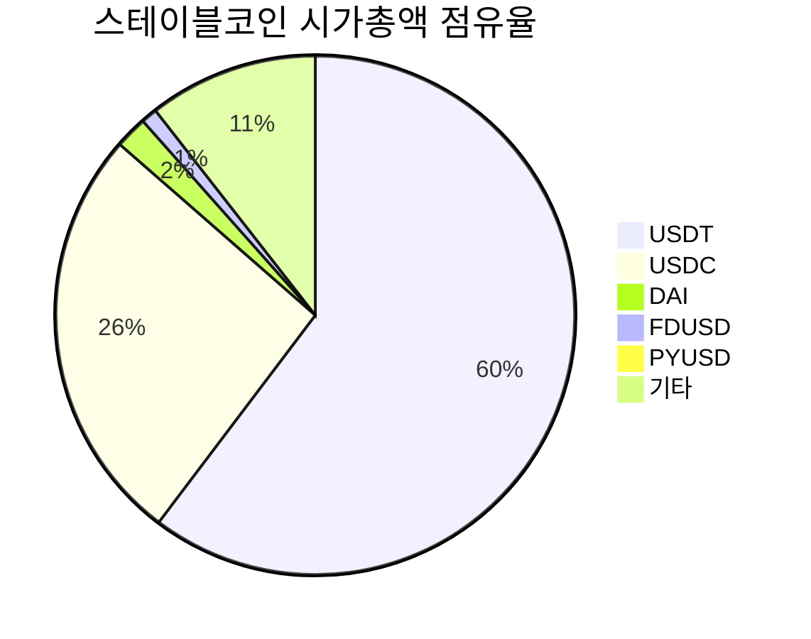
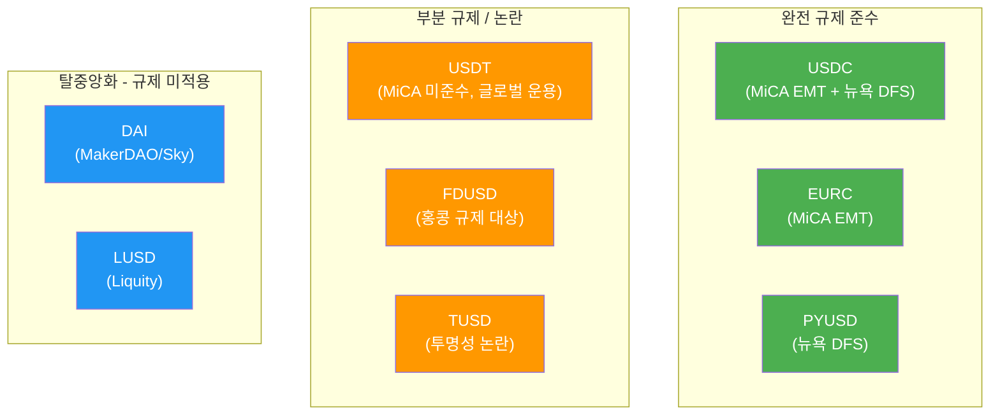

---
tags:
  - 디지털자산
  - 규제
  - 스테이블코인
search:
  boost: 1.5
---
# 주요 스테이블코인 비교

> 마지막 검토: 2025년 5월

주요 스테이블코인의 특성, 담보 구성, 규제 상태를 비교 분석한다.

## 스테이블코인 비교표

| 스테이블코인 | 발행사 | 유형 | 시가총액 (2025) | 담보 구성 | 규제 상태 |
|-------------|--------|------|----------------|-----------|-----------|
| **[USDT](usdt.md)** | Tether Limited | 법정화폐 담보 | ~1,400억$ | 미국 국채 중심 + 현금 | MiCA 미준수, 뉴욕 합의 |
| **[USDC](usdc.md)** | Circle | 법정화폐 담보 | ~600억$ | 현금 + 단기 미국 국채 100% | MiCA EMT 인가, 뉴욕 DFS |
| **[DAI](dai.md)** | MakerDAO (Sky) | 암호화폐 담보 | ~50억$ | ETH, USDC, RWA 등 과잉 담보 | 탈중앙화 규제 쟁점 |
| **BUSD** | Paxos (Binance) | 법정화폐 담보 | ~0$ (상환 완료) | (구) 현금 + 국채 | 2023년 발행 중단 |
| **PYUSD** | PayPal (Paxos) | 법정화폐 담보 | ~8억$ | 미국 국채, 현금, 역RP | 뉴욕 DFS 인가 |
| **FDUSD** | First Digital | 법정화폐 담보 | ~20억$ | 현금 + 국채 | 홍콩 규제 대상 |
| **EURC** | Circle | 법정화폐 담보 | ~2억$ | 유로 현금 + 단기 국채 | MiCA EMT 인가 |
| **TUSD** | TrueUSD | 법정화폐 담보 | ~5억$ | 현금 + 국채 | 투명성 논란 |
| **LUSD** | Liquity | 암호화폐 담보 | ~5억$ | ETH 110%+ 담보 | 완전 탈중앙화 |
| **FRAX** | Frax Finance | 하이브리드 | ~6억$ | (구) 부분 알고리즘 → 완전 담보 | 규제 대응 진화 중 |

## 시가총액 점유율 (2025년 기준)

## 규제 상태별 분류

## 선택/사용 가이드

### 용도별 추천

| 용도 | 추천 스테이블코인 | 이유 |
|------|------------------|------|
| **EU 내 거래** | USDC, EURC | MiCA EMT 인가로 법적 확실성 |
| **글로벌 거래** | USDT, USDC | 최대 유동성, 최다 거래 페어 |
| **DeFi 활용** | DAI, USDC | DeFi 프로토콜 호환성 |
| **기관 투자** | USDC, PYUSD | 규제 준수, 투명한 감사 |
| **결제/송금** | USDC, USDT | 넓은 수용처, 빠른 정산 |

### 리스크 요인별 비교

| 리스크 요인 | USDT | USDC | DAI |
|------------|------|------|-----|
| 준비금 투명성 | 중간 (분기별 증명) | 높음 (월간 감사) | 온체인 투명 |
| 규제 리스크 | 높음 (MiCA 미준수) | 낮음 (다수 인가) | 중간 (규제 쟁점) |
| 디페깅 리스크 | 낮음 (역사적 회복) | 낮음 (SVB 후 회복) | 중간 (담보 변동) |
| 카운터파티 리스크 | 중간 (Tether 집중) | 낮음 (분산 수탁) | 낮음 (탈중앙화) |
| 유동성 리스크 | 매우 낮음 (최대 유동성) | 낮음 | 중간 |

## 상세 분석

| 스테이블코인 | 상세 문서 |
|-------------|-----------|
| USDT | [USDT (Tether) 상세 분석](usdt.md) |
| USDC | [USDC (Circle) 상세 분석](usdc.md) |
| DAI | [DAI (MakerDAO) 상세 분석](dai.md) |

---

> [개요로 돌아가기](../index.md) | [규제 프레임워크](../frameworks.md) | [국가별 현황](../by-country/index.md)
