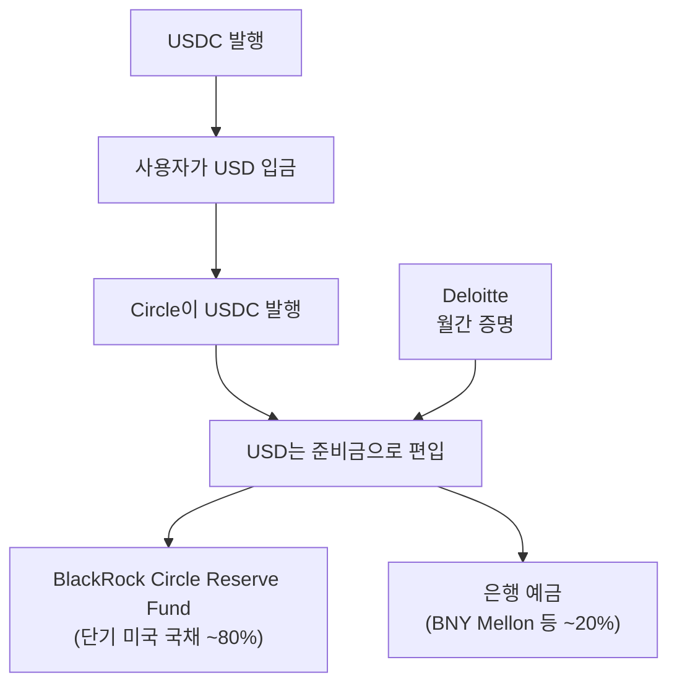
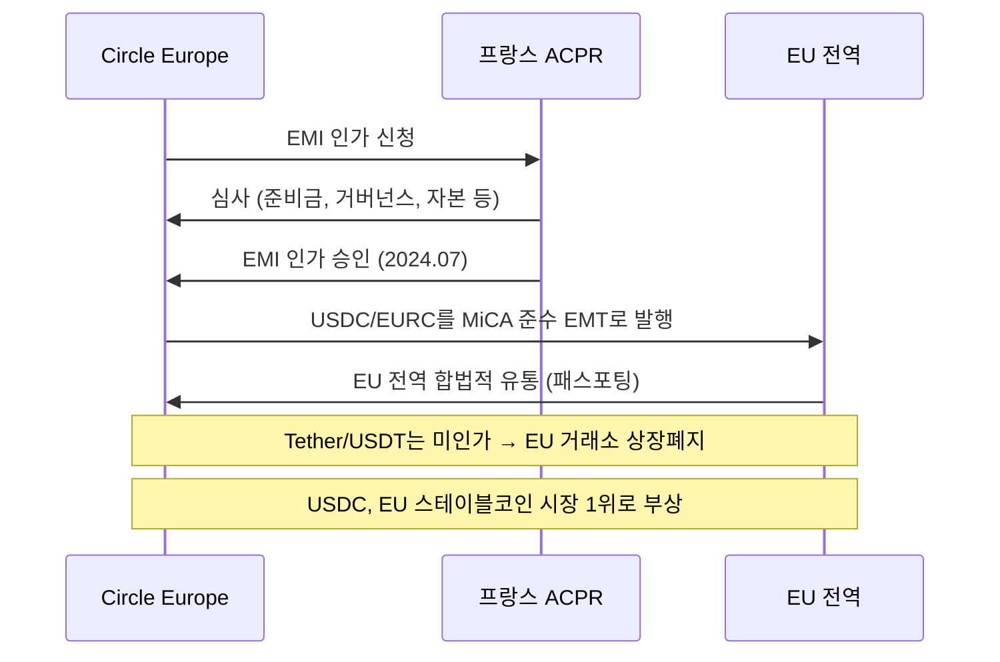
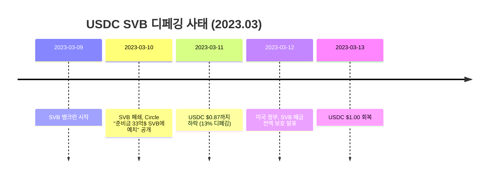

---
tags:
  - 디지털자산
  - 규제
  - 스테이블코인
---
# USDC (Circle)

> 마지막 검토: 2025년 5월

## 기본 정보

| 항목 | 내용 |
|------|------|
| **정식 명칭** | USD Coin (USDC) |
| **발행사** | Circle Internet Financial, LLC (미국 보스턴) |
| **출시** | 2018년 9월 (Centre Consortium에 의해 출시, 이후 Circle 단독 관리) |
| **시가총액** | 약 600억$ (2025년 기준, 스테이블코인 2위) |
| **페깅 대상** | USD 1.00 |
| **유형** | 법정화폐 담보형 |
| **규제 인가** | 뉴욕 DFS 머니트랜스미터, 프랑스 ACPR EMI (MiCA 준수) |

---

## 담보 구성

### 100% 투명한 준비금

USDC는 "세계에서 가장 투명한 스테이블코인"을 표방하며, 준비금의 100%를 현금 및 단기 미국 국채로 구성한다.

| 자산 유형 | 비율 (약) | 설명 |
|-----------|-----------|------|
| 단기 미국 국채 (T-Bills) | ~80% | 3개월 이내 만기 미국 재무부 증권 |
| 현금 (은행 예금) | ~20% | 복수 주요 은행에 분산 예치 |

### 준비금 관리 특징

| 항목 | 내용 |
|------|------|
| **준비금 관리자** | BlackRock (Circle Reserve Fund, USDXX) |
| **수탁 은행** | BNY Mellon (주요 수탁), 기타 다수 은행 분산 |
| **감사** | Deloitte에 의한 월간 준비금 증명(attestation) |
| **감사 기준** | AICPA 2025 Criteria for SOC 2 |
| **공시 주기** | 월간 (매월 공개) |
| **전체 감사** | 연간 재무제표 감사 (Big 4 회계법인) |

!!! note "USDT와의 차이"
    USDC는 (1) 정식 Big 4 감사, (2) 비전통 자산(BTC, 금, 기업 대출) 미포함, (3) BlackRock이 준비금 운용, (4) 미국 법인 구조라는 점에서 USDT보다 규제 친화적이다.

---

## MiCA 승인 현황

### MiCA 최초 주요 스테이블코인 승인

Circle은 MiCA 하에서 주요 글로벌 스테이블코인 최초로 EMT(E-Money Token) 라이선스를 취득했다.

| 항목 | 내용 |
|------|------|
| **인가 기관** | 프랑스 ACPR (Autorite de controle prudentiel et de resolution) |
| **인가 유형** | 전자화폐기관(EMI) 인가 |
| **인가 시기** | 2024년 7월 |
| **적용 대상** | USDC (달러 연동), EURC (유로 연동) |
| **EU 법인** | Circle Europe SAS (파리 소재) |
| **패스포팅** | 프랑스 인가로 EU 27개국 전역 영업 가능 |

### MiCA 승인의 의미

**EU 시장에서의 경쟁 우위**:

- MiCA 준수로 EU 내 모든 규제 거래소에서 거래 가능
- USDT가 상장폐지되면서 USDC가 EU 스테이블코인 시장 선도
- EURC(유로 스테이블코인)로 유로존 사용자 직접 공략
- 기관 투자자의 EU 내 스테이블코인 선택지로 부상

→ 상세: [EU 규제 현황](../by-country/eu.md)

---

## SVB 사태 시 디페깅 경험

### 사건 개요

2023년 3월, 미국 실리콘밸리은행(SVB) 파산 시 USDC가 일시적으로 디페깅된 사건은 법정화폐 담보형 스테이블코인의 은행 리스크를 보여준 중요한 사례다.

### 경과

| 항목 | 내용 |
|------|------|
| **SVB 예치금** | 약 33억$ (당시 USDC 준비금의 약 8%) |
| **최저 가격** | $0.87 (2023년 3월 11일) |
| **디페깅 기간** | 약 3일 (금요일~일요일, 주말 동안 은행 운영 중단) |
| **회복 원인** | 미국 정부의 SVB 예금 전액 보호 결정 |
| **USDC 상환** | 디페깅 기간 중에도 상환 처리 지속 (주말 제외) |

### 교훈

| 교훈 | 설명 |
|------|------|
| **은행 집중 리스크** | 준비금이 소수 은행에 집중되면 해당 은행 실패 시 디페깅 가능 |
| **주말 리스크** | 은행 영업일이 아닌 기간에는 상환·이전이 불가능하여 패닉 증폭 |
| **전이 효과** | USDC 디페깅이 DAI 등 USDC를 담보로 사용하는 스테이블코인으로 전이 |
| **정부 개입의 중요성** | 결국 정부의 예금 보호 결정이 신뢰 회복의 결정적 요인 |
| **분산의 필요성** | 사건 이후 Circle은 수탁 은행을 BNY Mellon 중심으로 재편하고 분산 강화 |

### Circle의 후속 대응

- 수탁 은행을 BNY Mellon(세계 최대 수탁은행)으로 집중, 기타 은행 분산
- BlackRock Circle Reserve Fund를 통한 준비금 운용 체계 강화
- 준비금 중 국채 비중을 더욱 확대 (은행 예금 비중 축소)
- 2024년 MiCA 인가를 통한 글로벌 규제 준수 강화

!!! warning "디페깅 리스크는 완전히 제거되지 않는다"
    SVB 사태는 100% 담보 스테이블코인도 뱅크런과 유동성 위기에 취약할 수 있음을 보여주었다. 준비금의 "양"뿐 아니라 "질"과 "접근 가능성"이 중요하며, 이는 MiCA와 GENIUS Act 모두 준비금 구성 요건을 엄격히 규정하는 이유이기도 하다.

---

## 멀티체인 지원 현황

| 블록체인 | 특성 | 주요 용도 |
|----------|------|-----------|
| Ethereum | 최대 발행량, DeFi 핵심 | DeFi, 기관 거래, NFT |
| Solana | 고속·저비용 | 결제, DeFi, 게임 |
| Avalanche | 기관 파일럿 | 기관 DeFi, 서브넷 |
| Arbitrum | L2 확장 | DeFi, 저비용 거래 |
| Optimism | L2 확장 | DeFi, 저비용 거래 |
| Base | Coinbase L2 | 소매 결제, DeFi |
| Polygon PoS | 다용도 | 결제, 게임, DeFi |
| Stellar | 국제 송금 | 크로스보더 결제 |

---

## 장단점 표

| 관점 | 장점 | 단점 |
|------|------|------|
| **투명성** | 월간 Deloitte 증명, 연간 감사 | 실시간 온체인 증명은 미제공 |
| **규제** | MiCA EMT 인가, 뉴욕 DFS 인가, 다수 규제 준수 | - |
| **준비금** | 100% 현금 + 단기 국채, BlackRock 운용 | - |
| **유동성** | 스테이블코인 2위, 주요 거래소 지원 | USDT 대비 거래 페어 적음 |
| **DeFi** | 주요 DeFi 프로토콜 통합 | - |
| **SVB 경험** | 디페깅 후 회복, 수탁 구조 개선 | 디페깅 가능성 입증 |
| **기관 적합성** | 높은 규제 준수, 투명한 구조 | - |
| **미국 법인** | 미국 법률 적용, 법적 확실성 | 미국 제재 규정 직접 적용 |

---

> [스테이블코인 비교로 돌아가기](index.md) | [USDT](usdt.md) | [DAI](dai.md) | [개요](../index.md)
