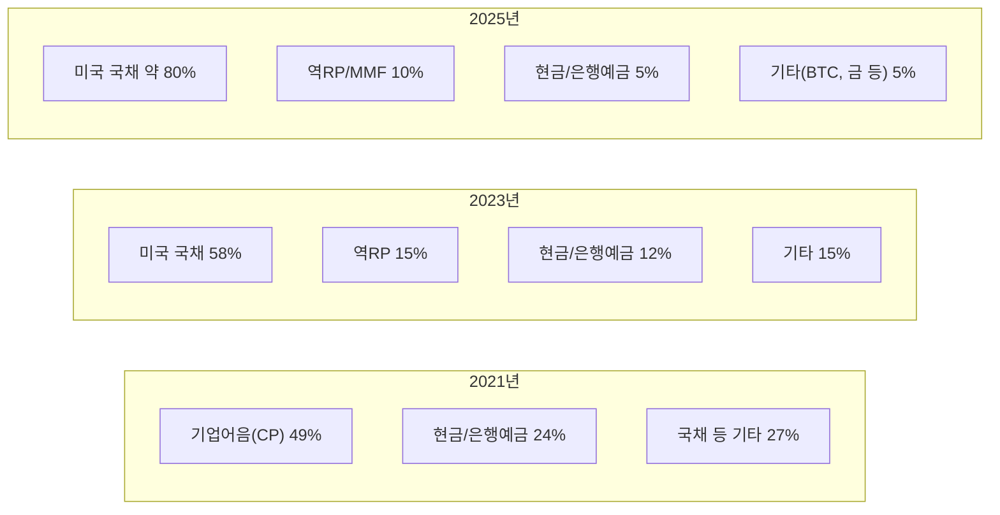
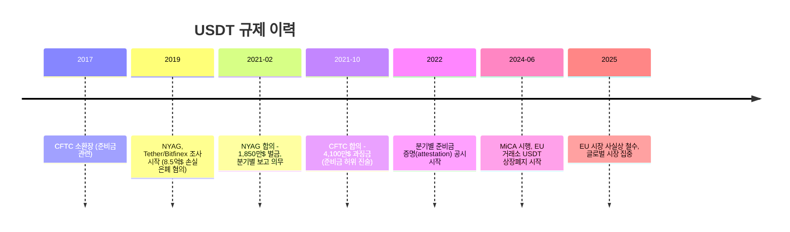

# USDT (Tether)

> 마지막 검토: 2025년 5월

## 기본 정보

| 항목 | 내용 |
|------|------|
| **정식 명칭** | Tether USD (USDT) |
| **발행사** | Tether Limited (영국령 버진아일랜드 등록, 홍콩·엘살바도르 운영) |
| **출시** | 2014년 10월 (최초 "Realcoin"으로 출시, 이후 Tether로 리브랜딩) |
| **시가총액** | 약 1,400억$ (2025년 기준, 스테이블코인 1위) |
| **페깅 대상** | USD 1.00 |
| **유형** | 법정화폐 담보형 |
| **관련 회사** | iFinex (Bitfinex 거래소 운영사)와 동일 경영진 |

---

## 담보 구성

### 준비금 구조 변화

Tether의 준비금 구성은 시간에 따라 크게 변화해왔으며, 투명성 논란을 거치며 미국 국채 비중을 대폭 높였다.

### 2025년 기준 담보 구성 (Tether 공식 보고 기준)

| 자산 유형 | 비율 (약) | 설명 |
|-----------|-----------|------|
| 미국 국채(T-Bills) | ~80% | 단기(6개월 이내) 미국 재무부 증권 |
| 역환매조건부채권(역RP) | ~7% | 미국 국채 담보 역RP |
| 현금 및 은행 예금 | ~5% | 복수 은행에 분산 예치 |
| 비트코인(BTC) | ~3% | 자체 보유 (논란의 대상) |
| 금(Gold) | ~2% | 실물 금 보유 |
| 기타 투자 | ~3% | 기업 대출, 담보 대출 등 |

!!! warning "준비금의 '기타' 항목"
    Tether의 준비금에는 비트코인, 금, 기업 대출 등 전통적인 스테이블코인 준비금으로는 이례적인 자산이 포함되어 있다. 이는 규제 준수 스테이블코인(USDC, PYUSD)과 비교할 때 리스크 요인이다.

---

## 멀티체인 지원 현황

USDT는 가장 많은 블록체인을 지원하는 스테이블코인이다 (2025년 기준).

| 블록체인 | 발행량 비율 (약) | 특성 |
|----------|----------------|------|
| **Tron (TRC-20)** | ~50% | 저수수료, 아시아/신흥국 중심 사용 |
| **Ethereum (ERC-20)** | ~35% | DeFi 활용, 기관 거래 |
| **Solana** | ~5% | 고속·저비용, DeFi/결제 |
| **Avalanche** | ~2% | DeFi, 기관 파일럿 |
| **TON** | ~2% | Telegram 생태계 |
| **기타** | ~6% | Polygon, Arbitrum, Optimism, BSC 등 |

---

## 규제 이슈

### 주요 규제 이력

### 준비금 투명성 논란

**핵심 쟁점**:

- 2017~2021년: "USDT는 100% 달러로 뒷받침된다"는 주장이 거짓으로 밝혀짐
- 실제로는 기업어음, 담보 대출, 관계사(Bitfinex) 대출 등 포함
- NYAG 조사에서 8.5억$ 손실 은폐 사실 확인
- 이후 미국 국채 비중을 대폭 확대하며 개선 시도

**현재 상태**:

- BDO Italia가 분기별 준비금 증명(attestation) 보고서 발행
- 전체 기간 정식 감사(full audit)는 여전히 미실시
- 증명 보고서의 세부 항목 공개 수준은 USDC 대비 낮음

### MiCA 대응

| 항목 | 현황 |
|------|------|
| EU EMI 인가 | **미취득** |
| EU 내 유통 | 주요 거래소 상장폐지로 사실상 축소 |
| 전략 | EU 시장 대신 아시아, 중동, 남미, 아프리카 시장에 집중 |
| EURT (유로 버전) | 발행 중단 |

→ 상세: [EU 규제 현황](../by-country/eu.md)

---

## 장단점 표

| 관점 | 장점 | 단점 |
|------|------|------|
| **유동성** | 스테이블코인 최대 유동성, 최다 거래 페어 | - |
| **접근성** | 가장 많은 거래소·블록체인 지원 | - |
| **투명성** | - | 정식 감사 미실시, 증명만 제공 |
| **규제** | - | MiCA 미준수, 복수 규제 합의 이력 |
| **준비금** | 국채 비중 80%+ 개선 | BTC, 금, 기업 대출 등 비전통적 자산 포함 |
| **법적 구조** | - | BVI 등록, 경영진 Bitfinex와 중복 |
| **시장 지위** | 60%+ 시장 점유율, 네트워크 효과 | 규제 강화 시 점유율 하락 리스크 |
| **신흥국 활용** | 인플레이션 국가에서 달러 접근 수단 역할 | 규제 비준수로 장기 지속가능성 의문 |

!!! note "USDT의 이중적 위상"
    USDT는 준비금 투명성, 규제 준수 측면에서 꾸준히 비판받지만, 전 세계 가상자산 거래의 핵심 결제 인프라이며 특히 신흥국에서 달러 접근 수단으로서 중요한 역할을 수행한다. 규제와 시장 현실 사이의 괴리가 USDT를 둘러싼 핵심 쟁점이다.

---

> [스테이블코인 비교로 돌아가기](index.md) | [USDC](usdc.md) | [DAI](dai.md) | [개요](../index.md)
