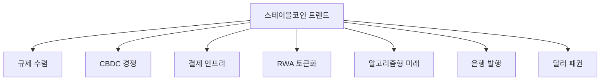
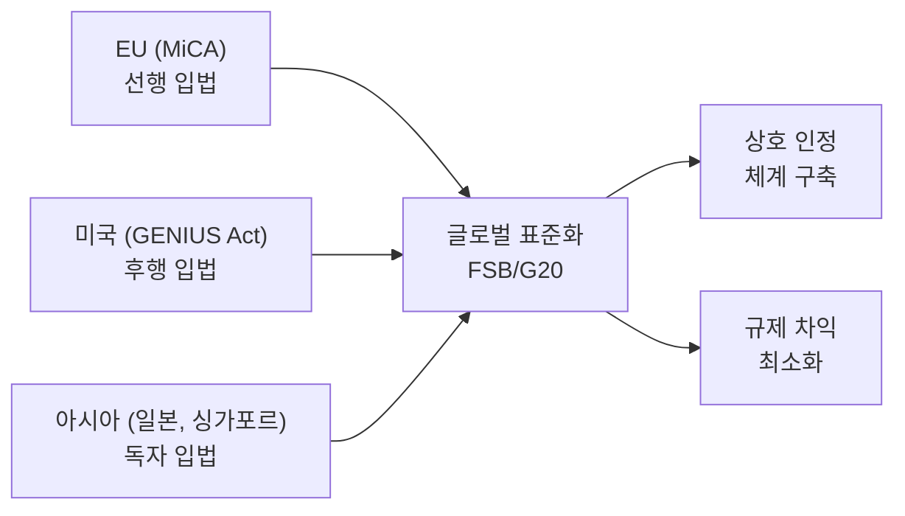
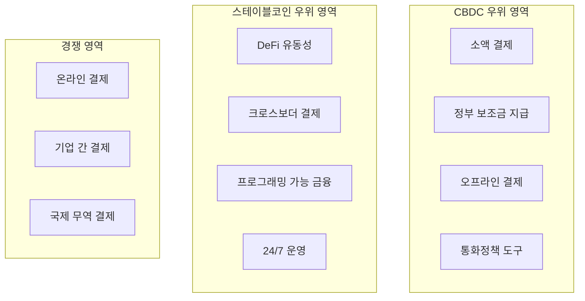
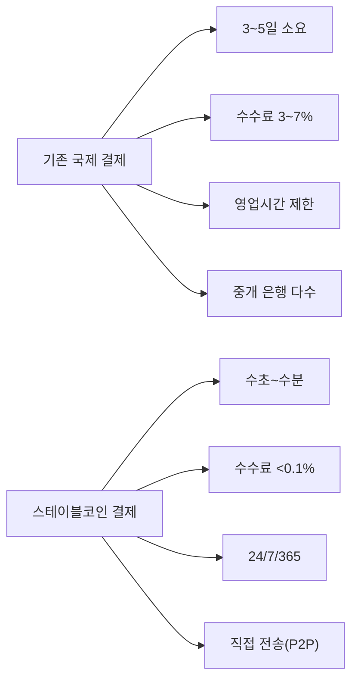
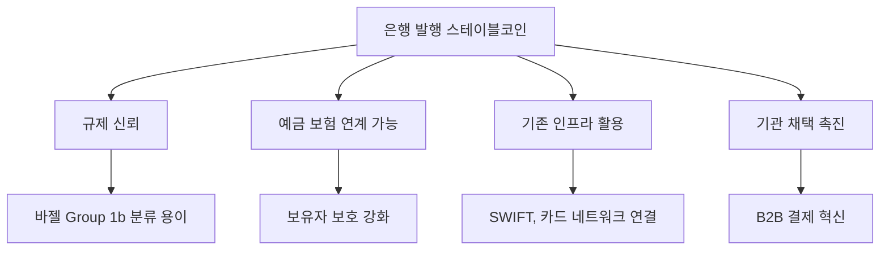
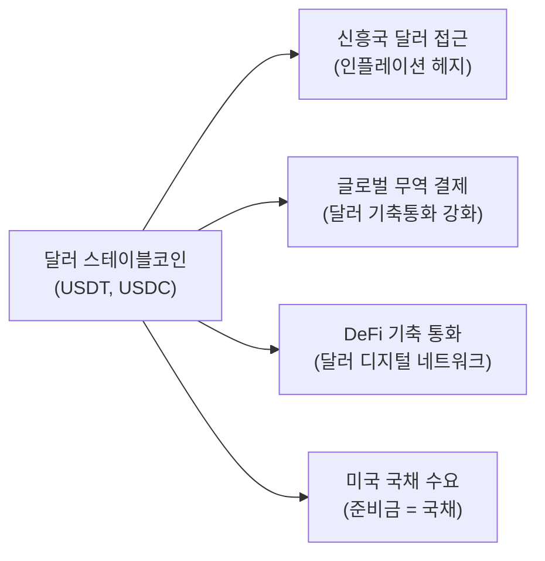
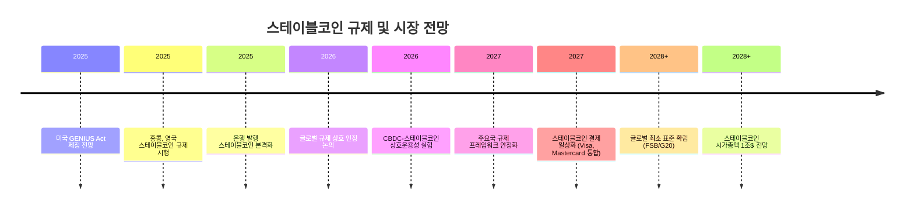

---
tags:
  - 디지털자산
  - 규제
  - 스테이블코인
---
# 트렌드 및 전망

> 마지막 검토: 2025년 5월

스테이블코인 규제와 시장의 주요 트렌드를 분석하고, 향후 전망을 정리한다.

---

## 1. 글로벌 스테이블코인 규제 수렴 동향

### 수렴하는 규제 원칙

2022년 Terra/Luna 사태 이후, 각국의 스테이블코인 규제가 놀라울 정도로 유사한 방향으로 수렴하고 있다.

**공통 규제 원칙**:

| 원칙 | 설명 | 채택 현황 |
|------|------|-----------|
| 100% 준비금 의무 | 발행량 전액을 고품질 자산으로 담보 | EU, 미국(안), 일본, 싱가포르, 홍콩, UAE |
| 발행자 인가제 | 금융 당국의 사전 인가/등록 의무 | EU, 미국(안), 일본, 싱가포르 |
| 상환권 보장 | 보유자의 액면가 상환 요구 권리 | EU, 미국(안), 일본, 싱가포르 |
| 준비금 감사 | 독립적 정기 감사 및 공시 | EU, 미국(안), 일본, 싱가포르, 뉴욕 DFS |
| 분리 보관 | 발행자 자산과 준비금의 법적 분리 | EU, 미국(안), 일본, 싱가포르 |

### 규제 경쟁과 협력

**핵심 전망**:

- 2025~2026년: 주요국 대부분이 스테이블코인 규제를 시행하거나 입법 완료
- 2026~2027년: 국가 간 상호 인정(mutual recognition) 체계 논의 본격화
- 장기: FSB 권고안 기반의 글로벌 최소 표준 확립

---

## 2. CBDC vs 스테이블코인: 경쟁과 보완

### 글로벌 CBDC 추진 현황

2025년 기준, 130개 이상의 중앙은행이 CBDC를 연구 또는 개발 중이며, 일부는 이미 시범 운영에 들어갔다.

| 국가/지역 | CBDC | 단계 | 스테이블코인과의 관계 |
|-----------|------|------|---------------------|
| 중국 | e-CNY (디지털 위안) | 실제 유통 (파일럿 → 확대) | 스테이블코인 사실상 금지, CBDC로 대체 |
| EU | 디지털 유로 | 준비 단계 (2025~) | MiCA로 스테이블코인 규제, CBDC와 공존 추구 |
| 한국 | 디지털 원화 | 파일럿 | 스테이블코인 규제 미비, CBDC 우선 추진 |
| 일본 | 디지털 엔 | 연구·파일럿 | 스테이블코인 규제 시행, CBDC와 병행 |
| 미국 | 디지털 달러 | 연구 단계 (정치적 반대) | 민간 스테이블코인 우선 입법 |
| 영국 | 디지털 파운드 | 설계 단계 | 스테이블코인 규제와 동시 추진 |

### 경쟁과 보완의 다이내믹스

**핵심 전망**:

- **공존 모델**이 유력: CBDC는 리테일 결제 인프라, 스테이블코인은 가상자산/DeFi 생태계에서 각자 역할 수행
- 미국은 정치적 이유로 CBDC보다 민간 스테이블코인을 선호하는 방향
- 중국 모델(CBDC 독점)은 다른 민주주의 국가에서 채택 가능성 낮음

---

## 3. 결제 인프라로서의 스테이블코인

### 전통 금융의 스테이블코인 진출

2023년 이후, 전통 결제·금융 기업의 스테이블코인 진출이 가속화되고 있다.

| 기업 | 활동 | 시기 | 의미 |
|------|------|------|------|
| **PayPal** | PYUSD 출시 (Paxos 발행) | 2023.08 | 최초 주요 결제 기업의 스테이블코인 발행 |
| **Visa** | USDC 결제 네트워크 통합 | 2023~ | 스테이블코인을 카드 결제 정산에 활용 |
| **Mastercard** | 스테이블코인 결제 파일럿 | 2024~ | 가맹점 스테이블코인 수용 지원 |
| **Stripe** | 스테이블코인 결제 API (Bridge 인수) | 2024.10 | 11억$ 인수, 스테이블코인 결제 인프라 구축 |
| **JPMorgan** | JPM Coin (내부 결제용) | 2019~ | 기관 간 실시간 결제 (블록체인 기반) |
| **Societe Generale** | EUR CoinVertible (EURCV) | 2023~ | EU 은행 최초 유로 스테이블코인 발행 |

### 스테이블코인 결제의 장점

**핵심 전망**:

- B2B 국제 결제에서 스테이블코인 활용이 가장 먼저 확대될 영역
- Stripe의 Bridge 인수가 신호탄: 결제 인프라 기업의 스테이블코인 통합 가속화
- 2025~2027년 주요 결제 네트워크(Visa, Mastercard)에서 스테이블코인 정산 일상화 전망

→ 관련: [PG (Payment Gateway)](../pg-service/index.md)

---

## 4. RWA 토큰화와 스테이블코인

### RWA (Real World Assets) 토큰화

RWA 토큰화는 부동산, 채권, 주식, 사모펀드 등 전통 금융 자산을 블록체인 토큰으로 변환하는 것을 의미한다. 스테이블코인은 이 생태계의 결제 수단이자, 일부는 RWA 자체이기도 하다.

### 스테이블코인과 RWA의 교차점

| 교차점 | 설명 |
|--------|------|
| **결제 수단** | RWA 토큰 거래 시 스테이블코인으로 결제 |
| **담보 자산** | DAI 등 담보 중 RWA 비중 증가 (국채 토큰 등) |
| **수익형 스테이블코인** | 미국 국채 수익을 보유자에게 전달하는 모델 (규제 쟁점) |
| **온체인 국채** | Ondo Finance, Franklin Templeton 등이 토큰화 국채 발행 |

### 수익형 스테이블코인 (Yield-Bearing Stablecoins)

2024~2025년 주목받는 트렌드로, 스테이블코인의 준비금 운용 수익(국채 이자 등)을 보유자에게 분배하는 모델이다.

| 프로젝트 | 수익 원천 | 연수익률 (약) | 규제 쟁점 |
|----------|-----------|-------------|-----------|
| sDAI (Maker) | DSR (Vault 수수료) | ~8% | DeFi 수익, 규제 불명확 |
| Ondo USDY | 미국 국채 이자 | ~5% | 증권 해당 가능성 |
| Mountain USDM | 미국 국채 이자 | ~5% | 증권 해당 가능성 |
| Ethena USDe | 선물 펀딩비 차익 | ~15%+ | 높은 리스크, 규제 미비 |

!!! warning "수익형 스테이블코인의 규제 리스크"
    수익을 제공하는 스테이블코인은 미국 SEC 관점에서 증권(투자계약)으로 분류될 가능성이 높다. MiCA도 EMT/ART에 대한 이자 지급을 금지한다. 수익형 모델이 규제 프레임워크 내에서 어떻게 자리잡을지가 핵심 쟁점이다.

---

## 5. 알고리즘 스테이블코인의 미래 (Terra/Luna 이후)

### Terra/Luna의 유산

2022년 5월 Terra/Luna 붕괴는 알고리즘 스테이블코인에 대한 시장과 규제 당국의 신뢰를 근본적으로 훼손했다.

**붕괴 후 변화**:

| 변화 | 설명 |
|------|------|
| **규제 대응** | GENIUS Act: 알고리즘형 명시적 금지. STABLE Act: 2년 모라토리엄 |
| **시장 반응** | 순수 알고리즘형 스테이블코인 시가총액 급감 |
| **프로젝트 전환** | FRAX 등 하이브리드 모델이 완전 담보로 전환 |
| **학술적 논의** | 순수 알고리즘형은 본질적으로 불안정하다는 연구 결과 다수 |

### 남아 있는 실험

완전 담보 없는 순수 알고리즘형은 사실상 소멸했지만, "부분 알고리즘" 또는 "델타 중립" 등 새로운 접근이 시도되고 있다.

| 모델 | 대표 프로젝트 | 메커니즘 | 리스크 |
|------|-------------|----------|--------|
| 델타 중립 | Ethena (USDe) | ETH 현물 롱 + 선물 숏 | 펀딩비 역전, 거래소 리스크 |
| 과잉 담보 + 알고리즘 | Liquity v2 | ETH 과잉 담보 + 금리 조절 | 담보 변동성 |
| 부분 준비금 | (대부분 전환 완료) | 일부 담보 + 알고리즘 | 뱅크런에 취약 |

**핵심 전망**: 순수 알고리즘형의 부활 가능성은 매우 낮다. 대부분의 규제 프레임워크가 이를 금지하거나 극도로 제한하는 방향이며, 시장의 신뢰도 회복되지 않았다.

---

## 6. 은행 발행 스테이블코인 트렌드

### 은행의 스테이블코인 시장 진출

2024~2025년, 전통 은행이 직접 스테이블코인을 발행하거나, 스테이블코인 인프라에 참여하는 트렌드가 뚜렷해지고 있다.

| 은행/기관 | 스테이블코인 | 용도 | 현황 |
|-----------|-------------|------|------|
| **JPMorgan** | JPM Coin | 기관 간 결제 | 운영 중 (Onyx 플랫폼) |
| **Societe Generale** | EUR CoinVertible | 유로 결제 | MiCA 하 EMT 발행 |
| **Deutsche Bank** | (파일럿 중) | 기관 결제 | 2025년 파일럿 |
| **Standard Chartered** | (계획 중) | 크로스보더 | 2025~2026년 목표 |
| **미쓰비시 UFJ (MUFG)** | Progmat Coin | 엔화 스테이블코인 | 일본 자금결제법 하 발행 |

### 은행 발행의 의미

**핵심 전망**:

- 은행 발행 스테이블코인은 기관 간(B2B) 결제에서 주요 역할을 수행할 전망
- 바젤 프레임워크의 Group 1b 분류에 유리하여 은행 간 거래에서 채택 가속화
- GENIUS Act 등 입법 완료 시 미국 은행의 스테이블코인 발행 본격화 예상

---

## 7. 달러 패권과 스테이블코인

### 달러 스테이블코인의 압도적 지배

2025년 기준, 전체 스테이블코인 시가총액의 약 **99%가 미국 달러 연동**이다.

| 연동 화폐 | 비중 (약) | 대표 스테이블코인 |
|-----------|-----------|-----------------|
| **USD** | ~99% | USDT, USDC, DAI, PYUSD, FDUSD |
| **EUR** | ~0.5% | EURC, EURT(폐지), EURS |
| **기타** | ~0.5% | XSGD(싱가포르 달러), GYEN(엔), 기타 |

### 스테이블코인 = 디지털 달러 확산

### 지정학적 함의

| 관점 | 분석 |
|------|------|
| **미국 이익** | 달러 스테이블코인은 미국 밖에서 달러 사용을 확대. 미국 국채 수요 증가 (USDT 준비금 = 세계 18위 국채 보유) |
| **EU 우려** | 유로존 내 달러 스테이블코인 지배가 유로 주권 약화. MiCA 거래량 제한 조항의 배경 |
| **중국 대응** | 달러 스테이블코인 완전 차단, e-CNY(디지털 위안)로 대안 구축 시도 |
| **신흥국** | 자국 통화 약세 국가(아르헨티나, 터키, 나이지리아 등)에서 USDT가 사실상 달러 대용 |

### 미국의 전략적 입장

2025년 미국 의회와 행정부는 달러 스테이블코인을 달러 패권 강화의 도구로 인식하고 있다.

- GENIUS Act 지지자: "스테이블코인은 전 세계에 달러의 도달 범위를 확장한다"
- 재무부: 스테이블코인 발행사가 미국 국채의 주요 매수자가 된 점에 주목
- 국가안보 관점: 달러 스테이블코인이 적대국의 금융 시스템 대안 개발을 억제

!!! note "달러 스테이블코인의 역설"
    달러 스테이블코인은 탈중앙화를 지향하는 가상자산 생태계 위에서 달러 중심의 금융 질서를 더욱 강화하는 역설적 역할을 수행하고 있다. 이는 "탈중앙화 기술 위의 중앙화된 화폐"라는 구조적 긴장을 내포한다.

---

## 종합 전망 타임라인

---

## 참고 자료

- FSB: [Global Stablecoin Arrangements - Progress Report (2024)](https://www.fsb.org/)
- BIS: [The future monetary system (2022)](https://www.bis.org/publ/arpdf/ar2022e3.htm)
- Atlantic Council: [CBDC Tracker](https://www.atlanticcouncil.org/cbdctracker/)
- Chainalysis: [Stablecoin Report 2025](https://www.chainalysis.com/)
- Circle: [State of the USDC Economy (2025)](https://www.circle.com/)

---

> [개요로 돌아가기](index.md) | [규제 프레임워크](frameworks.md) | [국가별 현황](by-country/index.md) | [주요 스테이블코인](products/index.md)
