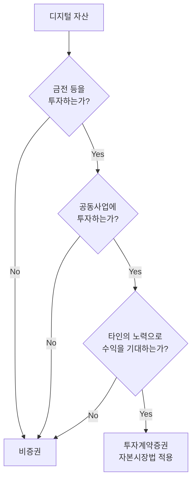
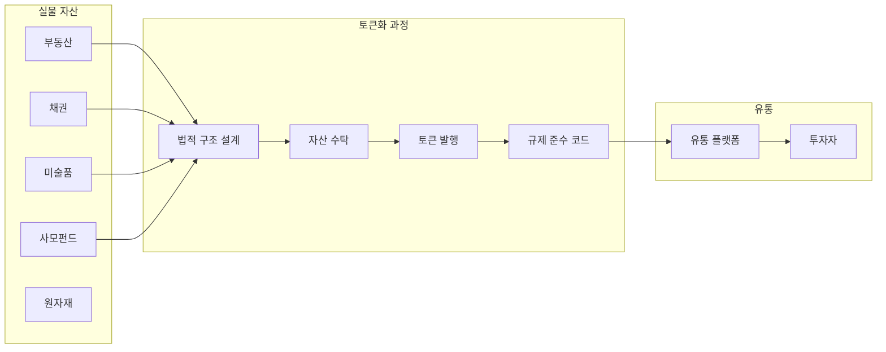
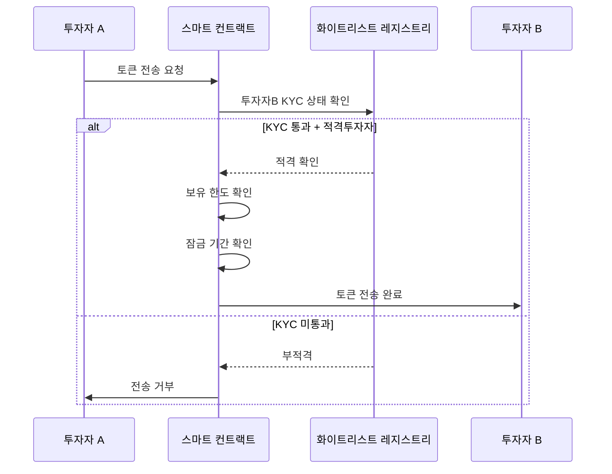
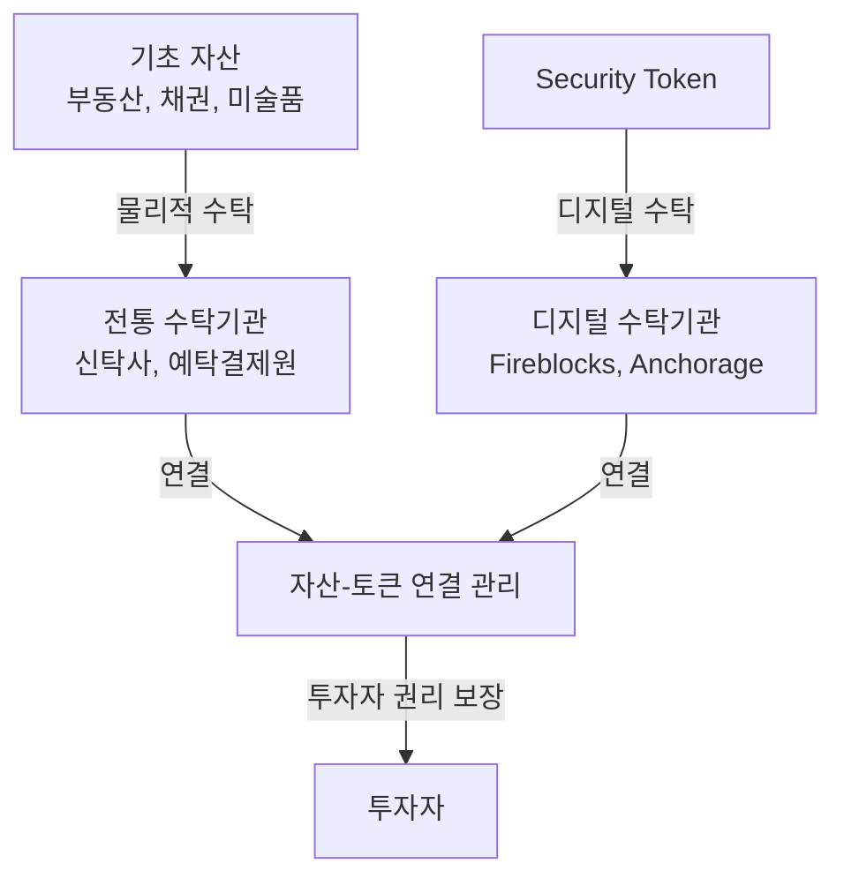
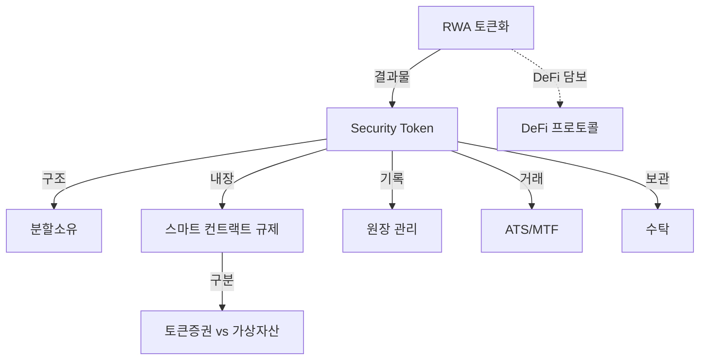

---
tags:
  - 디지털자산
  - 토큰증권
  - STO
---
# STO 핵심 개념

토큰증권 생태계를 구성하는 핵심 개념을 체계적으로 정리한다. 기술, 규제, 시장 구조가 긴밀하게 얽혀 있으며, 각 개념의 상호 관계를 이해하는 것이 중요하다.

---

## 토큰증권 vs 가상자산

**토큰증권(Security Token)**은 증권법의 적용을 받는 디지털 자산이고, **가상자산(Utility Token/Cryptocurrency)**은 증권이 아닌 디지털 자산이다. 이 구분은 규제·투자자 보호·유통 방식에서 근본적 차이를 만든다.

| 구분 | 토큰증권 | 가상자산 |
|------|---------|---------|
| 법적 성격 | 증권 (금투법/증권법 적용) | 비증권 (가상자산업법 등) |
| 발행 | 증권신고서 필요, 규제 대상 | 자유 발행 (ICO/IDO) |
| 유통 | 인가된 ATS/MTF/거래소 | 암호화폐 거래소 |
| 투자자 보호 | 공시 의무, 불공정거래 금지 | 제한적 |
| 수익 구조 | 배당, 이자, 자본차익 | 토큰 가격 상승, 유틸리티 |
| 대표 사례 | BlackRock BUIDL, 부동산 STO | BTC, ETH, UNI |

!!! warning "Howey Test"
    미국에서는 SEC의 Howey Test를 통해 토큰의 증권성을 판단한다. "투자 계약"에 해당하면 증권이며, 대부분의 수익 분배형 토큰은 증권으로 분류된다. 한국은 금융위의 "토큰 증권 가이드라인(2023)"으로 유사한 기준을 제시했다.

### 한국의 증권성 판단 기준

금융위원회는 2023년 "토큰 증권 가이드라인"을 통해 디지털 자산의 증권성을 판단하는 기준을 제시했다. 핵심은 자본시장법상 **투자계약증권** 해당 여부다.

| 판단 요소 | 미국 Howey Test | 한국 투자계약증권 |
|----------|---------------|----------------|
| 투자 행위 | Investment of money | 금전 등의 투자 |
| 공동사업 | Common enterprise | 공동사업 |
| 수익 기대 | Expectation of profits | 이익을 얻을 목적 |
| 타인 노력 | From the efforts of others | 타인의 노력에 의한 |
| 적용 법령 | Securities Act 1933 | 자본시장법 제4조 |

### DeFi 상품의 증권성 쟁점

DeFi 상품은 구조에 따라 증권으로 분류될 가능성이 있다:

| DeFi 상품 | 증권성 리스크 | 판단 근거 |
|----------|-------------|----------|
| **볼트 수익 상품** | 높음 | 운영자가 전략 설계·실행, 투자자는 수익만 수취 |
| **LP 토큰** | 중간 | AMM은 자동화되나, 프로토콜 운영자 존재 |
| **스테이킹 수익** | 낮음~중간 | 네트워크 유지 기여 vs 수동적 수익 기대 |
| **거버넌스 토큰** | 낮음 | 의결권 중심, 수익 분배 없으면 비증권 가능 |
| **수익형 스테이블코인** | 높음 | 이자 수익 기대, 운영자 관리 의존 |

!!! info "기관의 DeFi 상품 제공 시 주의"
    증권사·자산운용사가 DeFi 볼트를 활용한 투자 상품을 리테일에 제공할 경우, 해당 상품은 높은 확률로 투자계약증권에 해당한다. 이 경우 자본시장법상 증권신고서 제출, 투자설명서 작성, 투자권유 규제 등이 적용된다. 상품 설계 단계에서 법률 검토가 필수다.

---

## RWA 토큰화

**RWA(Real World Assets) 토큰화**는 부동산, 채권, 미술품, 사모펀드 등 실물 자산의 소유권·수익권을 블록체인 토큰으로 변환하는 과정이다.

RWA 토큰화 시장은 2025년 기준 약 $150B 규모로 성장했으며, BlackRock의 BUIDL 펀드(미국 국채 토큰화), JPMorgan의 Onyx 플랫폼, Franklin Templeton의 온체인 머니마켓 펀드 등 기관급 사례가 급증하고 있다.

!!! tip "RWA와 DeFi의 만남"
    토큰화된 RWA는 [DeFi 프로토콜](../defi/index.md)에서 담보 자산으로 활용될 수 있다. MakerDAO가 미국 국채 RWA를 DAI 담보로 편입한 것이 대표적이며, 이는 TradFi와 DeFi의 가교 역할을 한다. 자세한 내용은 [MakerDAO 상세](../defi/products/makerdao.md)를 참고하라.

---

## 분할소유 (Fractional Ownership)

**분할소유**는 고가 자산(빌딩, 미술품, 비상장 주식 등)을 수천~수만 개의 토큰으로 나누어 소액 투자자도 참여할 수 있게 하는 구조다.

기존에는 강남 빌딩 한 채에 투자하려면 수백억 원이 필요했지만, 토큰화를 통해 1만 원 단위부터 투자가 가능해진다. 이는 투자 민주화(democratization)의 핵심 메커니즘이며, 한국에서는 "조각투자"라는 이름으로 대중화되고 있다.

| 항목 | 전통 방식 | 분할소유 |
|------|----------|---------|
| 최소 투자 | 수억~수백억 원 | 수천~수만 원 |
| 유동성 | 매우 낮음 (매각에 수개월) | 플랫폼 내 거래 가능 |
| 접근성 | 기관·고액 투자자 한정 | 일반 투자자 개방 |
| 배당 | 수동 분배 | 스마트 컨트랙트 자동 분배 |

---

## 스마트 컨트랙트 기반 규제

토큰증권의 핵심 혁신 중 하나는 **규제 준수를 코드로 구현(compliance-by-design)**하는 것이다.

주요 규제 준수 토큰 표준:

| 표준 | 설명 |
|------|------|
| **ERC-3643 (T-REX)** | 이더리움 기반 규제 준수 토큰 표준, 신원 레지스트리 포함 |
| **ERC-1400** | 부분 대체 가능 토큰, 파티션별 권리 차등 |
| **Polymesh** | 규제 준수 전용 블록체인 (Polymath 개발) |
| **R-Token** | Harbor 개발, 규제 서비스 레이어 포함 |

---

## 원장 관리

토큰증권에서 **원장(ledger)**은 소유권의 법적 진실(legal truth)을 담는 핵심 인프라다. 블록체인이 원장 역할을 대체할 수 있는지, 기존 중앙 원장과 어떻게 공존할지가 핵심 논점이다.

| 접근 방식 | 설명 | 사례 |
|----------|------|------|
| **온체인 원장** | 블록체인이 법적 원장 | Polymesh, 스위스 DLT법 |
| **오프체인 원장 + 토큰 미러링** | 기존 원장이 법적 권위, 블록체인은 미러 | 한국 STO, 대부분의 초기 구현 |
| **하이브리드** | 블록체인 원장을 법적으로 인정하되 백업 원장 유지 | 싱가포르, 영국 |

!!! info "한국의 원장 관리"
    한국은 전자등록기관(한국예탁결제원 등)이 법적 원장을 관리하며, 블록체인은 유통 인프라로 활용되는 구조다. 장기적으로 블록체인 원장의 법적 인정이 논의되고 있다.

---

## ATS/MTF (유통 플랫폼)

토큰증권의 2차 거래를 위해서는 규제된 유통 플랫폼이 필요하다.

| 유형 | 지역 | 설명 |
|------|------|------|
| **ATS** (Alternative Trading System) | 미국 | SEC/FINRA 등록, Securitize Markets·tZERO |
| **MTF** (Multilateral Trading Facility) | 유럽 | MiFID II 규제, SDX, SIX Digital Exchange |
| **혁신금융서비스** | 한국 | 금융위 지정, 증권사·핀테크 운영 |
| **DeFi DEX** | 글로벌 | 규제 미비, 실험적 단계 |

---

## 수탁 (Custody)

**수탁**은 토큰증권의 프라이빗 키와 기초 자산을 안전하게 보관·관리하는 서비스다.

전통 증권의 수탁(예탁결제원, Custodian Bank)과 디지털 자산의 수탁(Fireblocks, Anchorage 등)이 융합되는 영역이다. 토큰증권은 "기초 자산의 물리적 수탁 + 토큰의 디지털 수탁" 양쪽이 모두 필요하며, 이 이중 수탁 구조가 규제·운영의 복잡성을 높인다.

---

## 개념 간 관계

## 관련 문서

- [STO 개요](index.md)
- [주요 플랫폼 비교](products/index.md)
- [시장 트렌드](trends.md)
