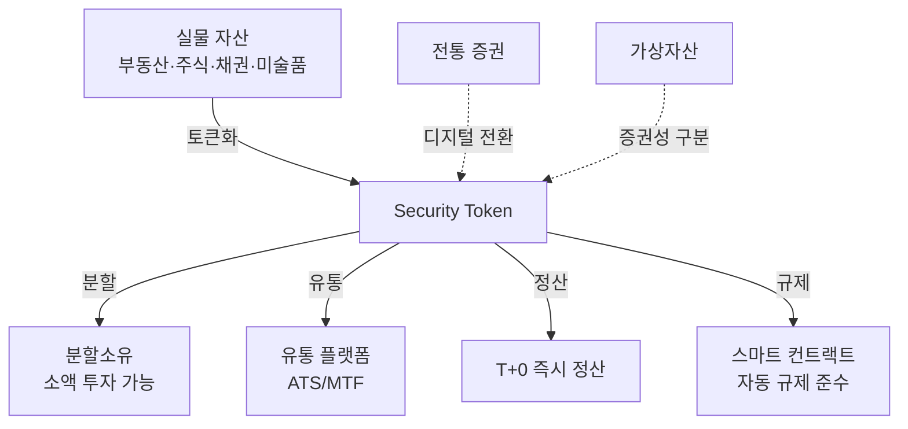

---
tags:
  - 디지털자산
  - 토큰증권
  - STO
---
# 토큰증권 (STO)

**STO(Security Token Offering)**는 주식, 채권, 부동산 등 실물 자산의 권리를 블록체인 토큰으로 발행·유통하는 것으로, 전통 증권의 디지털 전환이자 자본시장 인프라의 근본적 혁신이다.

## 왜 중요한가

전통 증권 시스템은 발행·유통·정산에 수일이 걸리고, 높은 중개 비용과 최소 투자 단위로 인해 소액 투자자의 접근이 제한된다. 토큰증권은 블록체인의 프로그래머블 특성을 활용하여 이러한 구조적 한계를 해결한다. 24/7 거래, T+0 정산, 분할소유를 통한 투자 민주화, 스마트 컨트랙트 기반 자동 규제 준수가 핵심 가치다.

특히 RWA(Real World Assets) 토큰화 열풍과 함께 BlackRock, JPMorgan 등 글로벌 금융기관이 적극 참여하면서, 토큰증권은 더 이상 실험적 기술이 아닌 자본시장의 차세대 인프라로 자리잡고 있다. 한국에서도 금융위원회 주도로 토큰증권 제도화가 진행 중이며, 조각투자·부동산 토큰화 시장이 급성장하고 있다.

## 핵심 키워드

| 키워드 | 설명 |
|--------|------|
| **Security Token** | 증권성을 가진 블록체인 토큰, 증권법 규제 대상 |
| **RWA (Real World Assets)** | 실물 자산(부동산, 채권, 미술품 등)의 토큰화 |
| **분할소유** | 고가 자산을 소액 단위로 나누어 다수가 공동 소유 |
| **유통 플랫폼** | ATS/MTF 등 토큰증권 전용 거래소 |

!!! info "토큰증권 vs 가상자산"
    토큰증권(Security Token)은 증권법의 적용을 받는 규제 자산이다. 비트코인·이더리움 같은 가상자산(Utility Token)과 달리, 발행·유통·공시 의무가 있으며 투자자 보호 체계가 적용된다. 이 구분은 각국 규제의 핵심이다.

## 전통 증권과의 차이

| 구분 | 전통 증권 | 토큰증권 |
|------|----------|---------|
| 발행 | 증권사 인수, 수주 소요 | 스마트 컨트랙트, 수분 내 |
| 유통 | 거래소 영업시간 내 | 24/7 글로벌 |
| 정산 | T+2 (2영업일) | T+0 (즉시) |
| 최소 투자 | 1주 단위 (수만~수백만 원) | 분할소유 (수천 원~) |
| 중개 비용 | 다층 중개 수수료 | 스마트 컨트랙트로 절감 |
| 규제 준수 | 수동 확인 | 자동 (화이트리스트, 잠금) |

## 이 섹션의 구성

| 문서 | 내용 |
|------|------|
| [핵심 개념](concepts.md) | RWA, 분할소유, 스마트 컨트랙트 규제, 수탁 등 |
| [주요 플랫폼 비교](products/index.md) | Securitize, Polymath, tZERO, 한국 STO 플랫폼 등 |
| [시장 트렌드](trends.md) | RWA 성장, 기관 투자자 유입, 규제 정비, DeFi 연동 |

## 관련 도메인

- [CBDC](../cbdc/index.md) — CBDC 인프라 위에서 토큰증권 결제·정산 가능성
- [DeFi 프로토콜](../defi/index.md) — DeFi와 토큰증권의 접점 (RWA 담보 렌딩, DEX 유통)

## 실무 적용

- **금융기관**: 토큰증권 발행·수탁·유통 인프라 구축
- **자산 운용사**: RWA 펀드 토큰화, 분할소유 상품 설계
- **핀테크 기업**: 조각투자 플랫폼 개발, 규제 샌드박스 참여
- **개발자**: ERC-3643(T-REX) 등 규제 준수 토큰 표준 구현
- **규제 기관**: 투자자 보호와 혁신 촉진의 균형 설계
