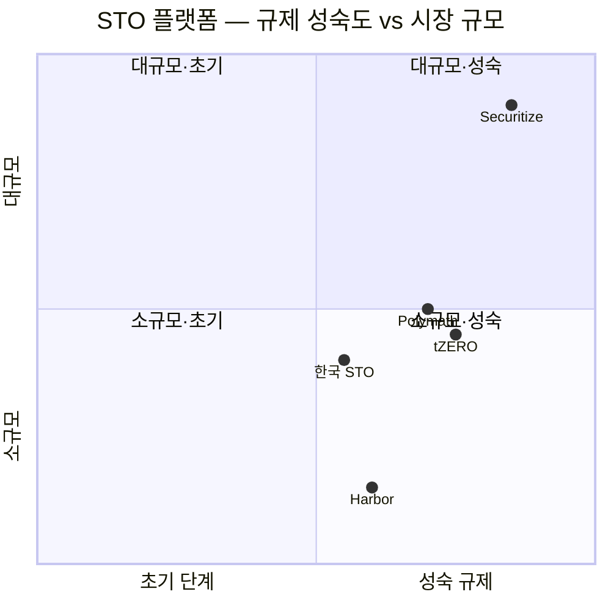
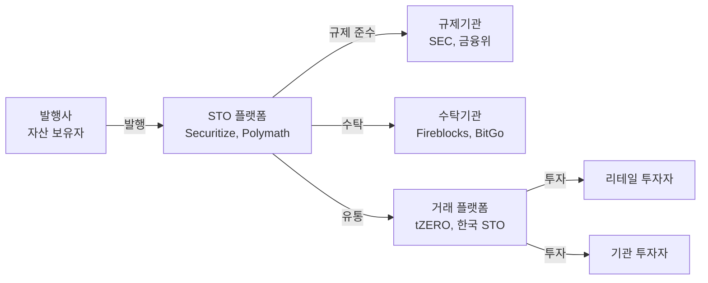

---
tags:
  - 디지털자산
  - 토큰증권
  - STO
---
# 주요 STO 플랫폼 비교

글로벌 토큰증권 생태계를 이끄는 주요 플랫폼을 비교 분석한다. 미국 중심의 글로벌 플랫폼과 한국의 조각투자 플랫폼을 함께 다룬다.

---

## 비교 요약

| 항목 | Securitize | Polymath | tZERO | 한국 STO (카이로스 등) | Harbor |
|------|-----------|----------|-------|---------------------|--------|
| **국가** | 미국 | 캐나다 | 미국 | 한국 | 미국 |
| **설립** | 2017 | 2017 | 2018 | 2022~ | 2017 |
| **핵심 역할** | 발행+유통+수탁 풀스택 | 발행+전용 체인 | 유통 플랫폼 | 발행+유통 (규제 샌드박스) | 발행+규제 |
| **블록체인** | Ethereum, Avalanche, Polygon | Polymesh (자체 체인) | Ethereum, Tezos | 허가형 (금융결제원 인프라) | Ethereum |
| **토큰 표준** | ERC-3643 등 | Polymesh 네이티브 | 자체 표준 | 자체 (금융위 가이드라인) | R-Token |
| **규제 라이선스** | SEC 등록 Transfer Agent, ATS | 자체 체인 규제 내장 | ATS (FINRA 등록) | 혁신금융서비스 지정 | SEC Reg D |
| **주요 고객** | BlackRock, KKR, Hamilton Lane | 기관 발행사 | 기관·리테일 | 리테일 투자자 | 부동산 펀드 |
| **TVL/AUM** | ~$2B+ | ~$500M | ~$300M | 수천억 원 | 서비스 축소 |
| **차별화** | BlackRock BUIDL 파트너 | 규제 전용 블록체인 | 리테일 거래소 | 조각투자 특화 | 규제 레이어 |

!!! info "시장 상황"
    Harbor는 BitGo에 인수된 후 독립 서비스가 축소되었다. 토큰증권 시장은 빠르게 변하고 있으므로 최신 정보를 교차 확인해야 한다.

---

## 포지셔닝 맵

---

## 개별 플랫폼 요약

### Securitize
미국 SEC에 Transfer Agent로 등록된 풀스택 토큰증권 플랫폼으로, BlackRock BUIDL 펀드($500M+)의 기술 파트너다. 발행·유통·수탁을 원스톱으로 제공하며, 기관급 RWA 토큰화의 사실상 표준이 되고 있다.

**강점**: SEC 등록, BlackRock 파트너십, 멀티체인 지원
**약점**: 높은 서비스 비용, 미국 규제 중심

→ [Securitize 상세](securitize.md)

### Polymath / Polymesh
토큰증권 전용 블록체인인 Polymesh를 개발·운영한다. 블록체인 레벨에서 신원 확인, 규제 준수, 거버넌스를 내장하여 "compliance by design"을 극대화한 접근이다.

**강점**: 규제 전용 체인, 신원 레이어 내장
**약점**: 생태계 규모 제한, Polymesh 채택 불확실

→ [Polymath 상세](polymath.md)

### tZERO
Overstock.com의 자회사로 출발한 토큰증권 유통 플랫폼이다. FINRA 등록 ATS를 운영하며, 리테일 투자자도 토큰증권을 거래할 수 있는 몇 안 되는 플랫폼이다.

**강점**: 리테일 접근성, ATS 라이선스
**약점**: 거래량 저조, 제한적 상장 종목

### 한국 STO 플랫폼
금융위원회의 혁신금융서비스 지정을 받은 플랫폼들이 조각투자 시장을 형성하고 있다. 카이로스, 펀블, 피스, 루센트블록 등이 부동산·미술품·음악 저작권 등을 토큰화하여 제공한다.

**강점**: 규제 샌드박스 기반 합법적 운영, 리테일 접근성
**약점**: 유통 시장 미성숙, 플랫폼 간 상호운용 부재

→ [한국 STO 상세](korea-sto.md)

### Harbor
부동산 펀드 토큰화에 특화된 플랫폼으로, R-Token 표준을 개발했다. 그러나 BitGo에 인수된 후 독립 서비스는 축소되었으며, 수탁 기능 중심으로 전환되었다.

**강점**: R-Token 표준 기여, 수탁 통합
**약점**: 독립 서비스 축소, 시장 존재감 저하

---

## 시나리오별 선택 가이드

| 시나리오 | 추천 플랫폼 | 이유 |
|---------|-----------|------|
| 기관급 RWA 펀드 토큰화 | Securitize | BlackRock 수준의 기관 고객 실적 |
| 규제 준수 최우선 | Polymath/Polymesh | 체인 레벨 규제 내장 |
| 리테일 투자자 대상 거래 | tZERO, 한국 STO | ATS/혁신금융 라이선스 보유 |
| 한국 시장 조각투자 | 한국 STO 플랫폼 | 국내 규제 적합, 원화 결제 |
| 부동산 특화 | Securitize, Harbor | 부동산 토큰화 실적 |

---

## 밸류체인 내 위치

## 관련 문서

- [STO 개요](../index.md) | [핵심 개념](../concepts.md)
- [시장 트렌드](../trends.md)
