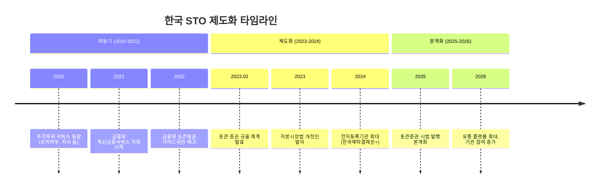
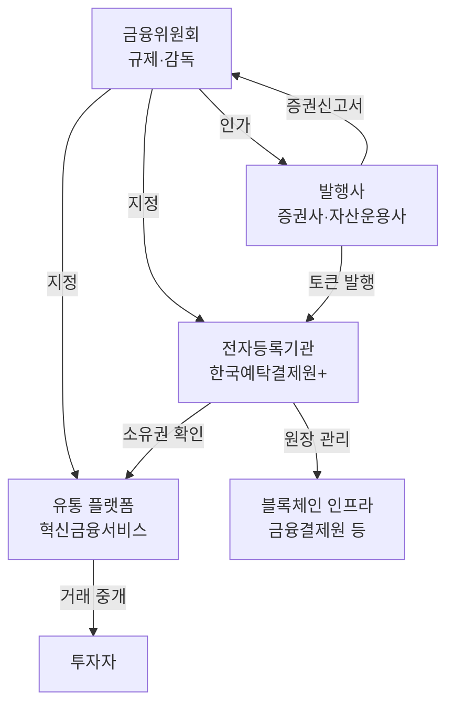
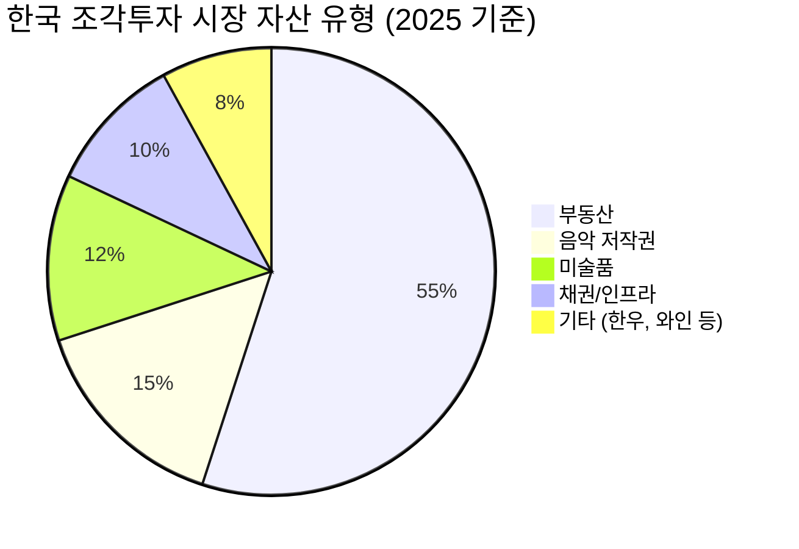
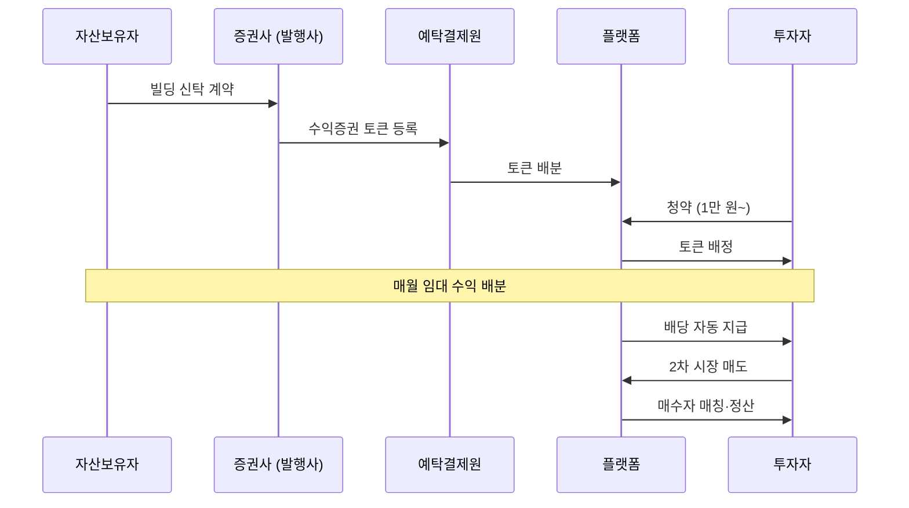

# 한국 STO (토큰증권)

**한국 STO**는 금융위원회 주도의 "토큰 증권 발행·유통 규율 체계(2023)"를 기반으로, 규제 샌드박스와 혁신금융서비스 지정을 통해 부동산·미술품·음악 저작권 등의 조각투자 시장을 형성하고 있는 국내 토큰증권 생태계다.

## 배경과 규제 환경

한국은 2023년 2월 금융위원회가 "토큰 증권 발행·유통 규율 체계 정비 방안"을 발표하면서 STO의 제도적 기반을 마련했다. 핵심은 분산원장 기술로 발행되는 증권을 기존 자본시장법 체계 내에서 규율한다는 것이다.

## 규제 프레임워크

| 항목 | 내용 |
|------|------|
| 근거 법률 | 자본시장법 (전자증권법 개정) |
| 발행 | 증권신고서 제출, 전자등록기관 등록 |
| 유통 | 혁신금융서비스 지정 플랫폼, 향후 다자간매매체결회사(MTF) |
| 수탁 | 한국예탁결제원 + 지정 전자등록기관 |
| 투자자 보호 | 공시 의무, 불공정거래 금지, 적합성 원칙 |
| 토큰화 대상 | 수익증권, 투자계약증권, 채무증권 등 |

!!! info "전자등록기관 확대"
    기존에는 한국예탁결제원만 전자등록기관이었으나, 토큰증권 제도화와 함께 복수의 전자등록기관을 허용하는 방향으로 개정이 진행 중이다. 이는 블록체인 기반 원장 관리의 법적 기반을 마련하는 핵심 변화다.

## 설계 구조

## 주요 플랫폼 현황

| 플랫폼 | 운영사 | 토큰화 대상 | 특징 |
|--------|--------|-----------|------|
| **카이로스** | 한국투자증권 | 부동산, 인프라, 채권 | 대형 증권사 기반, 기관급 |
| **펀블** | NH투자증권 | 부동산, 선박, 항공기 | NH 그룹 생태계 연계 |
| **피스** | KB증권 | 부동산, 미술품 | KB 금융그룹 연계 |
| **루센트블록** | 신한투자증권 | 부동산, 인프라 | 신한 그룹 디지털 전략 |
| **뮤직카우** | 뮤직카우 | 음악 저작권 | 음악 저작권 조각투자 선구자 |
| **카사** | 카사코리아 | 상업용 부동산 | 부동산 조각투자 초기 기업 |
| **소유** | 소유 | 미술품 | 미술품 조각투자 특화 |

## 조각투자 시장

한국 STO의 가장 활성화된 영역은 **조각투자**다. 고가 자산을 소액 단위로 분할하여 일반 투자자에게 투자 기회를 제공한다.

**투자 흐름 예시 (부동산 조각투자)**:

!!! warning "유동성 리스크"
    한국 조각투자 시장의 가장 큰 과제는 2차 유통 시장의 미성숙이다. 플랫폼별로 유동성이 파편화되어 있고, 매수·매도 호가 괴리가 큰 경우가 많다. 플랫폼 간 상호운용성 부재도 유동성 분산을 악화시킨다.

## 과제와 전망

**제도적 과제**:
- 자본시장법 개정 완료 필요 (전자등록기관 확대, MTF 도입)
- 플랫폼 간 상호운용 표준 부재
- 세제 불확실성 (배당소득세, 양도소득세 적용 기준)

**시장 과제**:
- 2차 유통 시장 유동성 부족
- 투자자 교육 필요 (토큰증권 ≠ 가상자산)
- 기관 투자자 참여 제한적 (소규모 자산 위주)

**긍정적 전망**:
- 대형 증권사의 적극적 참여로 신뢰도 향상
- 부동산·인프라 등 대형 자산의 토큰화 확대 예상
- [CBDC(디지털 원화)](../../cbdc/products/digital-won.md)와의 결제 연계 가능성
- 아시아 STO 허브 경쟁에서의 위치 확보

## 관련 문서

- [STO 개요](../index.md) | [핵심 개념](../concepts.md)
- [주요 플랫폼 비교](index.md)
- [Securitize](securitize.md) | [Polymath](polymath.md)
- [시장 트렌드](../trends.md)
