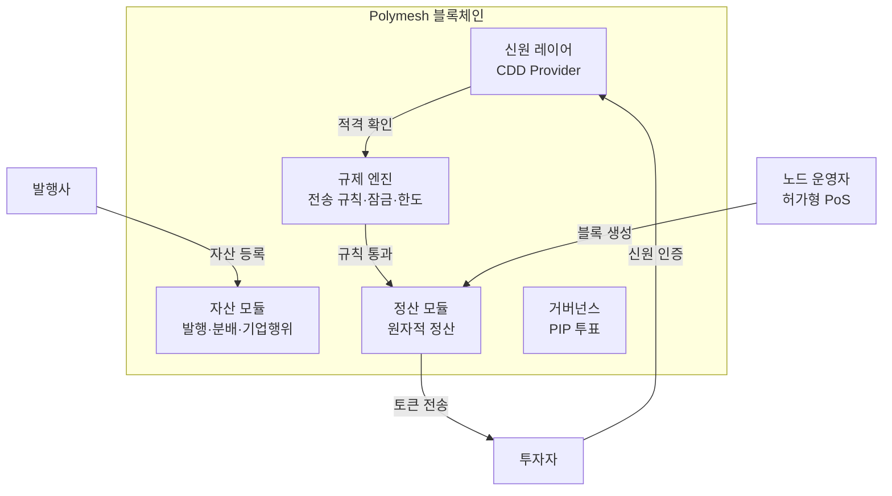
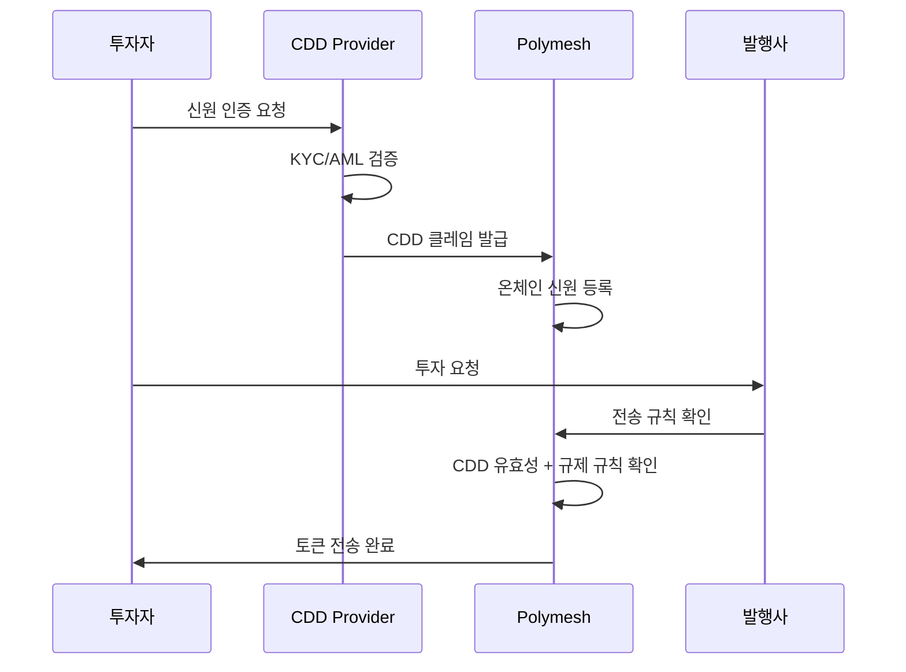

---
tags:
  - 디지털자산
  - 토큰증권
  - STO
---
# Polymath / Polymesh

**Polymath**는 토큰증권 전용 블록체인 **Polymesh**를 개발·운영하는 프로젝트로, 블록체인 레이어에서 신원 확인, 규제 준수, 거버넌스를 네이티브로 내장하여 "compliance by design"을 극대화한 접근을 취한다.

## 개요

2017년 설립된 Polymath는 초기에 Ethereum 위에서 ST-20 토큰 표준을 제안했으나, 범용 블록체인의 한계(가스비 변동, 규제 로직 부재, 신원 레이어 없음)를 인식하고 2021년 규제 준수 전용 블록체인인 Polymesh를 출시했다.

Polymesh는 Substrate(Polkadot SDK) 기반으로 구축되었으며, 모든 참여자의 신원을 온체인에서 관리하고, 토큰 전송 시 규제 규칙을 자동 검증하는 구조를 갖추고 있다. 이는 Ethereum 위에서 스마트 컨트랙트로 규제를 구현하는 Securitize와 근본적으로 다른 철학이다.

## Polymesh 아키텍처

## 규제 준수 설계

Polymesh가 범용 블록체인과 차별화되는 핵심은 프로토콜 레벨의 규제 준수다.

### 신원 레이어 (CDD)
모든 Polymesh 참여자는 CDD(Customer Due Diligence) Provider를 통해 신원 확인을 받아야 한다. 이는 Ethereum의 익명 주소 모델과 대비되며, KYC/AML을 블록체인 자체에서 보장한다.

### 전송 제한 규칙
발행사는 토큰별로 세밀한 전송 규칙을 설정할 수 있다:

| 규칙 유형 | 설명 |
|----------|------|
| **관할권 제한** | 특정 국가 투자자 차단 (예: 미국 비적격 투자자) |
| **투자자 유형** | 적격투자자·일반투자자 구분 |
| **보유 한도** | 단일 투자자 최대 보유 비율 제한 |
| **잠금 기간** | 일정 기간 전송 금지 |
| **투자자 수** | 최대 투자자 수 제한 (Reg D 등) |

### 기업행위 (Corporate Actions)
배당 분배, 주주총회 투표, 주식 분할 등 기업행위를 프로토콜 레벨에서 지원한다. 발행사가 스마트 컨트랙트를 직접 작성할 필요 없이, 내장 모듈로 처리할 수 있다.

!!! tip "Ethereum 대비 장점"
    Ethereum에서는 ERC-3643 같은 스마트 컨트랙트 표준으로 규제를 구현하지만, 컨트랙트 버그·가스비 변동·익명 주소 문제가 있다. Polymesh는 이를 프로토콜 레벨에서 해결하여 더 안정적이고 예측 가능한 규제 준수를 제공한다.

## 합의 메커니즘

Polymesh는 허가형 PoS(Proof of Stake)를 사용한다. 노드 운영자는 신원 인증을 받은 허가된 기관만 가능하며, 이는 퍼블릭 블록체인의 무허가(permissionless) 모델과 대비된다.

| 항목 | Polymesh | Ethereum |
|------|---------|----------|
| 합의 | 허가형 NPoS | 퍼블릭 PoS |
| 노드 운영 | 허가된 기관만 | 누구나 가능 |
| 트랜잭션 수수료 | POLYX (예측 가능) | ETH (변동 심함) |
| 최종성 | 확정적 (수초) | 확률적 (~15분) |

## 강점과 약점

**강점**:
- 블록체인 레벨 규제 준수 — 스마트 컨트랙트 버그 리스크 감소
- 온체인 신원 관리 — KYC/AML 자동화
- 예측 가능한 수수료와 확정적 최종성
- 기업행위 네이티브 지원 (배당, 투표, 분할)
- Substrate 기반으로 업그레이드 용이

**약점**:
- Polymesh 생태계 규모가 Ethereum 대비 매우 작음
- 허가형 모델로 인한 탈중앙화 제한
- DeFi 프로토콜과의 연동 제한적
- Securitize 대비 기관 파트너십 부족
- POLYX 토큰의 시장 유동성 제한

!!! warning "채택 과제"
    Polymesh의 기술적 우수성에도 불구하고, 대부분의 기관은 이미 Ethereum 생태계에 투자하고 있어 전용 체인으로의 마이그레이션에 소극적이다. "최선의 기술이 항상 시장을 지배하지는 않는다"는 점이 Polymesh의 가장 큰 도전이다.

## 관련 문서

- [STO 개요](../index.md) | [핵심 개념](../concepts.md)
- [주요 플랫폼 비교](index.md)
- [Securitize](securitize.md) | [한국 STO](korea-sto.md)
