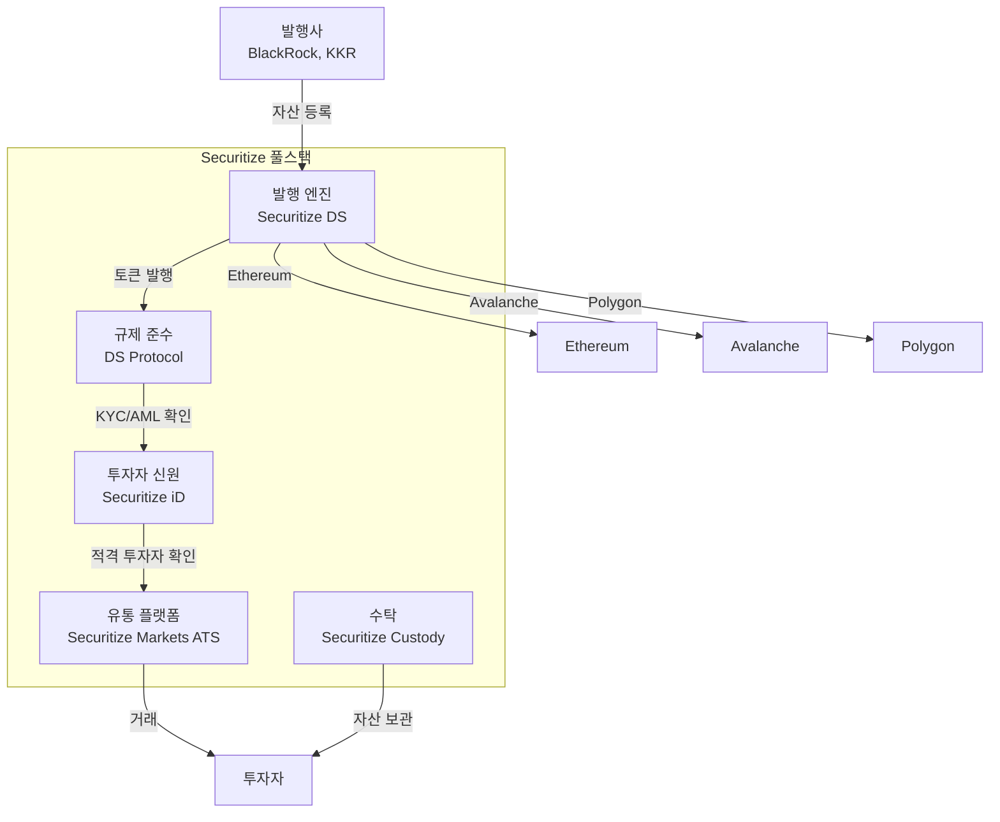
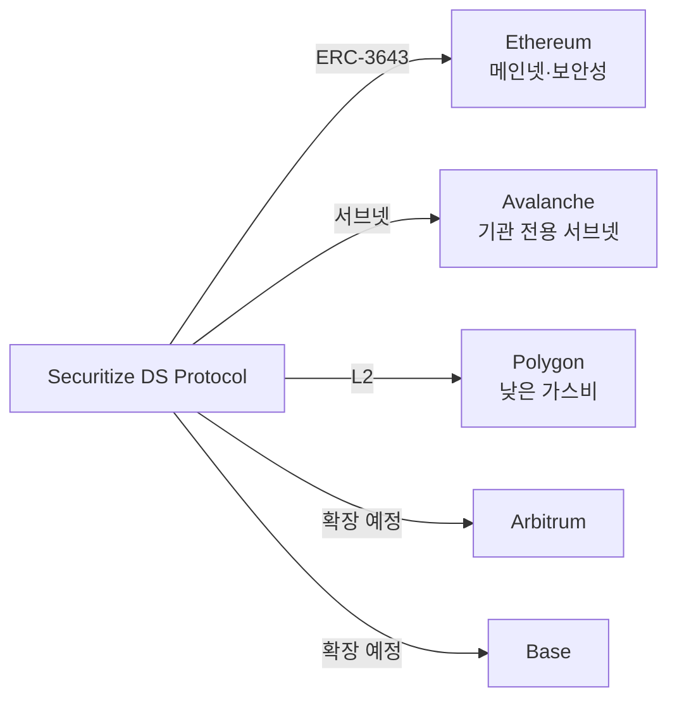
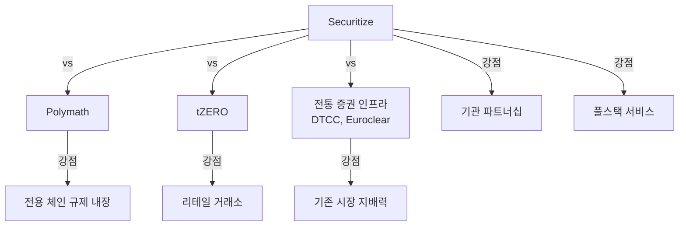

# Securitize

**Securitize**는 미국 SEC에 등록된 Transfer Agent이자 ATS 운영사로, BlackRock BUIDL 펀드의 기술 파트너로서 기관급 RWA 토큰화의 사실상 글로벌 표준을 구축하고 있는 풀스택 토큰증권 플랫폼이다.

## 개요

Securitize는 2017년 Carlos Domingo에 의해 설립되었으며, 토큰증권의 발행(issuance), 규제 준수(compliance), 유통(trading), 수탁(custody)을 원스톱으로 제공한다. SEC 등록 Transfer Agent 자격과 FINRA 등록 ATS(Securitize Markets)를 보유하여 미국 증권법 프레임워크 내에서 합법적으로 운영된다.

2024년 BlackRock이 Securitize 플랫폼 위에 BUIDL(BlackRock USD Institutional Digital Liquidity) 펀드를 출시하면서 시장의 판도가 바뀌었다. 이후 KKR, Hamilton Lane, Ares Management 등 글로벌 대형 자산운용사가 잇따라 Securitize를 통해 펀드를 토큰화했다.

## 설계 구조

## BlackRock BUIDL 펀드

BUIDL은 BlackRock이 Securitize를 통해 발행한 토큰화 미국 국채 펀드로, 기관 투자자에게 온체인으로 국채 수익을 제공한다.

| 항목 | 내용 |
|------|------|
| 정식 명칭 | BlackRock USD Institutional Digital Liquidity Fund |
| 기초 자산 | 미국 단기 국채, 역레포 |
| 블록체인 | Ethereum (1차), 멀티체인 확장 |
| 최소 투자 | $5M (기관 전용) |
| AUM | $500M+ (2025년 기준) |
| 수익 분배 | 일일 토큰 리베이스 |
| 의의 | 세계 최대 자산운용사의 RWA 토큰화 진입 |

!!! tip "BUIDL의 DeFi 활용"
    BUIDL 토큰은 [DeFi 프로토콜](../../defi/index.md)에서 담보 자산으로 활용되기 시작했다. MakerDAO, Aave 등에서 BUIDL을 담보로 인정하는 논의가 진행 중이며, 이는 TradFi-DeFi 브릿지의 핵심 사례다.

## 핵심 기능

### Securitize DS (Digital Securities) Protocol
ERC-3643(T-REX) 호환 규제 준수 프로토콜로, 토큰 전송 시 자동으로 KYC/AML, 적격투자자 확인, 보유 한도, 잠금 기간을 검증한다.

### Securitize iD
블록체인 기반 투자자 신원 관리 시스템으로, 한 번 KYC를 통과하면 Securitize 생태계 내 모든 토큰증권에 투자 가능하다.

### Securitize Markets
FINRA 등록 ATS로, 토큰증권의 2차 거래를 제공한다. 기관 투자자 간 OTC 거래와 리테일 투자자 접근이 모두 가능하다.

## 멀티체인 전략

## 강점과 약점

**강점**:
- SEC 등록 Transfer Agent + ATS — 미국 규제 완전 준수
- BlackRock, KKR 등 세계 최대 자산운용사와의 파트너십
- 풀스택 서비스 (발행→규제→유통→수탁)
- 멀티체인 지원으로 유연한 배포
- $2B+ AUM으로 시장 지배력

**약점**:
- 높은 서비스 비용 (기관급 가격)
- 미국 규제 중심으로 글로벌 확장에 한계
- 리테일 접근성은 tZERO 대비 제한적
- 중앙화된 플랫폼 의존도 (탈중앙화와 거리)

## 경쟁 포지션

## 관련 문서

- [STO 개요](../index.md) | [핵심 개념](../concepts.md)
- [주요 플랫폼 비교](index.md)
- [Polymath](polymath.md) | [한국 STO](korea-sto.md)
- [DeFi — MakerDAO RWA](../../defi/products/makerdao.md)
