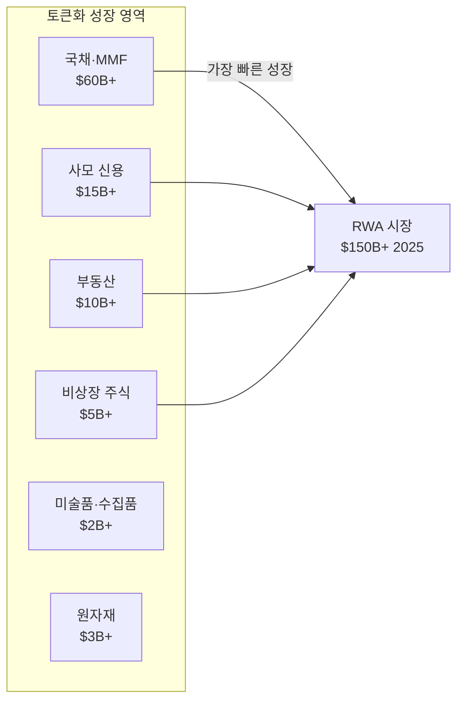
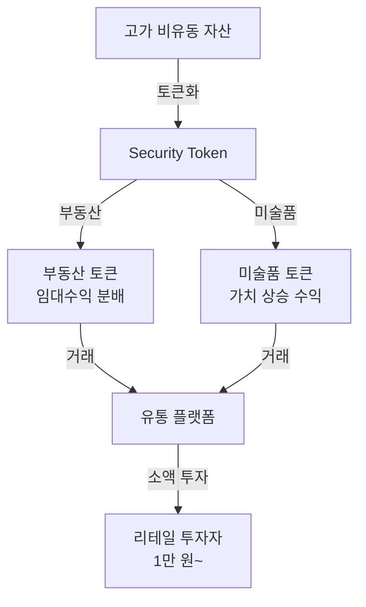
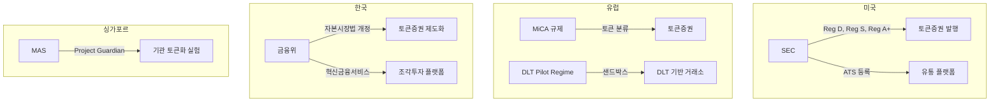
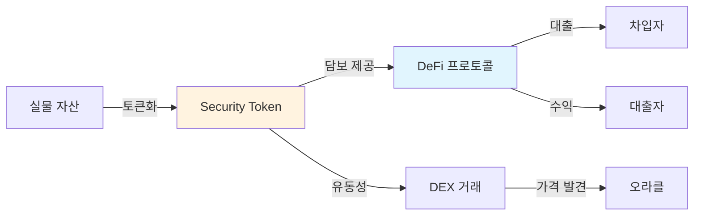

---
tags:
  - 디지털자산
  - 토큰증권
  - STO
---
# STO 시장 트렌드

토큰증권 시장을 형성하는 5가지 핵심 트렌드를 분석한다. RWA 토큰화의 폭발적 성장, 기관 투자자의 진입, 그리고 DeFi와의 융합이 시장의 방향을 결정하고 있다.

---

## 1. RWA 시장 성장

RWA(Real World Assets) 토큰화 시장은 2024년 $100B를 돌파한 이후 2025년 $150B 이상으로 성장했으며, 2030년까지 $16T에 이를 것으로 전망된다(Boston Consulting Group, McKinsey 추산). 이 성장은 기관 투자자의 진입과 규제 명확화가 동시에 이루어진 결과다.

!!! tip "국채 토큰화가 견인"
    RWA 시장 성장의 핵심 동력은 미국 국채(T-Bill) 토큰화다. [BlackRock BUIDL](products/securitize.md), Franklin Templeton OnChain Fund, Ondo Finance USDY 등이 온체인으로 국채 수익을 제공하며, 스테이블코인의 수익형 대안으로 급성장했다.

---

## 2. 부동산·미술품 토큰화

부동산과 미술품은 토큰화의 대표적 대상 자산이다. 고가·비유동 자산을 [분할소유](concepts.md)로 전환하여 투자 접근성을 혁신한다.

**부동산 토큰화**:
- 상업용 부동산(오피스, 물류센터)이 주요 대상
- 임대 수익의 자동 분배(스마트 컨트랙트)
- [한국의 조각투자 플랫폼](products/korea-sto.md)이 활발 (카사, 펀블 등)
- 미국의 RealT, Lofty AI 등 리테일 플랫폼도 성장

**미술품 토큰화**:
- Masterworks (미국), 소유 (한국) 등이 미술품 분할소유 제공
- 감정·보관·보험 등 물리적 수탁의 복잡성이 과제
- NFT와의 경계가 모호한 영역 존재

---

## 3. 기관 투자자 유입

2024~2025년은 기관 투자자가 토큰증권 시장에 본격 진입한 전환점이다.

| 기관 | 참여 내용 | 의미 |
|------|----------|------|
| **BlackRock** | BUIDL 펀드 ($500M+) via [Securitize](products/securitize.md) | 세계 최대 자산운용사의 토큰화 진입 |
| **JPMorgan** | Onyx 플랫폼, 토큰화 레포 거래 | 대형 IB의 인프라 구축 |
| **Goldman Sachs** | GS DAP (Digital Asset Platform) | 기관 토큰화 플랫폼 |
| **Franklin Templeton** | OnChain US Govt Money Fund | 최초 온체인 뮤추얼 펀드 |
| **KKR** | Health Care fund tokenized on Avalanche | PE 펀드 토큰화 |
| **Citi** | 토큰화 예금, 크로스보더 결제 연구 | 대형 은행 인프라 실험 |

!!! info "기관 진입의 의미"
    기관 투자자의 참여는 단순한 투자 규모 확대를 넘어, 규제 기관에 대한 신뢰 시그널, 인프라 표준화 촉진, 리테일 투자자 신뢰도 향상 등 생태계 전반에 긍정적 영향을 미친다.

---

## 4. 규제 정비

주요국의 토큰증권 규제가 명확해지면서 시장 불확실성이 감소하고 있다.

| 지역 | 규제 프레임워크 | 특징 |
|------|--------------|------|
| **미국** | 기존 증권법 적용 (Reg D/S/A+) | 가장 엄격, 그러나 명확 |
| **유럽** | MiCA + DLT Pilot Regime | 통합 규제, 샌드박스 병행 |
| **한국** | 자본시장법 개정 추진 | 제도화 진행 중, [상세 참고](products/korea-sto.md) |
| **싱가포르** | MAS Project Guardian | 기관 중심 실험, 유연한 규제 |
| **스위스** | DLT법 (2021 시행) | 가장 선진적 법적 프레임워크 |
| **일본** | 금상법 개정 (2020) | STO 제도 명시적 도입 |

!!! warning "규제 차익거래 리스크"
    규제가 관할권별로 상이하여, 규제 차익거래(regulatory arbitrage)가 발생할 수 있다. 발행사가 규제가 느슨한 관할권에서 토큰을 발행하고 글로벌로 유통하는 구조는 투자자 보호를 약화시킬 수 있다.

---

## 5. DeFi 연동

토큰증권과 [DeFi 프로토콜](../defi/index.md)의 융합은 가장 혁신적이면서도 규제적으로 복잡한 트렌드다.

**현재 진행 중인 DeFi-STO 융합**:

| 사례 | 내용 |
|------|------|
| [MakerDAO](../defi/products/makerdao.md) RWA | 미국 국채 $1B+ DAI 담보 편입 |
| [Aave](../defi/products/aave.md) RWA 시장 | 토큰화 자산 담보 렌딩 시장 |
| Centrifuge | RWA 토큰화 → DeFi 렌딩 브릿지 |
| Maple Finance | 기관 신용 대출 토큰화 |
| Ondo Finance | 국채 수익 토큰 → DeFi 유동성 |

!!! warning "규제 장벽"
    DeFi의 비허가(permissionless) 특성과 토큰증권의 규제 요건(KYC, 적격투자자 확인)은 근본적으로 충돌한다. 현재는 "허가형 DeFi(permissioned DeFi)" 또는 "기관 DeFi"라는 중간 형태로 절충하고 있으나, 장기적으로 이 긴장 관계의 해결이 필요하다.

---

## 향후 전망

1. **국채·MMF 토큰화가 킬러 유스케이스**: 스테이블코인의 수익형 대안으로 기관 수요 지속
2. **아시아 STO 허브 경쟁**: 한국, 싱가포르, 홍콩, 일본 간 규제 경쟁력 확보 경쟁
3. **DeFi-TradFi 브릿지 확대**: [MakerDAO RWA](../defi/products/makerdao.md) 모델의 확산
4. **크로스보더 토큰증권 유통**: [CBDC](../cbdc/index.md) 인프라와의 결제 연계
5. **AI 기반 토큰증권 분석**: 자산 가치 평가, 규제 준수 자동화에 AI 활용

## 관련 문서

- [STO 개요](index.md) | [핵심 개념](concepts.md)
- [주요 플랫폼 비교](products/index.md)
- [CBDC 트렌드](../cbdc/trends.md) | [DeFi 트렌드](../defi/trends.md)
