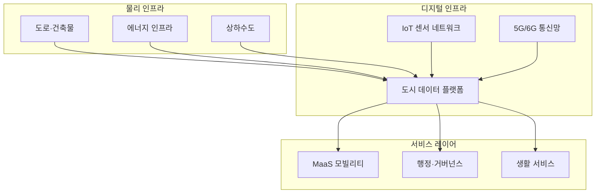
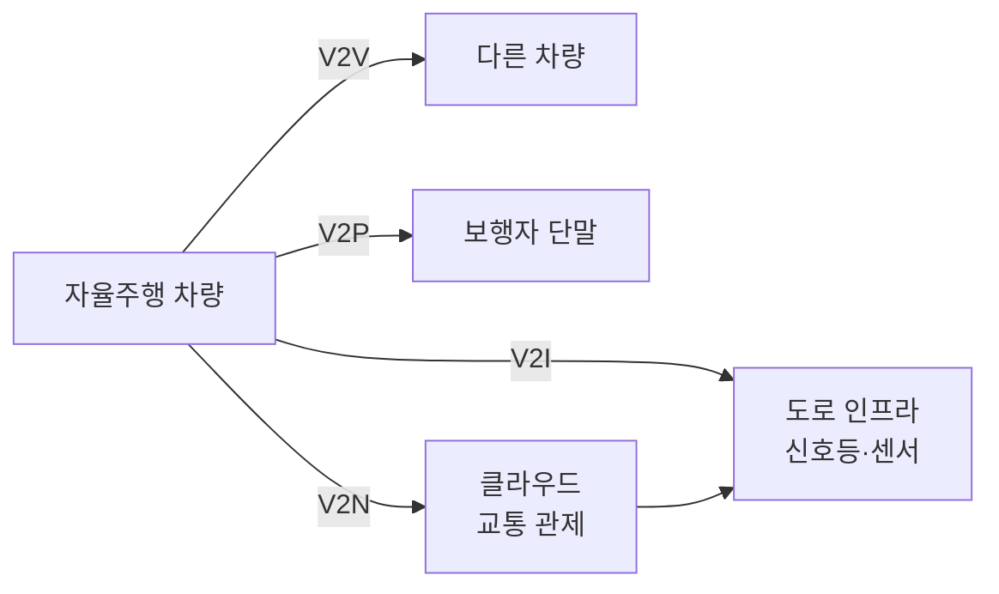
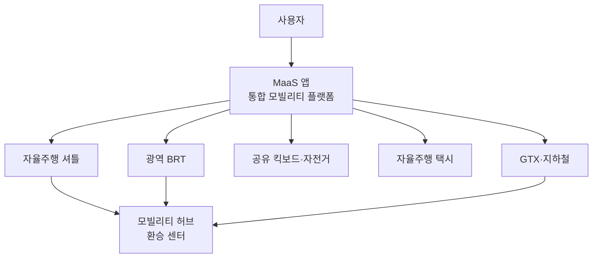
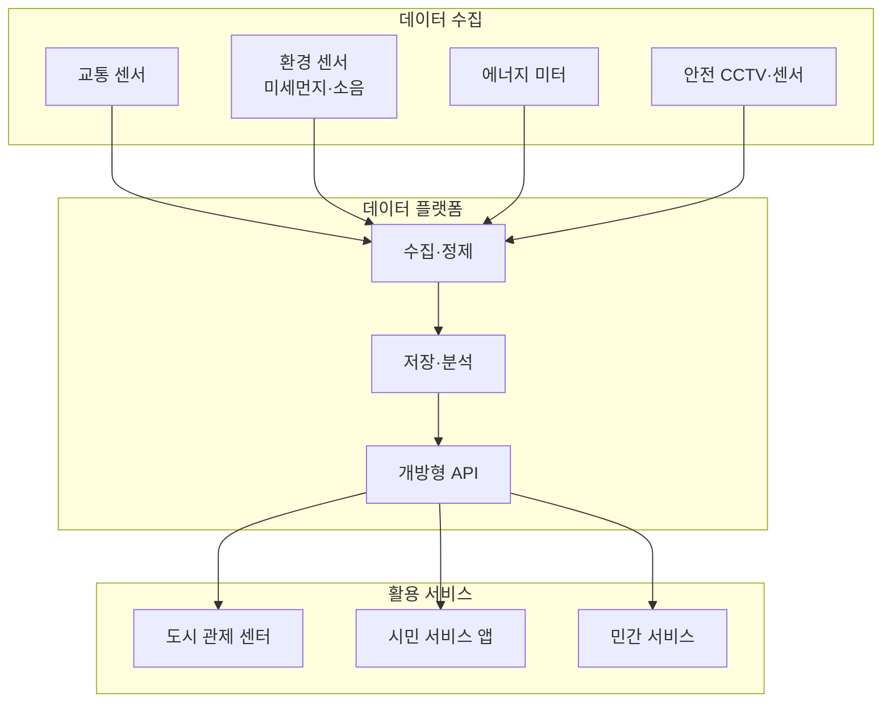
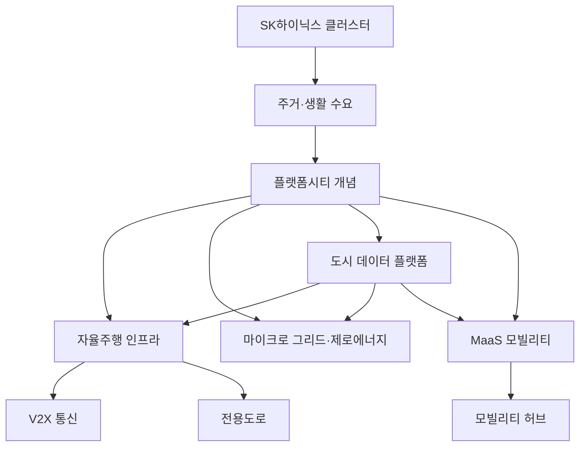

---
tags:
  - 부동산
  - 용인플랫폼시티
  - 스마트시티
---
# 용인플랫폼시티 핵심 개념

용인플랫폼시티에 적용되는 핵심 기술과 도시 설계 개념을 정리한다. 자율주행, MaaS, 에너지, 데이터 플랫폼, 반도체 클러스터 연계까지, 플랫폼시티를 구성하는 기술 스택을 체계적으로 다룬다.

---

## 플랫폼시티 개념

**플랫폼시티**는 도시 자체를 하나의 디지털 플랫폼으로 설계하는 차세대 도시 모델이다. 전통 신도시가 "도로를 깔고 아파트를 짓는" 물리적 개발에 집중했다면, 플랫폼시티는 **데이터·기술 인프라를 도시의 운영체제(OS)**로 내장한다.

| 계층 | 역할 | 용인플랫폼시티 적용 |
|------|------|-------------------|
| 물리 인프라 | 도로, 건축물, 에너지, 수도 | 자율주행 전용도로, 제로에너지 건축 |
| 디지털 인프라 | 센서, 통신, 데이터 수집 | IoT 센서 네트워크, 5G 커버리지 |
| 데이터 플랫폼 | 수집·분석·의사결정 | 도시 통합 데이터 플랫폼 (개방형) |
| 서비스 레이어 | 시민 대면 서비스 | MaaS, 스마트 행정, 생활 앱 |

---

## 자율주행 인프라

용인플랫폼시티의 가장 핵심적인 차별점은 **도시 설계 단계부터 자율주행을 전제**한다는 점이다.

### V2X (Vehicle to Everything)

차량과 주변 환경(인프라, 다른 차량, 보행자) 간 실시간 통신 기술이다.

| V2X 유형 | 설명 | 플랫폼시티 적용 |
|----------|------|---------------|
| **V2I** (Vehicle to Infrastructure) | 차량 ↔ 신호등·도로 센서 | 자율주행 전용도로의 신호 제어 |
| **V2V** (Vehicle to Vehicle) | 차량 ↔ 차량 | 자율주행 군집 주행, 사고 예방 |
| **V2P** (Vehicle to Pedestrian) | 차량 ↔ 보행자 단말 | 보행자 안전, 횡단보도 연동 |
| **V2N** (Vehicle to Network) | 차량 ↔ 클라우드 | 실시간 교통 최적화, 원격 제어 |

### 자율주행 전용도로

기존 도로와 분리된 자율주행 전용 구간을 설계하여, 자율주행 차량과 일반 차량의 혼재 문제를 해결한다.

| 구분 | 일반 도로 | 자율주행 전용도로 |
|------|----------|-----------------|
| 차량 유형 | 혼재 | 자율주행 차량 전용 |
| 신호 체계 | 기존 신호등 | V2I 기반 디지털 신호 |
| 속도 | 제한적 | 고속 군집 주행 가능 |
| 안전 | 인간 운전 의존 | 시스템 기반 안전 관리 |

---

## MaaS (Mobility as a Service)

**MaaS**는 자율주행, 대중교통, 공유 모빌리티, 개인 이동수단을 **하나의 플랫폼에서 통합 제공**하는 서비스 모델이다. 사용자는 출발지~목적지까지 최적 경로와 교통수단 조합을 하나의 앱에서 예약·결제한다.

| MaaS 레벨 | 설명 | 플랫폼시티 목표 |
|-----------|------|---------------|
| Level 0 | 개별 교통수단 이용 | 현재 대부분의 도시 |
| Level 1 | 정보 통합 (경로 검색) | 네이버 지도, 카카오맵 수준 |
| Level 2 | 예약·결제 통합 | 일부 선진 도시 |
| **Level 3** | **서비스 통합 (구독형)** | **용인플랫폼시티 목표** |
| Level 4 | 정책 통합 (도시 교통 최적화) | 장기 비전 |

---

## 에너지: 마이크로 그리드 & 제로에너지

### 마이크로 그리드

중앙 발전소에 의존하지 않고, **블록 단위로 에너지를 생산·저장·소비**하는 분산형 에너지 시스템이다.

| 구성 요소 | 역할 | 기술 |
|----------|------|------|
| 분산 발전 | 블록 내 전력 생산 | 태양광 패널, 연료전지 |
| 에너지 저장 | 생산 전력 저장 | ESS (에너지 저장 시스템) |
| 스마트 그리드 | 수급 자동 조절 | AI 기반 에너지 관리 |
| P2P 거래 | 잉여 전력 이웃 간 거래 | 블록체인 기반 전력 거래 |

### 제로에너지 건축

건물이 소비하는 에너지를 **건물 자체에서 생산하여 순에너지 소비를 0에 가깝게** 만드는 건축 기법이다. 2025년부터 공공건축물 제로에너지 의무화가 확대되고 있으며, 플랫폼시티는 주거 건축물에도 적용을 추진한다.

| 등급 | 에너지 자립률 | 적용 대상 |
|------|-------------|----------|
| 1등급 | 100% 이상 | 시범 건물 |
| 2등급 | 80~100% | 공공건물 목표 |
| 3등급 | 60~80% | 주거 건물 목표 |
| 4등급 | 40~60% | 일반 건물 |
| 5등급 | 20~40% | 최소 기준 |

---

## 도시 통합 데이터 플랫폼

도시 내 모든 센서·시스템에서 수집되는 데이터를 **하나의 플랫폼에서 통합 관리**하고, 개방형 API로 민간 서비스 개발에 활용할 수 있게 하는 핵심 인프라다.

!!! info "세종 스마트시티 벤치마크"
    세종 5-1생활권 스마트시티는 국내 최초로 도시 데이터 플랫폼을 실증 중이다. 교통·환경·에너지 데이터를 통합 관리하며, 자율주행 셔틀을 시범 운행하고 있다.

---

## SK하이닉스 반도체 클러스터 연계

용인플랫폼시티의 자족 기능의 핵심은 **SK하이닉스 반도체 메가 클러스터**다.

| 항목 | 내용 |
|------|------|
| 투자 규모 | 약 120조 원 (국내 최대 단일 투자) |
| 위치 | 용인시 처인구 원삼면 일대 |
| 주요 시설 | 팹 4개+, R&D 센터, 소재·장비 협력사 |
| 고용 규모 | 직접 3만+, 간접 포함 수만 명 추정 |
| 착공 | 2025년~ 단계적 |

!!! warning "클러스터와 플랫폼시티의 거리"
    SK하이닉스 클러스터(처인구 원삼면)와 플랫폼시티(기흥구 보정·마북·신갈동)는 약 20~25km 거리로 직접 인접하지 않는다. 경부고속도로와 GTX-A를 통한 간접 연결이 핵심이며, 반도체 종사자의 주거 수요를 흡수하는 역할을 한다.

---

## 개념 간 관계

## 관련 문서

- [용인플랫폼시티 개요](index.md)
- [주변 프로젝트 비교](products/index.md)
- [개발 현황·투자 분석](trends.md)
