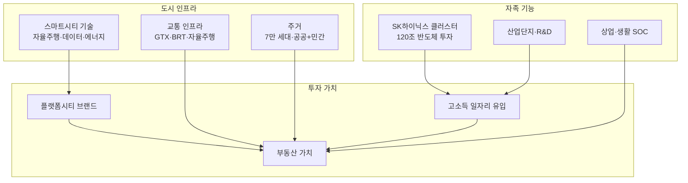

---
tags:
  - 부동산
  - 용인플랫폼시티
  - 스마트시티
search:
  boost: 2
---
# 용인플랫폼시티

**용인플랫폼시티**는 경기도 용인시 처인구에 조성되는 차세대 플랫폼시티다. 자율주행, 도시 데이터 플랫폼, MaaS(Mobility as a Service) 등 첨단 인프라를 도시 설계 단계부터 적용하며, SK하이닉스 반도체 클러스터의 배후 자족도시를 지향한다. 약 7만 세대, 17만 인구 규모의 수도권 최대급 신도시 프로젝트다.

## 왜 중요한가

용인플랫폼시티는 단순한 택지개발이 아니라 **도시 자체를 하나의 플랫폼으로 설계**하는 차세대 모델이다. 기존 3기 신도시(왕숙, 교산, 창릉 등)가 주거 공급에 초점을 맞추는 반면, 플랫폼시티는 자율주행 전용도로, 마이크로 그리드, 도시 통합 데이터 플랫폼 등 첨단 인프라를 기반으로 산업·기술 생태계를 함께 조성한다.

특히 용인에 120조 규모로 추진 중인 **SK하이닉스 반도체 클러스터**가 핵심 배후 수요다. 반도체 산업 종사자의 주거·생활 인프라를 제공하는 자족도시로서, 단순 베드타운과 차별화된 성장 잠재력을 갖는다.

## 기본 정보

| 항목 | 내용 |
|------|------|
| **사업명** | 용인 플랫폼시티 (구 용인 반도체 클러스터 배후도시) |
| **위치** | 경기도 용인시 처인구 남사읍·이동읍 일원 |
| **면적** | 약 1,262만㎡ (약 382만 평) |
| **계획 인구** | 약 17만 명 |
| **계획 세대** | 약 7만 세대 |
| **사업 시행** | LH (한국토지주택공사) + 경기도 + 용인시 |
| **사업 기간** | 2024 지구지정 ~ 2035 단계별 입주 (예상) |
| **핵심 교통** | GTX-A 연장 추진, 수도권 내부순환 연결, 자율주행 전용도로 |

## 핵심 키워드

| 키워드 | 설명 |
|--------|------|
| **플랫폼시티** | 자율주행·데이터 기반 도시 운영을 표방하는 차세대 신도시 모델 |
| **MaaS** | Mobility as a Service. 자율주행·대중교통·공유모빌리티를 하나의 플랫폼으로 통합 |
| **V2X** | Vehicle to Everything. 자율주행 차량과 도시 인프라 간 통신 기술 |
| **마이크로 그리드** | 소규모 분산형 에너지 생산·소비 시스템. 제로에너지 도시의 기반 |
| **SK하이닉스 클러스터** | 용인에 조성 중인 120조 규모 반도체 메가 클러스터 |
| **GTX-A 연장** | 수도권 광역급행철도 A노선의 용인 연장. 추진 검토 단계 |

!!! info "플랫폼시티 vs 3기 신도시"
    3기 신도시(왕숙, 교산, 계양 등)는 **국토교통부 주도의 공공택지 주거 공급** 모델이다. 용인플랫폼시티는 자율주행·데이터 플랫폼 등 **첨단 기술 인프라를 도시 설계에 내장**하고, SK하이닉스 클러스터와 연계한 **자족형 도시**를 지향하는 점이 근본적 차이다. 자세한 비교는 [주변 프로젝트 비교](products/index.md)를 참고하라.

## 전통 신도시 vs 용인플랫폼시티

| 구분 | 전통 신도시 | 용인플랫폼시티 |
|------|-----------|-------------|
| 도시 설계 | 용도지역 구분 중심 | 데이터 기반 복합용도 |
| 교통 체계 | 도로·대중교통 | 자율주행 + MaaS 통합 |
| 에너지 | 중앙 공급 | 마이크로 그리드, 제로에너지 건축 |
| 데이터 | 개별 시스템 | 도시 통합 데이터 플랫폼 |
| 산업 연계 | 베드타운 | SK하이닉스 클러스터 배후 자족도시 |

!!! tip "학습 순서"
    ① [핵심 개념](concepts.md) → ② [주변 프로젝트 비교](products/index.md) → ③ [개발 현황·투자 분석](trends.md)

## 이 섹션의 구성

| 문서 | 내용 |
|------|------|
| [핵심 개념](concepts.md) | 플랫폼시티 기술 (자율주행, MaaS, V2X, 마이크로 그리드, 데이터 플랫폼) |
| [분양 정보](presale.md) | 분양 일정, 공급 물량, 분양가 전망, 청약 자격·전략 |
| [주변 프로젝트 비교](products/index.md) | 3기 신도시와의 입지·규모·교통·투자 관점 비교 |
| [개발 현황·투자 분석](trends.md) | 개발 타임라인, 주변 시세, 투자 긍정/리스크 요인, 체크리스트 |

## 관련 도메인

- [부동산 투자](../real-estate-investment/index.md) — 부동산 투자 일반 개념, 수익률, 입지분석, 정책 도구
- [실물자산 토큰화 (RWA)](../rwa/index.md) — 부동산 토큰화, 조각투자 플랫폼
- [토큰증권 (STO)](../sto/index.md) — 부동산 수익증권의 토큰화 발행 메커니즘

## 실무 적용

- **개인 투자자**: 개발 진행 단계별 투자 타이밍 판단, GTX 연장 리스크 평가
- **반도체 산업 종사자**: SK하이닉스 클러스터 근무 시 주거 계획 수립
- **시행사·시공사**: 플랫폼시티 인프라 사업 참여 기회 탐색
- **PM·리서처**: 스마트시티·모빌리티 서비스 기획의 실증 사례 연구
