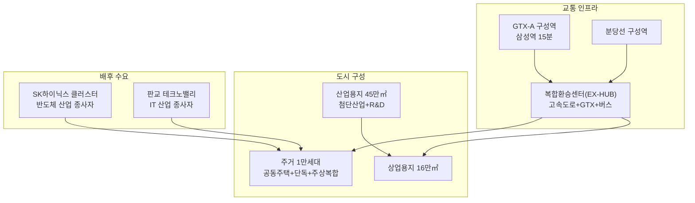

---
tags:
  - 부동산
  - 용인플랫폼시티
  - 스마트시티
search:
  boost: 2
---
# 용인플랫폼시티

**용인플랫폼시티**는 경기도 용인시 기흥구 보정동·마북동·신갈동 및 수지구 상현동·풍덕천동 일원에 조성되는 경제 복합 자족 신도시다. 약 272만9천㎡(83만 평), 판교테크노밸리의 약 4배 규모이며, GTX-A 구성역과 분당선 구성역을 중심으로 주거·상업·산업·문화 기능을 통합한다. 2025년 3월 착공, 2030년 준공을 목표로 약 8조2,680억 원이 투입된다.

## 왜 중요한가

용인플랫폼시티는 경부고속도로와 영동고속도로가 교차하는 **신갈분기점(JC) 주변**에 위치하며, GTX-A 구성역 복합환승센터를 핵심 교통 인프라로 갖추고 있다. 국내 최초로 **고속도로와 GTX 역사가 연결되는 복합환승센터(EX-HUB)**가 설치되어, 경부고속도로를 경유하는 버스와 GTX·분당선을 한 번에 이용할 수 있게 된다.

특히 용인에 추진 중인 **SK하이닉스 반도체 클러스터**와의 연계를 통해 반도체 산업 종사자의 주거·생활 수요를 흡수하는 자족도시를 지향한다. 산업용지(44만9천㎡)가 전체의 16.4%를 차지하여, 단순 베드타운이 아닌 경제 복합 도시로 설계되었다.

## 기본 정보

| 항목 | 내용 |
|------|------|
| **사업명** | 경기용인 플랫폼시티 도시개발사업 |
| **위치** | 용인시 기흥구 보정동·마북동·신갈동, 수지구 상현동·풍덕천동 일원 |
| **면적** | 272만9천㎡ (약 83만 평, 판교테크노밸리 4배) |
| **계획 인구** | 2만7,283명 |
| **계획 세대** | 약 1만105세대 |
| **사업비** | 8조2,680억 원 |
| **사업 시행** | 경기도 + 용인시 + 경기주택도시공사(GH) + 용인도시공사 (공영개발) |
| **착공** | 2025년 3월 (완료) |
| **준공 목표** | 2030년 |
| **핵심 교통** | GTX-A 구성역 (확정), 분당선 구성역, 복합환승센터(EX-HUB) |

## 토지이용계획

| 용도 | 면적 | 비율 |
|------|------|------|
| 주거용지 | 37만7,718㎡ | 13.8% |
| 상업용지 | 15만8,701㎡ | 5.8% |
| 산업용지 | 44만9,705㎡ | 16.4% |
| 도시기반시설 | — | 59.8% |
| 기타 | — | 4.2% |

## 핵심 키워드

| 키워드 | 설명 |
|--------|------|
| **플랫폼시티** | 교통·산업·주거·문화를 하나의 플랫폼으로 통합하는 복합 자족 신도시 |
| **GTX-A 구성역** | 수도권 광역급행철도 A노선 정차역. 삼성역까지 약 15분 |
| **복합환승센터(EX-HUB)** | 국내 최초 고속도로+GTX+분당선+버스 연결 환승시설 |
| **공영개발** | 경기도·용인시·GH·용인도시공사 공동 시행 방식 |
| **SK하이닉스 클러스터** | 용인 처인구에 조성 중인 반도체 메가 클러스터 |

!!! info "도시개발사업 vs 택지개발사업"
    용인플랫폼시티는 3기 신도시(왕숙, 교산 등)와 달리 **도시개발사업**으로 추진된다. 택지개발사업이 LH 주도의 공공 주거 공급에 초점을 맞추는 반면, 도시개발사업은 주거·상업·산업을 균형 있게 배치하는 복합 개발이 가능하다. 용인플랫폼시티는 산업용지가 전체의 16.4%를 차지하여 자족 기능이 강화된 것이 특징이다.

!!! tip "학습 순서"
    ① [핵심 개념](concepts.md) → ② [분양 정보](presale.md) → ③ [주변 프로젝트 비교](products/index.md) → ④ [개발 현황·투자 분석](trends.md)

## 이 섹션의 구성

| 문서 | 내용 |
|------|------|
| [핵심 개념](concepts.md) | 복합환승센터, 공영개발, 산업·주거 복합 도시 설계 |
| [분양 정보](presale.md) | 분양 완료·진행·예정 단지, 분양가, 청약 정보 |
| [주변 프로젝트 비교](products/index.md) | 3기 신도시와의 입지·규모·교통·투자 관점 비교 |
| [개발 현황·투자 분석](trends.md) | 공구별 진행 현황, 주변 시세, 투자 분석 |

## 관련 도메인

- [부동산 투자](../real-estate-investment/index.md) — 부동산 투자 일반 개념, 수익률, 입지분석, 정책 도구
- [실물자산 토큰화 (RWA)](../rwa/index.md) — 부동산 토큰화, 조각투자 플랫폼
- [토큰증권 (STO)](../sto/index.md) — 부동산 수익증권의 토큰화 발행 메커니즘

## 실무 적용

- **개인 투자자**: GTX-A 구성역 역세권 프리미엄 평가, 분양 단지별 투자 판단
- **반도체·IT 산업 종사자**: SK하이닉스 클러스터·판교 근무 시 주거 계획
- **시행사·시공사**: 잔여 주거·상업용지 개발 참여 기회
- **PM·리서처**: 복합환승센터 기반 모빌리티 서비스 기획 사례 연구
