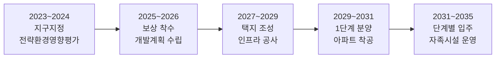
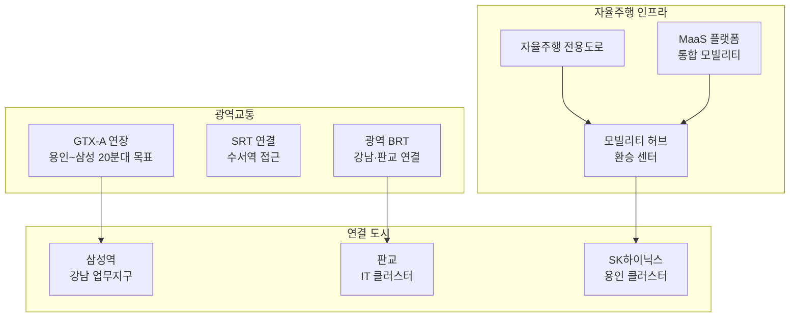

---
tags:
  - 부동산
  - 용인플랫폼시티
  - 스마트시티
---
# 용인플랫폼시티 개발 현황·투자 분석

용인플랫폼시티의 개발 진행 현황, 주변 시세 동향, 투자 분석(긍정·리스크 요인)을 정리한다.

---

## 개발 타임라인

| 단계 | 시기 (예상) | 주요 내용 | 투자 포인트 |
|------|-----------|----------|-----------|
| 지구지정 | 2023~2024 | 택지개발 예정지구 고시, 전략환경영향평가 | 토지 보상 전, 직접 투자 어려움. 주변 시세 모니터링 |
| 보상·계획 수립 | 2025~2026 | 토지 보상 착수, 개발계획 구체화 | 분양 일정 예측, 청약 전략 수립 시점 |
| 택지 조성 | 2027~2029 | 인프라 공사, 자율주행 도로 구축 | GTX 연장 확정 여부가 핵심 변수 |
| 1단계 분양 | 2029~2031 | 아파트 분양 개시, 착공 | 분양가 확인 후 청약·분양권 투자 판단 |
| 단계별 입주 | 2031~2035 | 순차 입주, 자족시설 가동 | 입주 물량에 따른 전세가·매매가 변동 |

---

## 교통 인프라 현황

| 교통 수단 | 목적지 | 예상 소요시간 | 현재 상태 |
|-----------|--------|-------------|----------|
| GTX-A 연장 | 삼성역 (강남) | 20~30분 | 추진 검토 중 |
| 광역 BRT | 판교역 | 20~30분 | 계획 |
| 자율주행 셔틀 | 도시 내부 순환 | 10분 이내 | 설계 단계 |
| 기존 도로 | 강남 (경부고속도로) | 40~60분 (비혼잡) | 기존 인프라 |

!!! warning "GTX-A 연장 불확실성"
    GTX-A 용인 연장은 **추진 검토** 단계로, 확정이 아니다. 예비타당성 조사, 기본계획 수립, 착공까지 최소 5~10년이 소요될 수 있으며, 노선 변경·축소·무산 가능성도 존재한다. GTX 연장을 전제로 한 투자 의사결정은 리스크가 크다.

---

## 주변 시세 동향

| 지역 | 대표 단지 | 전용 84㎡ 시세 (2025 기준) | 비고 |
|------|----------|-------------------------|------|
| 용인 수지 | 성복역 롯데캐슬 | 10~12억 | 분당선 역세권 |
| 용인 기흥 | 동백 센트럴자이 | 7~9억 | 에버라인 역세권 |
| 용인 처인 | 역북지구 | 4~6억 | 현재 플랫폼시티 인근 |
| 동탄2 | 동탄역 대방 디에트르 | 8~10억 | GTX-A 역세권 |

!!! info "시세 참고 포인트"
    플랫폼시티 인근 용인 처인구 시세(4~6억)가 현재 기준이 되지만, GTX 연장이 확정되면 **GTX-A 역세권인 동탄2 시세(8~10억)**가 벤치마크가 된다. GTX 미확정 시에는 처인구 시세 수준에 머물 가능성이 높다.

---

## 투자 분석

### 긍정 요인

| 요인 | 설명 |
|------|------|
| SK하이닉스 클러스터 | 용인에 120조 규모 반도체 클러스터 조성. 고소득 일자리 유입 |
| 분양가 상한제 | 공공택지 분양가 상한제 적용으로 시세 대비 저렴한 분양가 기대 |
| 대규모 자족도시 | 7만 세대 + 산업단지로 베드타운이 아닌 자족 기능 |
| 플랫폼시티 프리미엄 | 차세대 도시 모델로서의 브랜드 가치 |
| 수도권 남부 수요 | 판교·분당·수원 등 수도권 남부 주거 수요 흡수 |

### 리스크 요인

| 리스크 | 설명 | 심각도 |
|--------|------|--------|
| GTX 연장 불확실 | 추진 검토 단계, 확정 아님. 무산 시 서울 접근성 한계 | **높음** |
| 장기 개발 기간 | 입주까지 10년 이상. 시장 환경 변화 리스크 | **높음** |
| 입주 물량 충격 | 7만 세대 + 주변 3기 신도시 동시 입주 시 공급 과잉 | **중간** |
| 스마트시티 구현 리스크 | 자율주행 등 기술이 계획대로 구현되지 않을 가능성 | **중간** |
| 분양가 수준 | 플랫폼시티 인프라 비용이 분양가에 전가될 가능성 | **중간** |
| 현재 접근성 | GTX 개통 전까지 대중교통 접근성 미흡 | **중간** |

---

## 투자 체크리스트

!!! tip "투자 판단 전 확인사항"
    - [ ] GTX-A 연장 진행 상황 (예비타당성 통과 여부) 확인
    - [ ] SK하이닉스 클러스터 착공·채용 일정 확인
    - [ ] 분양 일정 및 분양가 상한제 적용 범위 확인
    - [ ] 주변 3기 신도시 (왕숙, 교산) 입주 시기와의 물량 겹침 확인
    - [ ] 현재 교통 인프라 (경부고속도로, 용인경전철) 실제 소요시간 체험
    - [ ] 세종 스마트시티 실제 구현 수준 벤치마킹
    - [ ] 용인 처인구 현재 시세와 향후 분양가 예상 범위 비교

---

## 관련 문서

- [용인플랫폼시티 개요](index.md) | [핵심 개념](concepts.md)
- [분양 정보](presale.md)
- [주변 프로젝트 비교](products/index.md)
- [부동산 투자 트렌드](../real-estate-investment/trends.md)
