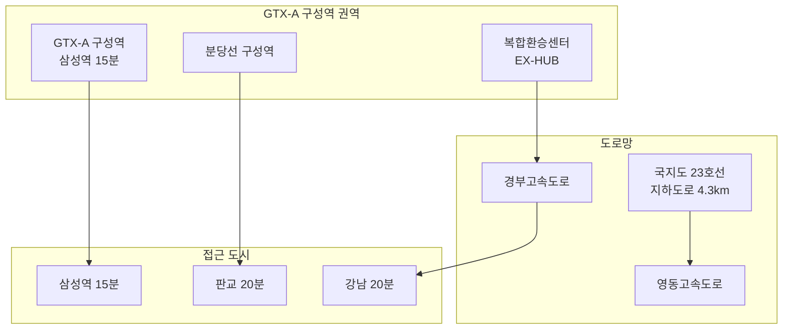

---
tags:
  - 부동산
  - 용인플랫폼시티
  - 스마트시티
---
# 용인플랫폼시티 개발 현황·투자 분석

용인플랫폼시티의 공구별 개발 진행 현황, 교통 인프라, 주변 시세, 투자 분석을 정리한다.

---

## 개발 타임라인

| 단계 | 시기 | 주요 내용 | 비고 |
|------|------|----------|------|
| 지구지정 | 2019 | 도시개발구역 지정 | 완료 |
| 실시계획 인가 | 2024.12 | 실시계획 인가 완료 | 완료 |
| 착공 | 2025.3 | 착공식, 3공구 선행 착공 | **완료** |
| 부지 조성 | 2025~2027 | 문화재 조사, 지장물 철거, 도로망 확보 | **진행 중** |
| GTX-A 구성역 인프라 | 2025~2028 | 복합환승센터 구축, 역세권 개발 | 진행 중 |
| 단지별 분양 | 2026~ | 주거·상업 블록 순차 분양 | 라온프라이빗 분양 중 |
| 준공 | 2030 | 부지 조성 완료 | 목표 |

---

## 공구별 현황

| 공구 | 시행 | 추정 사업비 | 현황 |
|------|------|-----------|------|
| 1공구 | 경기주택도시공사(GH) | 1,327억 | 2025 상반기 착공 |
| 2공구 | 경기주택도시공사(GH) | 3,718억 | 2025 상반기 착공 |
| 3공구 | 용인도시공사 | 91억 | 2024.12 착공 (선행) |

---

## 교통 인프라

| 교통 수단 | 목적지 | 소요시간 | 상태 |
|-----------|--------|---------|------|
| GTX-A | 삼성역 | 약 15분 | **확정** (구성역) |
| 분당선 | 판교역 | 약 20분 | 기존 운영 중 |
| 복합환승센터(EX-HUB) | 경부고속도로 연결 | — | 2028~2034 단계 추진 |
| 국지도 23호선 지하도로 | 동서 연결 | — | 4.3km 규모, 착공 예정 |
| 경부고속도로 | 강남 | 20~30분 | 기존 인프라 |

!!! info "GTX-A 구성역은 확정 호재"
    기존 문서에서는 GTX-A를 "추진 검토" 단계로 기재했으나, GTX-A 구성역은 **확정**이다. 또한 국내 최초로 고속도로와 GTX가 연결되는 **EX-HUB 복합환승센터**가 설치되어 교통 프리미엄이 매우 높다. 광역교통개선 총 11개 사업이 2028~2034년 단계별로 추진된다.

---

## 주변 시세 동향

| 지역 | 대표 단지 | 전용 84㎡ 시세 (2026 기준) | 비고 |
|------|----------|-------------------------|------|
| 기흥구 마북동 | e편한세상 구성역 플랫폼시티 | 10~12억 | 플랫폼시티 내 입주 완료 |
| 기흥구 영덕동 | 라온프라이빗 아르디에 | 약 7.5억 (분양가) | 2026년 분양 중 |
| 기흥구 보정동 | 보정역 일대 | 8~10억 | 분당선 역세권 |
| 수지구 상현동 | 광교 일대 | 10~14억 | 광교신도시 |
| 기흥구 동백 | 동백 센트럴자이 | 7~9억 | 에버라인 역세권 |

---

## 투자 분석

### 긍정 요인

| 요인 | 설명 |
|------|------|
| GTX-A 구성역 확정 | 삼성역 15분, 역세권 프리미엄 확보 |
| 복합환승센터(EX-HUB) | 국내 최초 고속도로+GTX 연결, 광역 접근성 |
| SK하이닉스 연계 | 반도체 산업 고소득 종사자 주거 수요 |
| 판교 4배 규모 | 산업용지 16.4%로 자족 기능 확보 |
| 공영개발 | 경기도·용인시 공동 추진으로 사업 안정성 높음 |
| 착공 완료 | 2025.3 착공, 2030 준공 일정 가시화 |

### 리스크 요인

| 리스크 | 설명 | 심각도 |
|--------|------|--------|
| 고분양가 | e편한세상 84㎡ 최고 12.35억으로 마피 발생 이력 | **중간** |
| 공사 기간 변동 | 2030 준공 목표이나 지연 가능성 | **중간** |
| 주변 공급 물량 | 용인 전체 입주 물량과 겹침 | **중간** |
| 산업용지 채움률 | 산업용지에 기업 유치 실패 시 자족 기능 약화 | **중간** |

---

## 투자 체크리스트

!!! tip "투자 판단 전 확인사항"
    - [ ] e편한세상 구성역 실거래가 추이 확인 (마피 해소 여부)
    - [ ] GTX-A 개통 일정 확인 (구성역 정차 확정)
    - [ ] 부지 조성 공사 진행 상황 (1·2공구)
    - [ ] 향후 분양 단지의 위치·분양가 공고 모니터링
    - [ ] 공공분양 vs 민간분양 구분 (규제·가격 차이)
    - [ ] SK하이닉스 클러스터 착공·채용 일정

---

## 관련 문서

- [용인플랫폼시티 개요](index.md) | [핵심 개념](concepts.md)
- [분양 정보](presale.md)
- [주변 프로젝트 비교](products/index.md)
- [부동산 투자 트렌드](../real-estate-investment/trends.md)
