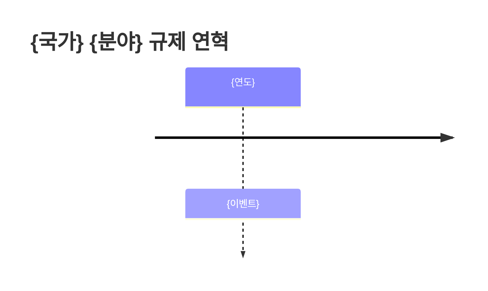

# AI 프롬프트 템플릿

> AI를 활용하여 도메인 스터디 콘텐츠를 작성할 때 사용할 수 있는 프롬프트 템플릿입니다.

## 1. 개념 설명 프롬프트

특정 도메인의 핵심 개념을 체계적으로 정리할 때 사용합니다.

```markdown
당신은 {도메인} 분야의 전문가입니다. 다음 형식으로 "{개념}"에 대해 설명해주세요.

## 요청 형식

### 정의
- 한 문장으로 간결하게 정의

### 상세 설명
- 2-3문단으로 개념을 풀어서 설명
- 비전문가도 이해할 수 있는 수준으로 작성

### 핵심 포인트
- 반드시 알아야 할 3-5가지 포인트를 불릿으로 정리

### 관련 개념
- 이 개념과 연결되는 다른 핵심 개념 3가지와 관계 설명

### 실무 적용
- 실제 비즈니스에서 이 개념이 어떻게 적용되는지 예시 1-2개

## 조건
- 한국어로 작성
- 전문 용어에는 영문 병기
- Markdown 형식 사용
- Mermaid 다이어그램으로 관계도 포함
```

## 2. 제품 비교 프롬프트

동일 도메인 내 경쟁 제품/서비스를 비교 분석할 때 사용합니다.

```markdown
당신은 {도메인} 분야의 제품 분석 전문가입니다. 다음 제품들을 비교 분석해주세요.

## 비교 대상
- {제품 A}
- {제품 B}
- {제품 C}

## 요청 형식

### 비교 요약 테이블
다음 항목으로 비교표를 작성해주세요:
- 설립/출시 연도
- 본사 위치
- 주요 특징 (3가지)
- 가격 모델
- 대상 고객
- 지원 국가/통화
- API 품질
- 문서화 수준

### 개별 분석
각 제품에 대해:
- 강점 3가지
- 약점 3가지
- 차별화 포인트

### 선택 가이드
다음 시나리오별 추천 제품과 이유:
- 스타트업이 빠르게 도입할 때
- 글로벌 확장을 준비할 때
- 비용 최적화가 중요할 때

## 조건
- 한국어로 작성
- 객관적 사실 기반, 주관적 판단은 근거 명시
- Markdown 테이블 형식 활용
- 최신 정보 기준 (정보 시점 명시)
```

## 3. 규제 요약 프롬프트

특정 국가/지역의 규제 현황을 정리할 때 사용합니다.

```markdown
당신은 {국가/지역}의 {규제 분야} 규제 전문가입니다. 현행 규제 현황을 다음 형식으로 정리해주세요.

## 요청 형식

### 규제 개요
- 핵심 규제 법령/규정 이름과 시행일
- 규제 목적 (1-2문장)
- 규제 범위

### 주요 규제 기관
| 기관명 | 역할 | 관할 범위 |
|--------|------|-----------|
- 각 기관의 역할과 관할 범위

### 핵심 규제 내용
- 허가/등록 요건
- 자본금 요건
- 보고 의무
- 소비자 보호 조항
- 위반 시 제재

### 최근 변화 (최근 1년)
- 신규 제정 또는 개정된 규제
- 시행 예정인 규제
- 주요 규제 이슈/논쟁

### 타임라인


### 시사점
- 사업자 관점에서의 실무적 시사점 3가지

## 조건
- 한국어로 작성
- 법령명은 원어와 한국어 병기
- 출처/근거 명시
- 정보 기준 시점 명시
```

## 활용 팁

!!! tip "프롬프트 커스터마이징"
    위 템플릿은 기본 틀이며, 도메인 특성에 맞게 항목을 추가하거나 수정하여 사용하세요.

!!! warning "AI 생성 콘텐츠 검증"
    AI가 생성한 콘텐츠는 반드시 사실 확인을 거쳐야 합니다. 특히 규제 관련 내용은 공식 출처를 통해 검증하세요.

!!! note "반복 사용"
    동일한 프롬프트를 여러 도메인/제품/국가에 반복 적용하면 일관된 형식의 콘텐츠를 확보할 수 있습니다.
