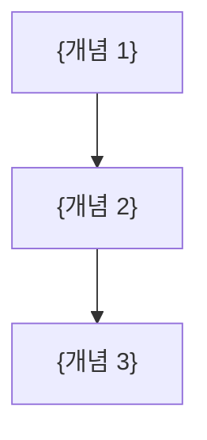

# {도메인 이름} - 핵심 개념

> 이 문서는 **{도메인 이름}**의 핵심 용어와 개념을 정리합니다.

## 용어 사전

| 용어 | 설명 |
|------|------|
| {용어 1} | {설명} |
| {용어 2} | {설명} |

## 핵심 개념

### {개념 1}

{개념에 대한 설명을 작성하세요.}

### {개념 2}

{개념에 대한 설명을 작성하세요.}

## 개념 관계도

## 참고 자료

- {참고 링크}
