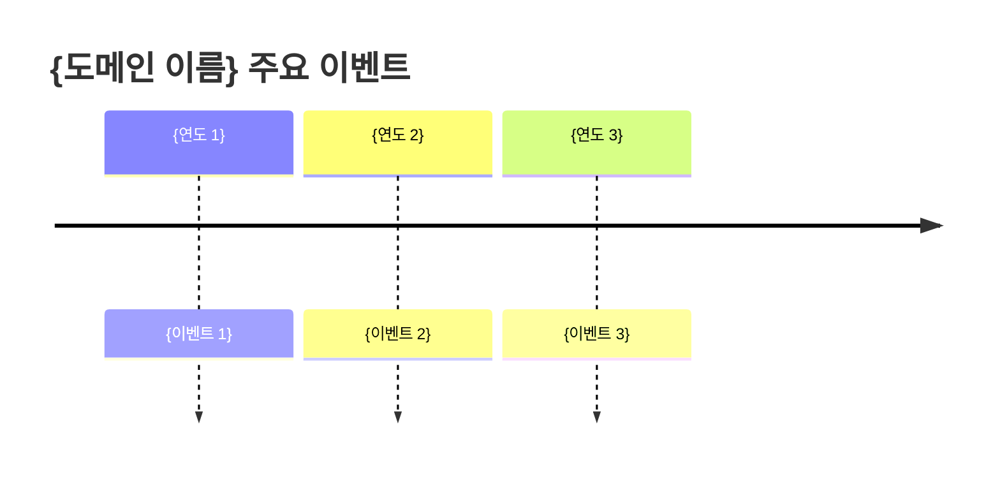

# {도메인 이름} - 트렌드

> 이 문서는 **{도메인 이름}** 분야의 최신 동향과 전망을 정리합니다.

## 최신 동향

### {트렌드 1}

- **시기**: {연도/분기}
- **요약**: {트렌드 설명}
- **영향**: {산업/시장에 미치는 영향}

### {트렌드 2}

- **시기**: {연도/분기}
- **요약**: {트렌드 설명}
- **영향**: {산업/시장에 미치는 영향}

## 전망

{향후 1-3년간의 전망을 작성하세요.}

## 타임라인

## 참고 자료

- {참고 링크}
